# Concurrency -- Explained from Scratch

## What Is Concurrency?

Concurrency means **multiple things happening at the same time**. In our marketplace platform, this means multiple customers can place orders simultaneously. Most of the time this is perfectly fine -- but sometimes, those orders compete for the **same limited resource** (like the last few units of a popular product), and that's where things get interesting.

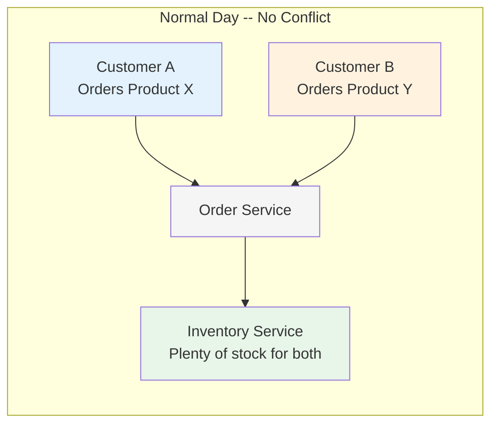

But what happens when **two customers want the same product at the same time**, and there isn't enough stock for both?

---

## 1. The Problem: When Two Orders Collide

### The Hotel Room Analogy

Imagine you and a stranger are both browsing a hotel website. There's **one room left**. You both see "1 room available" on your screens. You both click "Book Now" at the exact same moment.

What should happen? Only **one** of you should get the room. The other should see "Sorry, no rooms available."

What should NOT happen? Both of you getting a confirmation email, showing up at the hotel, and finding out they accidentally sold the same room twice. That's called **overselling**, and it's a serious problem.

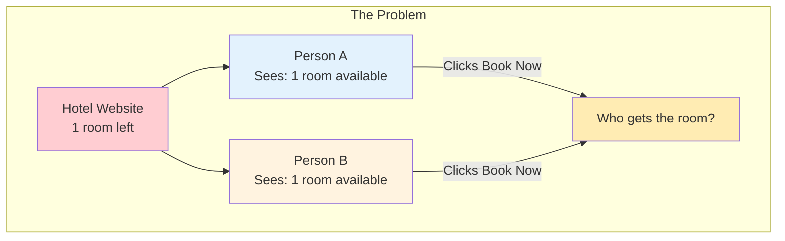

In our marketplace, the "hotel room" is **product stock**, and the "guests" are **concurrent orders**.

### The Race Condition

This problem has a name in computer science: a **race condition**. It happens when the outcome depends on which operation finishes first -- like two runners racing to the finish line, but instead of runners, it's two database operations racing to update the same piece of data.

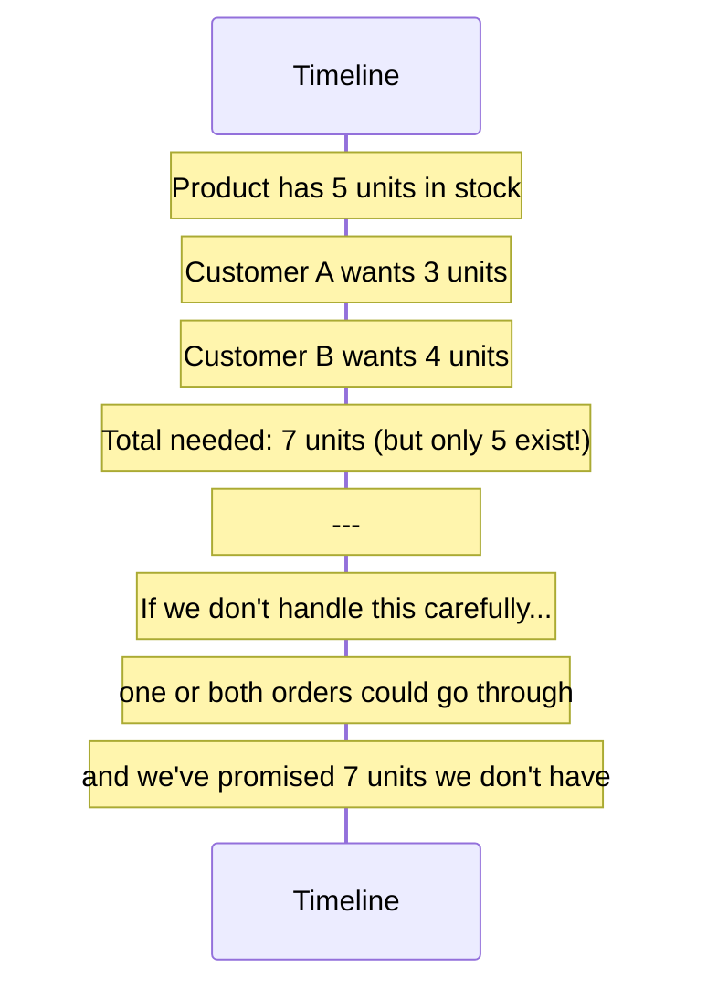

---

## 2. What Could Go Wrong (Without Protection)

Let's walk through a concrete disaster scenario, step by step. Our product (a wireless mouse, product ID `prod-1`) has **5 units** in stock.

- **Customer A** places an order for **3 units**
- **Customer B** places an order for **4 units**
- Both orders arrive at the inventory service at nearly the same time

Here is what happens if we have **no concurrency protection**:

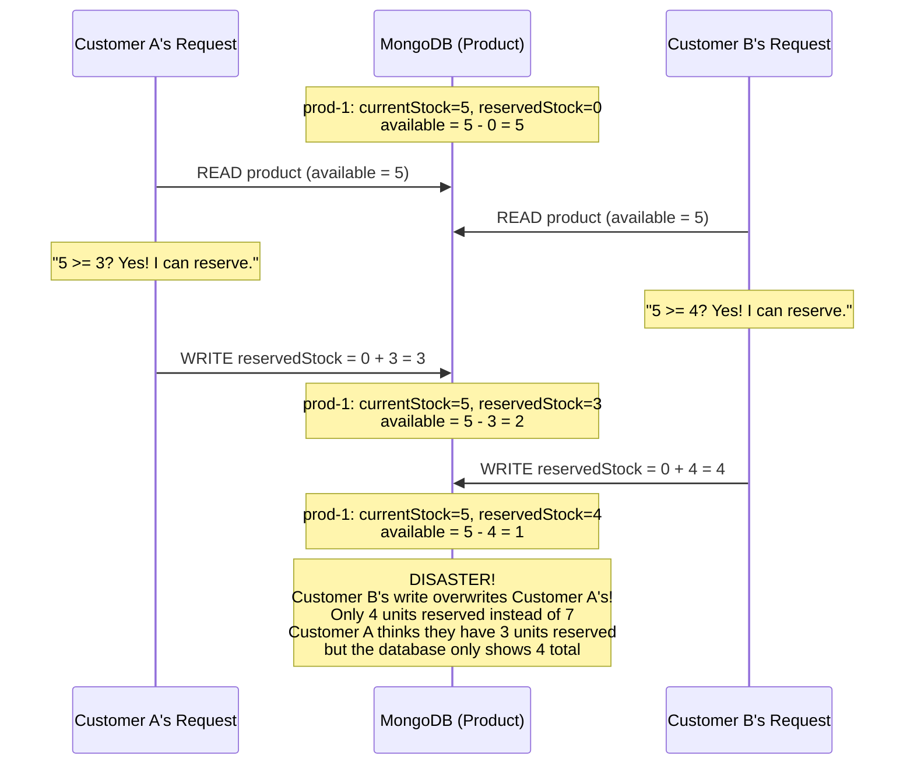

This is called a **lost update** problem. Customer B's write **overwrites** Customer A's write because B was working with stale data (it read `reservedStock=0` before A's write landed).

Even worse, there is a second scenario where both writes somehow add up:

| Step | Customer A sees | Customer B sees | Actual Database |
|------|----------------|-----------------|-----------------|
| Start | available = 5 | available = 5 | reserved = 0 |
| A reserves 3 | reserved = 3 | (still thinks reserved = 0) | reserved = 3 |
| B reserves 4 | | reserved = 4 | reserved = 4 (overwrote A!) |
| Result | Thinks 3 reserved | Thinks 4 reserved | Only 4 reserved |

Or in the worst case, if both manage to add their reservations:

| Total reserved | 3 + 4 = **7** |
|---|---|
| Actual stock | **5** |
| Oversold by | **2 units** |

**This is why we need concurrency control.**

---

## 3. Solution 1: Pessimistic Locking (The Bathroom Door Approach)

### The Analogy

Pessimistic locking is like a **bathroom door with a lock**. When someone goes in, they lock the door. Everyone else has to **wait in line** until the person inside is done. Only then can the next person enter.

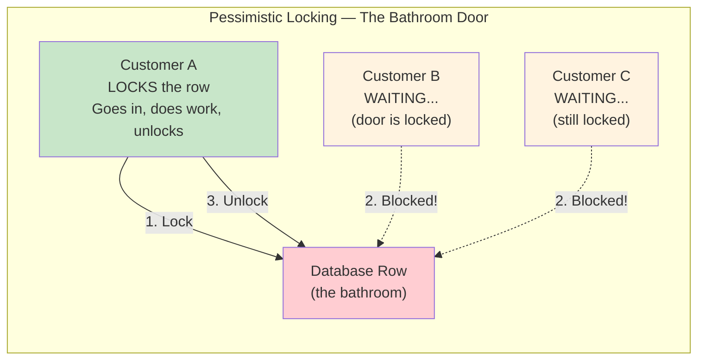

### How It Works in a Database

In SQL databases, pessimistic locking uses `SELECT ... FOR UPDATE`:

```sql
-- Customer A's transaction
BEGIN;
SELECT * FROM products WHERE product_id = 'prod-1' FOR UPDATE;
-- The row is now LOCKED. Nobody else can read or modify it.
-- Customer A does their work...
UPDATE products SET reserved_stock = reserved_stock + 3 WHERE product_id = 'prod-1';
COMMIT;
-- Lock released. Now Customer B can proceed.
```

### Why Our Project Does NOT Use This

Pessimistic locking **works**, but it has significant downsides:

1. **Performance bottleneck** -- If 100 customers order the same product at the same time, 99 of them are sitting there waiting. Each request takes the full lock-hold-unlock time before the next one can start.
2. **Deadlock risk** -- If Transaction A locks Product X and waits for Product Y, while Transaction B locks Product Y and waits for Product X, they're stuck forever (a deadlock).
3. **MongoDB limitation** -- Our inventory service uses MongoDB, which doesn't support `SELECT FOR UPDATE` the way relational databases do. MongoDB's document-level locking works differently.

We need something smarter.

---

## 4. Solution 2: Optimistic Locking (What We Actually Use)

### The Analogy: Editing a Google Doc

Imagine you and a coworker both open the same Google Doc. You both start editing. Google Docs handles this by detecting conflicts:

- You read version 1 of the document
- You make your changes
- When you try to save, the system checks: "Is this still version 1?"
  - If **yes**: your changes are saved, and the version becomes 2
  - If **no** (someone else already saved version 2): your save is **rejected**, and you need to re-read and try again

This is exactly how optimistic locking works. It's "optimistic" because it **assumes** conflicts are rare, so it lets everyone read freely and only checks for conflicts at **write time**.

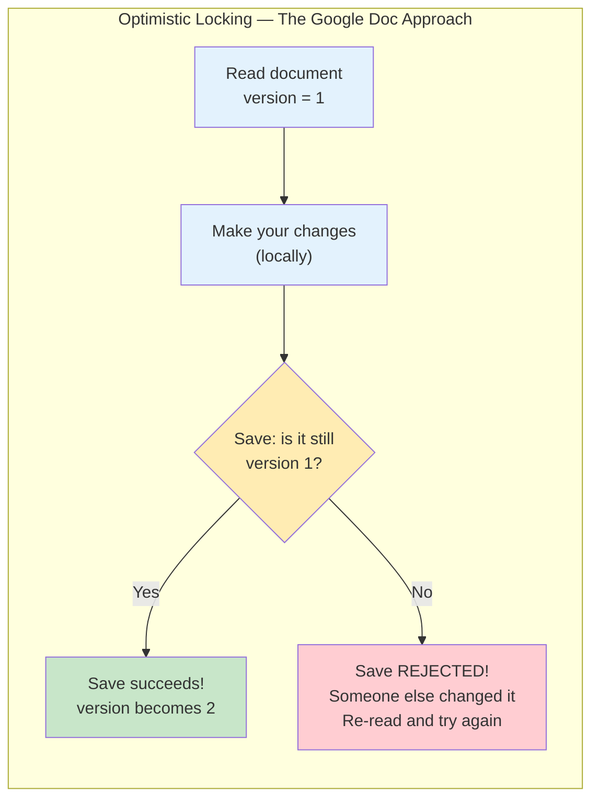

### How @Version Works in Our Code

In our `Product` model (MongoDB document), there is a special field:

```java
// Product.java (Inventory Service)
@Document(collection = "products")
public class Product {

    @Id
    private String id;
    private String productId;
    private int currentStock;
    private int reservedStock;

    // This is the magic field!
    @Version
    private Long version;

    // ...
}
```

The `@Version` annotation tells Spring Data MongoDB: **"Track a version number for this document. Every time you save it, increment the version. If the version in the database doesn't match the version I read, throw an exception."**

Here's what happens under the hood when you call `productRepository.save(product)`:

```
// What you write in Java:
productRepository.save(product);

// What Spring Data MongoDB actually does:
db.products.updateOne(
    { _id: "abc123", version: 1 },     // WHERE id matches AND version matches
    { $set: { reservedStock: 3, version: 2 } }  // Update fields AND increment version
)

// If version was already changed to 2 by someone else:
// → The WHERE clause finds 0 matching documents
// → Spring throws OptimisticLockingFailureException
```

### The Two-Customer Scenario WITH Optimistic Locking

Now let's replay our disaster scenario, but this time with optimistic locking protecting us:

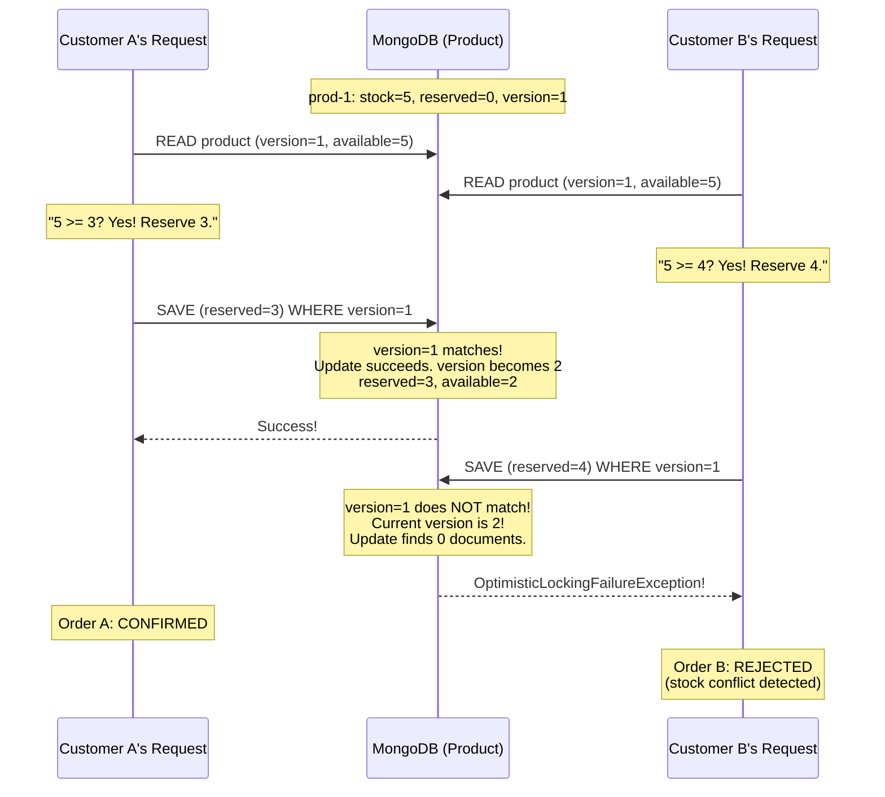

Customer A gets their 3 units. Customer B's reservation is rejected because the data changed between when B read it and when B tried to write. **No overselling.**

### The Actual Code: reserveStock()

Here is the exact code from our `InventoryStockService` that makes this work:

```java
// InventoryStockService.java
public boolean reserveStock(String productId, int quantity, String orderId) {
    try {
        // Step 1: Read the product (including its current version)
        Product product = productRepository.findByProductId(productId)
                .orElseThrow(() -> new IllegalArgumentException("Product not found: " + productId));

        // Step 2: Modify the product in memory
        // (This calls product.reserveStock(quantity), which checks available >= quantity
        //  and throws IllegalStateException if not enough stock)
        product.reserveStock(quantity);

        // Step 3: Save -- Spring Data checks the @Version field
        // If someone else modified this product between Step 1 and Step 3,
        // the version won't match, and this line throws OptimisticLockingFailureException
        productRepository.save(product);

        // Step 4: Log the event for audit trail
        stockEventRepository.save(new StockEvent(productId, StockEventType.RESERVED, quantity, orderId));
        log.info("Reserved {} units of product {} for order {}", quantity, productId, orderId);
        return true;  // Reservation succeeded

    } catch (OptimisticLockingFailureException e) {
        // Another request modified this product between our read and write.
        // Instead of crashing, we gracefully return false (reservation failed).
        log.warn("Optimistic lock conflict reserving stock for product {}, order {}", productId, orderId);
        return false;

    } catch (IllegalStateException e) {
        // Not enough stock available (even without a conflict)
        log.warn("Insufficient stock for product {}: {}", productId, e.getMessage());
        return false;
    }
}
```

The key insight: the `try/catch` around `OptimisticLockingFailureException` turns a crash into a **graceful "no"**. The method simply returns `false`, and the caller knows the reservation didn't go through.

---

## 5. Solution 3: Database-Level Atomic Operations (Brief Mention)

There's a third approach: instead of read-modify-write (which creates a window for conflicts), you can use MongoDB's `$inc` operator to **atomically** increment a field:

```
// Atomic operation -- no race condition possible
db.products.updateOne(
    { productId: "prod-1" },
    { $inc: { reservedStock: 3 } }
)
```

This is the fastest and most conflict-proof approach because the database handles the increment in a single, indivisible operation. There's no "read... think... write" gap where another request could sneak in.

**Why we chose optimistic locking instead:** We need to **check** that `available >= requested` before modifying. With `$inc`, we can't easily do that check and the update in one step. We would need a more complex MongoDB query like:

```
db.products.updateOne(
    { productId: "prod-1", $expr: { $gte: [{ $subtract: ["$currentStock", "$reservedStock"] }, 3] } },
    { $inc: { reservedStock: 3 } }
)
```

This works, but it moves business logic into the database query, making it harder to read and test. Optimistic locking keeps the logic in Java where it's easier to understand, test, and maintain -- and conflicts are rare enough that the occasional retry is acceptable.

---

## 6. The Complete Concurrency Flow

Here is the full picture of what happens when two customers order the same product at the same time, from start to finish:

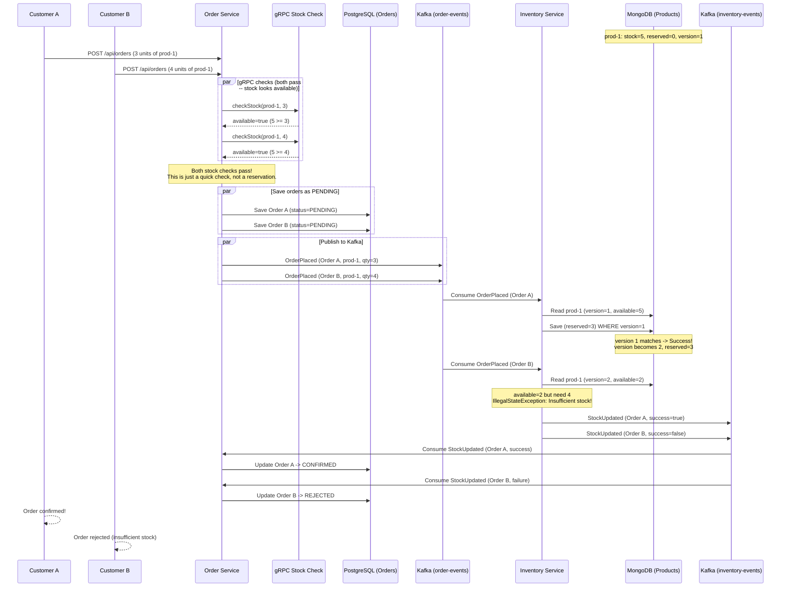

Notice something important: the gRPC stock check at the beginning is just a **quick pre-check** (a "soft check"). It's not authoritative. The real decision happens in the inventory service when it tries to actually **reserve** the stock with optimistic locking. This two-phase approach means:

1. **Fast feedback** -- Most obviously-impossible orders are rejected immediately by gRPC (e.g., ordering 100 units when only 5 exist)
2. **Guaranteed correctness** -- The optimistic locking in step 2 catches the edge cases where two orders look valid individually but conflict with each other

---

## 7. Key-Based Kafka Partitioning

### Why Message Ordering Matters

Kafka topics are split into **partitions**. Messages within a single partition are guaranteed to be processed **in order**. But messages across different partitions can be processed in **any order**.

When we publish an `OrderPlaced` event, we use the **order ID** as the Kafka message key:

```java
// OrderEventProducer.java
// Order ID as key ensures all events for the same order go to the same partition
kafkaTemplate.send(KafkaTopicConfig.ORDER_EVENTS_TOPIC, order.getId().toString(), event)
```

Kafka uses the key to determine which partition a message goes to (via hashing). Same key = same partition = guaranteed ordering.

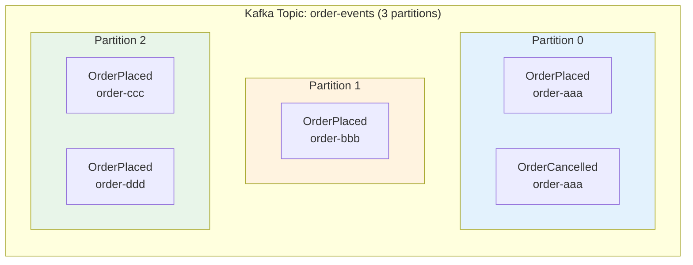

### Why This Matters

Imagine a customer places an order and then immediately cancels it. We publish two events:
1. `OrderPlaced` (order-aaa)
2. `OrderCancelled` (order-aaa)

Because both have the same key (`order-aaa`), they go to the **same partition** and are processed **in the correct order**: place first, cancel second.

If they went to different partitions, the cancel might be processed **before** the place -- and the inventory service would try to release stock that was never reserved, which would cause confusion.

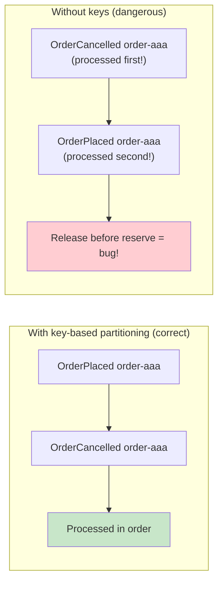

### A Subtlety: Product-Level Ordering

Our current design uses **order ID** as the Kafka key. This means all events for the same order are processed in sequence. However, two different orders for the **same product** might be processed in parallel (on different partitions). This is fine because optimistic locking at the MongoDB level catches any conflicts.

If we wanted to process all operations for the same **product** sequentially, we could use the product ID as the Kafka key instead. But this would reduce parallelism (all orders for a popular product would be single-threaded). Optimistic locking gives us the best of both worlds: high parallelism with correctness.

---

## 8. What Happens to the Rejected Order?

When an order is rejected due to a stock conflict, here's the complete compensation flow:

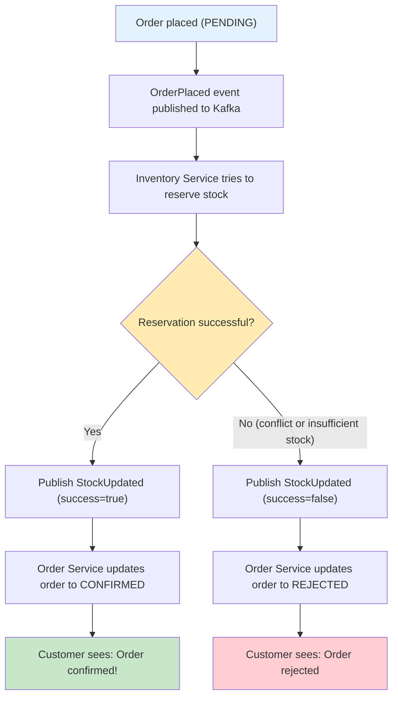

The key thing to understand: the rejection is **not a crash**. It's a normal, expected flow. The system is designed so that:

1. **No stock is wasted** -- If the reservation failed, no stock was reserved. There's nothing to "undo."
2. **No money is charged** -- In a real system, payment would only be captured after the order is CONFIRMED, not when it's PENDING.
3. **The customer is notified** -- The order status changes to REJECTED, and the customer can try again (perhaps with a smaller quantity).

This pattern is called **eventual consistency with compensation**: the system might be temporarily inconsistent (the order exists as PENDING, but the stock hasn't been reserved yet), but it eventually reaches a consistent state (either CONFIRMED with stock reserved, or REJECTED with no stock reserved).

### What About Cancellations?

If a customer cancels a CONFIRMED order, the flow reverses:

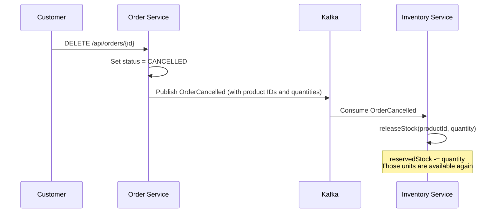

The `releaseStock` method in our code handles this gracefully, even using `Math.max(0, ...)` to prevent `reservedStock` from going negative if there's any mismatch:

```java
public void releaseStock(int quantity) {
    this.reservedStock = Math.max(0, this.reservedStock - quantity);
    this.lastUpdated = Instant.now();
}
```

---

## 9. Real-World Analogy Summary: The Concert Ticket Sale

Let's tie everything together with one story.

**The setup:** A concert venue has **100 tickets** left. A popular band announces a flash sale, and **thousands of fans** hit the website at the same time.

**Without any protection (race condition):**
All fans see "100 tickets available." They all click buy. The system sells 500 tickets for 100 seats. Chaos at the venue.

**With pessimistic locking (bathroom door):**
Only one fan at a time can access the ticket counter. Fan 1 buys their ticket. Then fan 2. Then fan 3. It works perfectly -- but with 1,000 fans in line, the last person waits 20 minutes. The website feels painfully slow.

**With optimistic locking (our approach):**
All fans can browse and click "Buy" freely. When each purchase reaches the database:
- The system checks: "Is the ticket count still what I think it is?"
- If **yes**: purchase goes through, ticket count decremented
- If **no** (someone else bought tickets between my read and write): purchase fails, fan is told "Please try again"

Most purchases succeed on the first try because conflicts are statistically rare (even with 1,000 concurrent users, only a handful happen at the exact same millisecond). The few that fail get a fast, friendly "try again" message.

**The key-based partitioning (organized lines):**
If a fan buys a ticket and then immediately requests a refund, both actions (buy + refund) go through the same queue (Kafka partition), so they're processed in the right order. Buy first, refund second.

**The eventual consistency:**
When you click "Buy," you immediately see "Order pending." A few milliseconds later, the inventory service either confirms or rejects the reservation. Your order updates to "Confirmed" or "Rejected." There's a brief window where the order exists but isn't finalized -- and that's by design.

---

## 10. Concurrency Concepts Cheat Sheet

| Concept | One-Line Definition | Used in Our Project? |
|---|---|---|
| **Race Condition** | A bug where the outcome depends on which operation finishes first, leading to unpredictable results. | We **prevent** this using optimistic locking. |
| **Optimistic Locking** | Allow concurrent reads freely, but check for conflicts at write time using a version number. | **Yes** -- `@Version` on the `Product` entity in MongoDB. Core mechanism for stock safety. |
| **Pessimistic Locking** | Lock the resource before reading it so nobody else can touch it until you're done. | **No** -- too slow for our use case, and MongoDB doesn't natively support `SELECT FOR UPDATE`. |
| **Atomic Operation** | A database operation that completes in one indivisible step, with no window for interference. | **Not directly** -- we could use MongoDB's `$inc`, but optimistic locking gives us more control over the business logic. |
| **Eventual Consistency** | The system may be temporarily inconsistent, but it will eventually reach a correct state. | **Yes** -- an order starts as PENDING and eventually becomes CONFIRMED or REJECTED after async processing via Kafka. |
| **Idempotency** | Processing the same operation multiple times produces the same result as processing it once. | **Partially** -- Kafka consumer offsets prevent reprocessing; `StockEvent` records provide an audit trail. |
| **Lost Update** | When one write silently overwrites another because both were based on the same stale read. | We **prevent** this using optimistic locking's version check. |
| **Deadlock** | Two operations each waiting for the other to release a lock, so neither can proceed. | **Not possible** -- optimistic locking doesn't hold locks, so deadlocks can't occur. |

---

## Quick Reference: Where to Find the Code

| What | File |
|---|---|
| `@Version` field on Product | `inventory-service/.../model/Product.java` |
| `reserveStock()` with try/catch | `inventory-service/.../service/InventoryStockService.java` |
| Order creation + gRPC check | `order-service/.../service/OrderService.java` |
| Kafka key-based publishing | `order-service/.../kafka/OrderEventProducer.java` |
| Inventory consuming order events | `inventory-service/.../kafka/OrderEventConsumer.java` |
| Order status update on stock result | `order-service/.../kafka/InventoryEventConsumer.java` |
| Order lifecycle states | `order-service/.../model/OrderStatus.java` |
