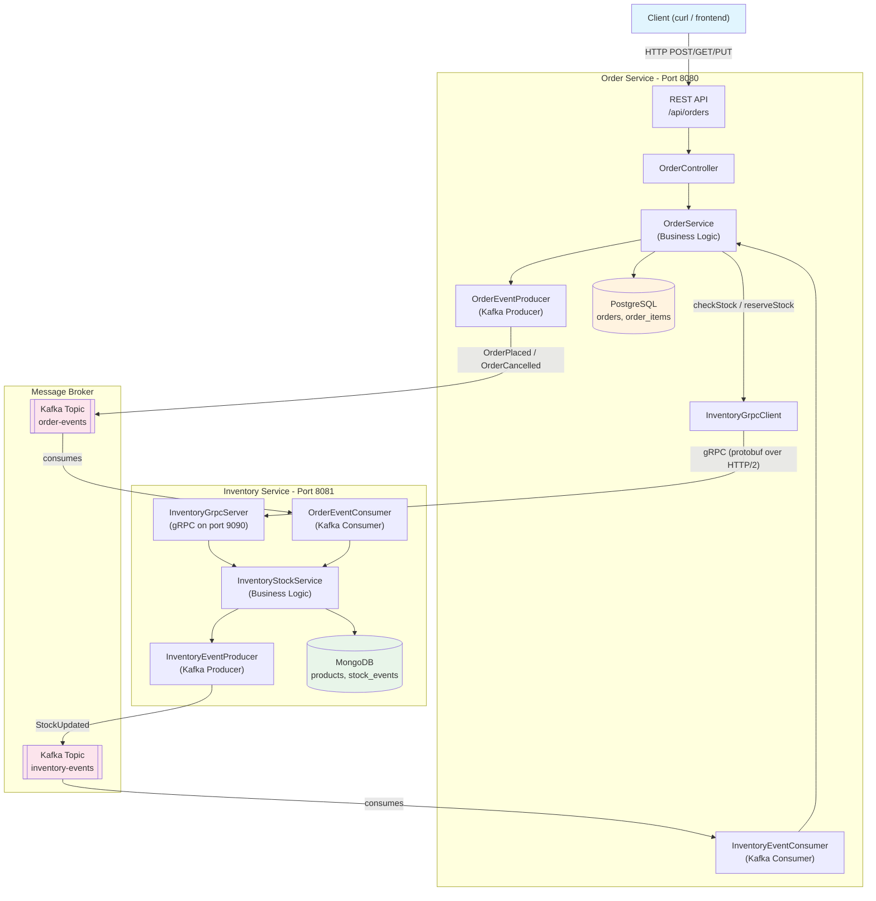
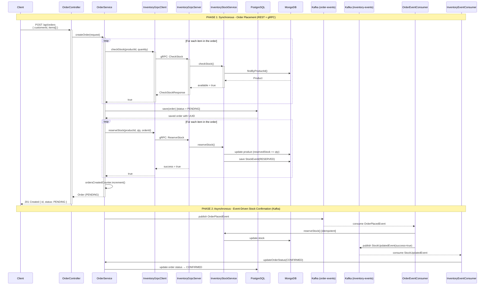
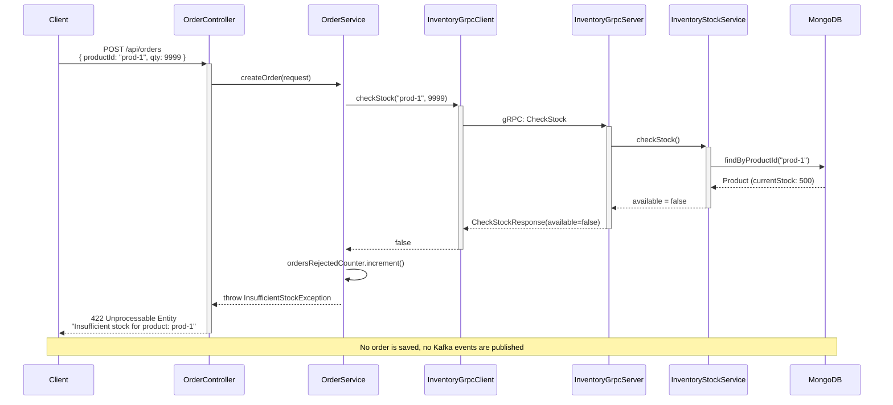
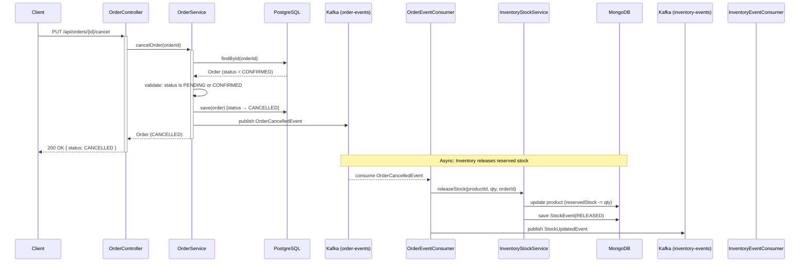
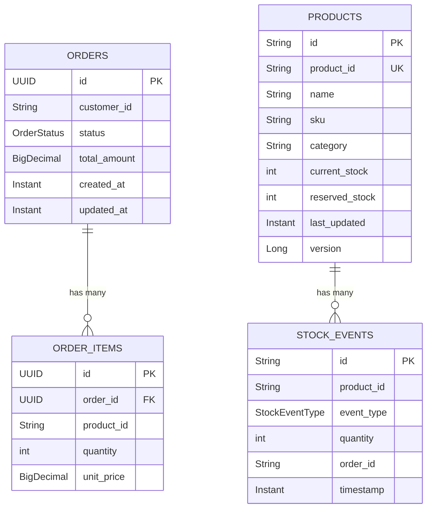
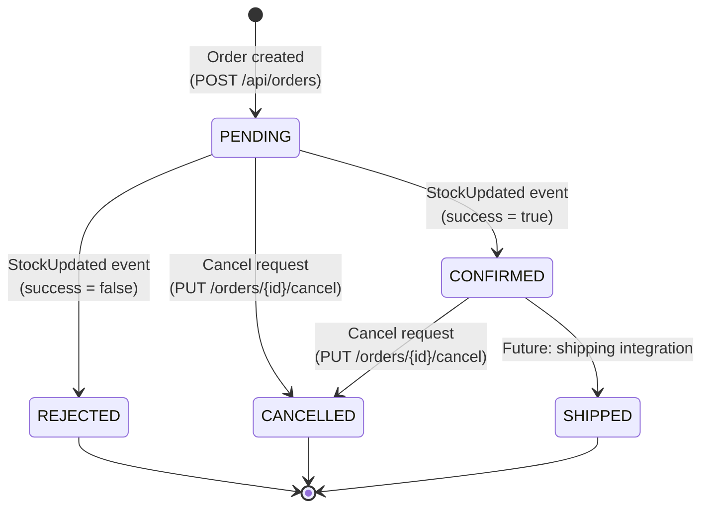
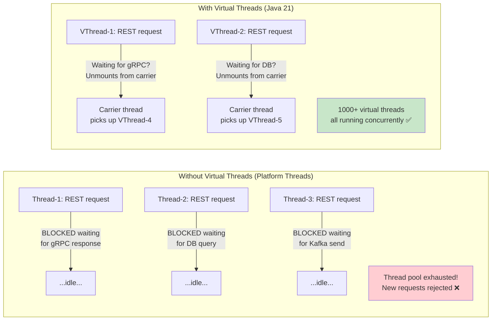
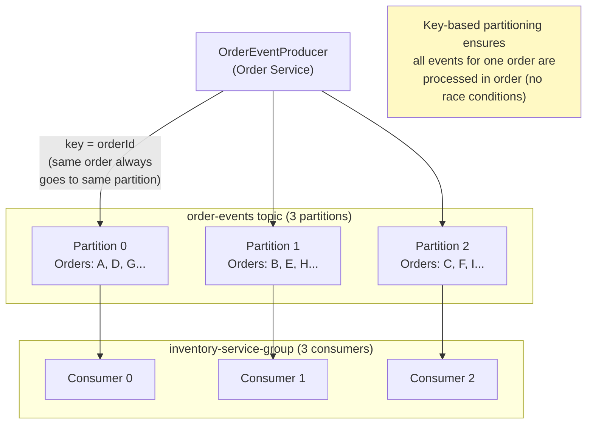
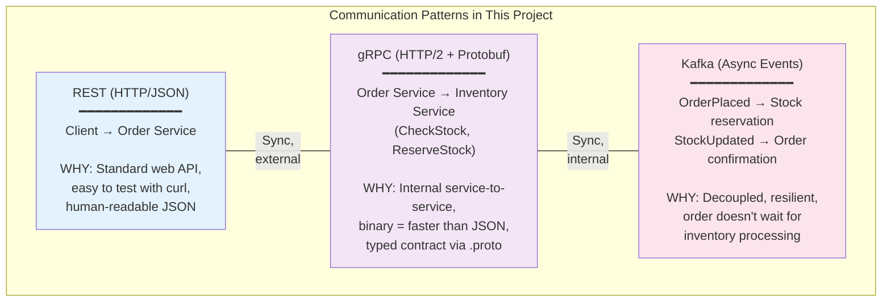

# Marketplace Platform — Architecture Diagrams

## 1. High-Level Architecture

## 2. Order Creation Flow (Happy Path)

## 3. Order Creation Flow (Insufficient Stock)

## 4. Order Cancellation Flow

## 5. Data Models

## 6. Order Status State Machine

## 7. Virtual Threads — Why They Matter Here

## 8. Kafka Topics and Partitioning

## 9. gRPC vs REST vs Kafka — When to Use Each

