# gRPC — Explained from Scratch

## What Problem Does gRPC Solve?

When you have two separate applications (like our Order Service and Inventory Service), they need a way to talk to each other over the network. There are two popular approaches:

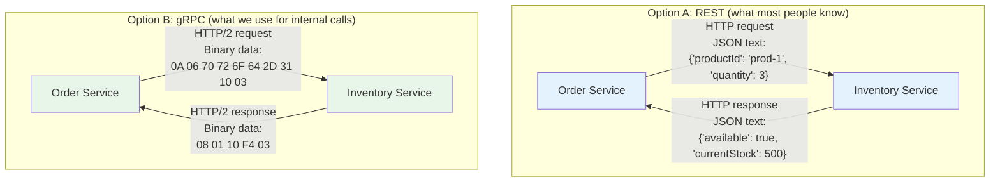

Both accomplish the same thing — one service asks another service a question and gets an answer. But gRPC does it **faster** because:

1. **Binary data** instead of text — computers process binary much faster than parsing JSON text
2. **HTTP/2** instead of HTTP/1.1 — can send multiple requests at once over a single connection
3. **Typed contract** — both sides agree in advance on exactly what data they'll exchange (no surprises)

---

## The Analogy: Phone Calls vs Letters

Think of the difference between REST and gRPC like this:

**REST is like writing letters in English:**
- Both sides agree to communicate in English (JSON format)
- You write a letter (HTTP request with JSON body)
- The mail carrier delivers it (HTTP/1.1)
- The recipient reads the English text, interprets it, and writes back
- Easy for humans to read, but slow to process

**gRPC is like a phone call with a prepared script:**
- Both sides have the same script in front of them (the `.proto` file)
- When you call, you say "Line 1, field 2 is 3" (binary-encoded)
- The other side knows exactly what "Line 1, field 2" means because they have the script
- Much faster because there's no interpretation needed — but harder for humans to read

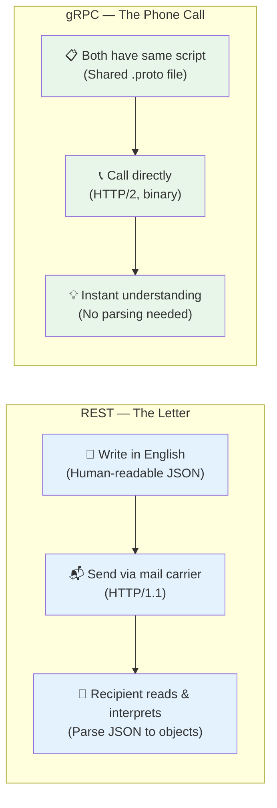

---

## The .proto File — The Shared Script

The foundation of gRPC is the `.proto` file. It's a contract that both services agree on — like a menu at a restaurant. It defines:
1. What **operations** (RPCs) are available — "what can I order?"
2. What **data** each operation expects and returns — "what comes with each dish?"

Here's our actual proto file (`proto/inventory.proto`), explained piece by piece:

### Defining the Service (the menu)

```protobuf
service InventoryService {
  rpc CheckStock (CheckStockRequest) returns (CheckStockResponse);
  rpc ReserveStock (ReserveStockRequest) returns (ReserveStockResponse);
}
```

This is like a restaurant menu with two items:
- **CheckStock** — "Do you have enough of this product?"
- **ReserveStock** — "Hold some stock for my order"

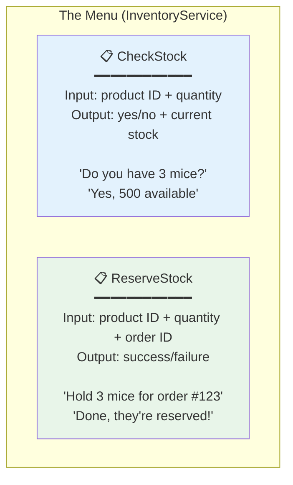

### Defining the Messages (what goes back and forth)

Each operation has a **request** (what you send) and a **response** (what you get back). These are called "messages" in proto language:

```protobuf
message CheckStockRequest {
  string product_id = 1;    // Which product to check
  int32 quantity = 2;        // How many you need
}

message CheckStockResponse {
  bool available = 1;        // true/false: is there enough?
  int32 current_stock = 2;   // How many are in stock right now
}
```

The numbers (`= 1`, `= 2`) are **field tags**, not values. They tell the binary encoder "field 1 is product_id, field 2 is quantity." This is how binary encoding works — instead of sending the field name as text, it just sends the number.

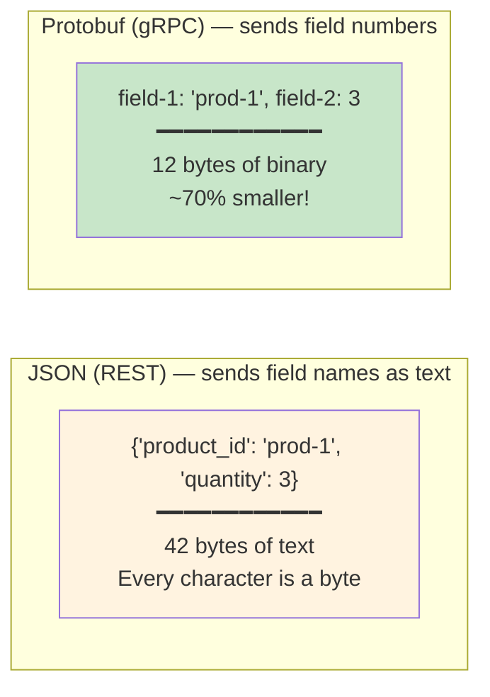

### Our Complete Proto File

Here's the full file with all four messages:

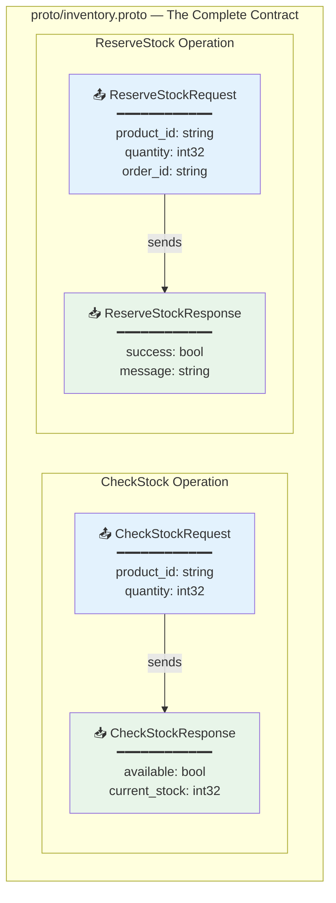

---

## How Code Gets Generated from the Proto File

Here's something really cool about gRPC — you don't write the networking code yourself. The `.proto` file is fed into a **code generator** that creates Java classes automatically.

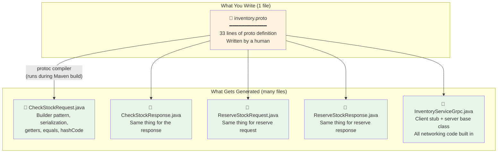

This means:
- You **never** manually write request/response Java classes for gRPC
- You **never** manually write networking/serialization code
- If you change the proto file, the generated code updates automatically on the next build
- Both services generate code from the **same proto file**, so they can never get out of sync

---

## The Server Side — Inventory Service Answers the Phone

The Inventory Service implements the gRPC server — it's the one answering the "phone calls" from the Order Service.

### What the developer writes

The developer only writes the **business logic**. The generated code handles all the networking:

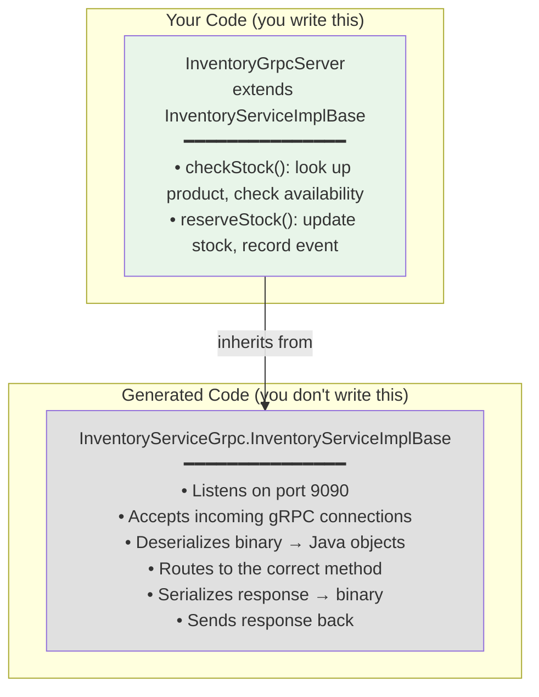

### How a checkStock call works

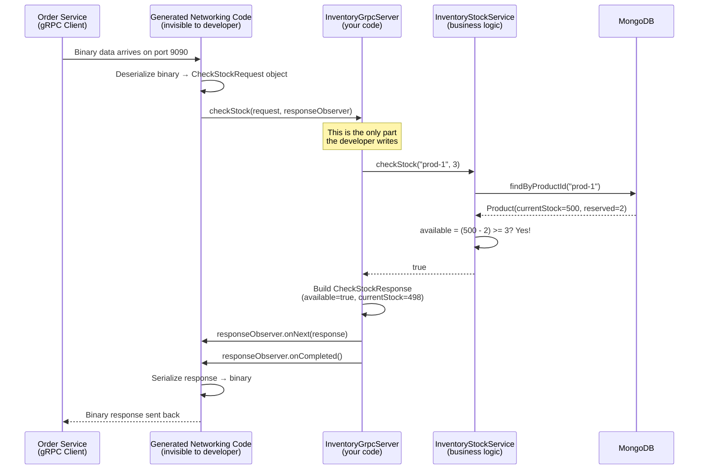

### The responseObserver pattern

You might have noticed the `responseObserver` — this is how gRPC sends responses. It's different from REST where you just `return` a value:

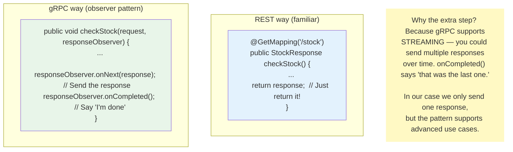

---

## The Client Side — Order Service Makes the Phone Call

The Order Service has a gRPC **client** that calls the Inventory Service. Again, the generated code handles all networking — the developer just calls methods:

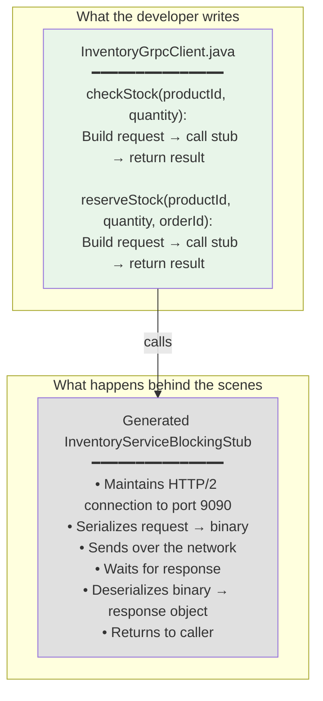

### How the client makes a call

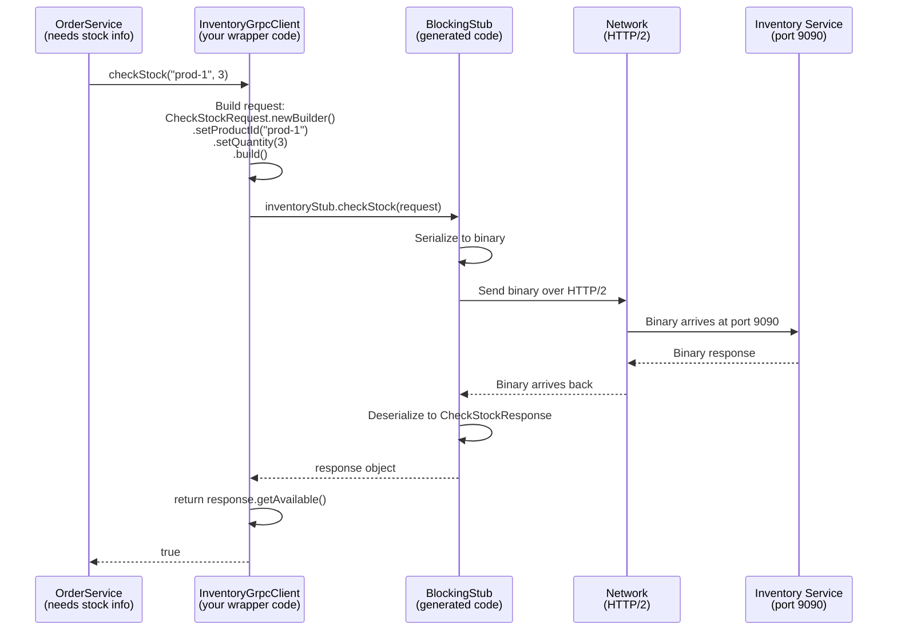

### The "BlockingStub" — what does "blocking" mean?

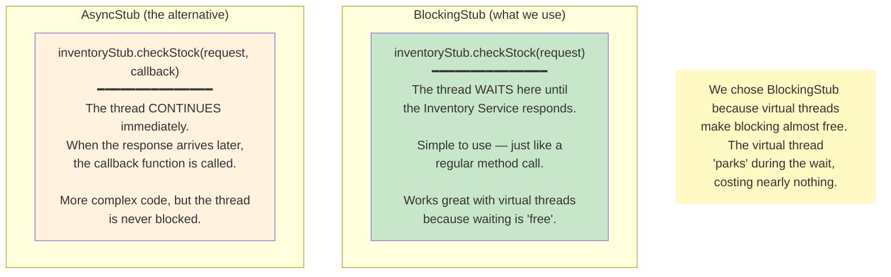

---

## The @GrpcClient Annotation — Spring Boot Magic

In our project, we use the `grpc-spring-boot-starter` library, which makes gRPC feel as easy as writing a REST controller. Here's the magic:

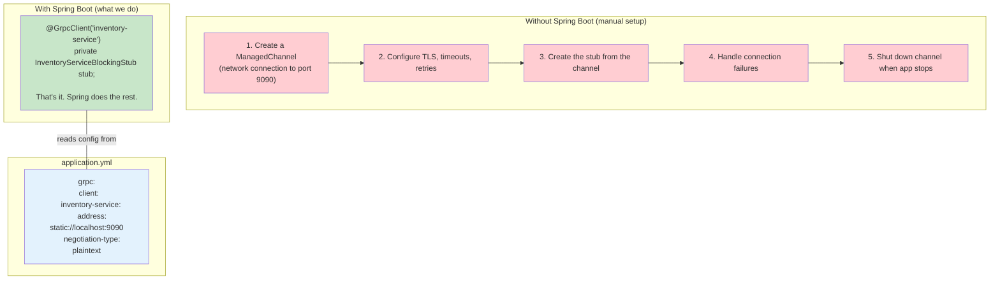

The `@GrpcClient("inventory-service")` annotation tells Spring: "Look up the connection details for 'inventory-service' in the config file, create a channel, create a stub, and inject it here." All in one line.

Similarly on the server side, `@GrpcService` replaces pages of server setup code:

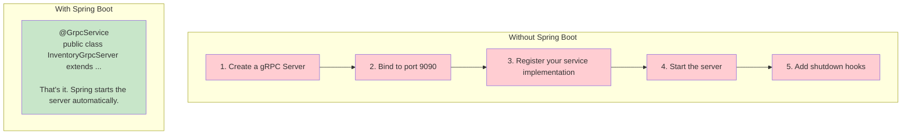

---

## gRPC vs REST vs Kafka — When to Use Each

In our project, we use all three. Here's a simple decision guide:

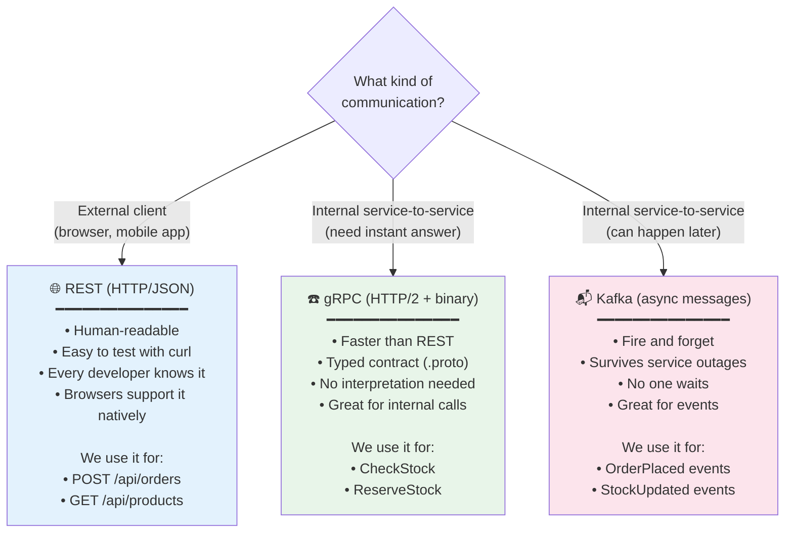

### Real-world analogy

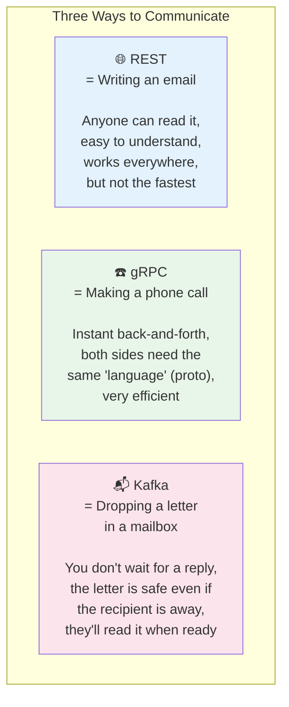

---

## The Complete gRPC Flow in Our Project

Here's everything that happens when the Order Service checks stock via gRPC, from top to bottom:

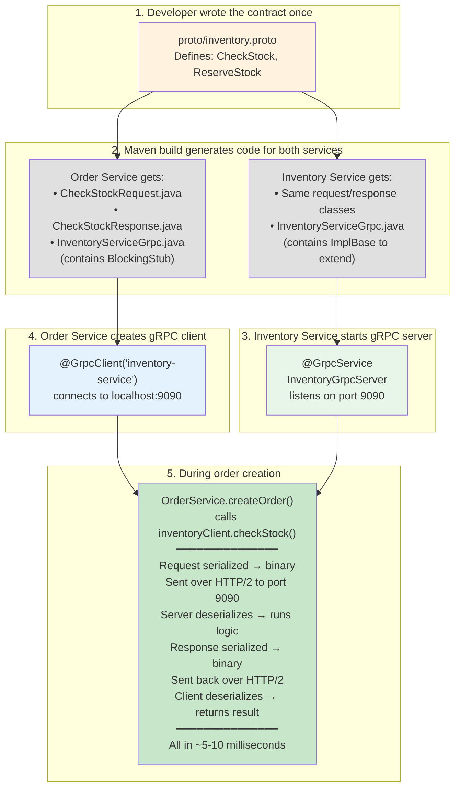

---

## Key Source Files

| File | What it is |
|------|-----------|
| `proto/inventory.proto` | The contract — defines operations and data types |
| `inventory-service/.../grpc/InventoryGrpcServer.java` | The server — answers gRPC calls with business logic |
| `order-service/.../grpc/InventoryGrpcClient.java` | The client — makes gRPC calls to the server |
| `order-service/src/main/resources/application.yml` (lines 34-38) | Client config — where to connect (`localhost:9090`) |
| `inventory-service/src/main/resources/application.yml` (lines 26-28) | Server config — which port to listen on (`9090`) |
| `order-service/pom.xml` (lines 126-143) | Maven plugin — generates Java code from the proto file |

---

## Summary — gRPC in One Picture

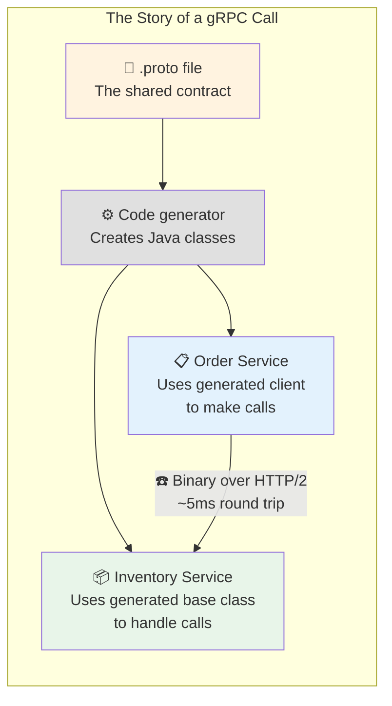

**The key insight:** You write a 33-line `.proto` file, and the tooling generates all the networking, serialization, and boilerplate code for both services. You just write the business logic.
