# How the Marketplace App Works — Visual Guide

This document uses simple, friendly diagrams to explain every part of the application. No technical jargon — just pictures and plain language.

---

## The Big Picture

Our marketplace has three layers: what the user sees, the services that handle business logic, and the databases that store everything.

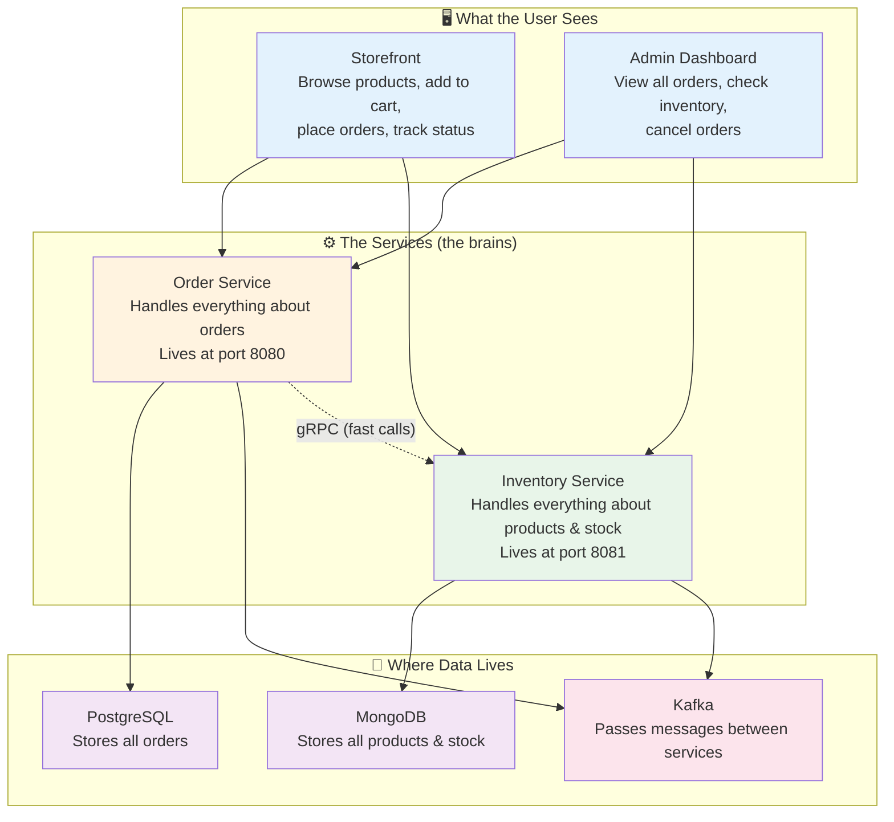

---

## The Shopping Experience — What Happens When You Shop

### Step 1: Browsing Products

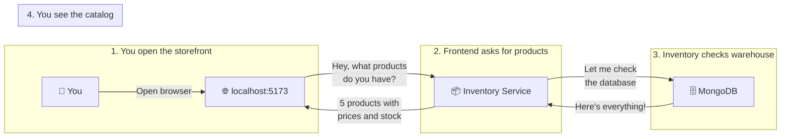

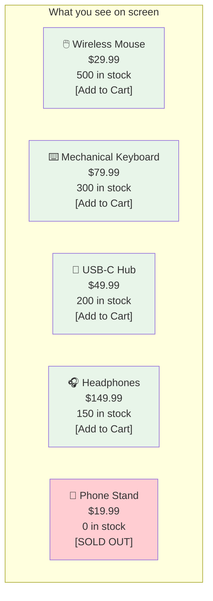

### Step 2: Adding Items to Cart

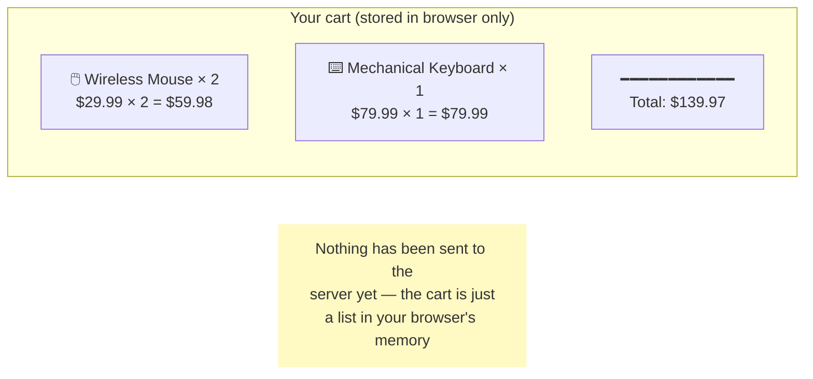

### Step 3: Placing the Order

This is where the magic happens. Here's a story version:

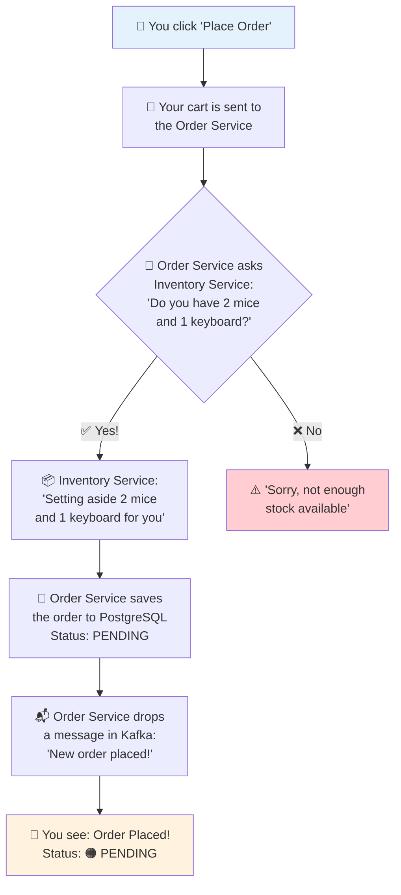

### Step 4: The Behind-the-Scenes Confirmation

While you're looking at the PENDING badge, things are happening in the background:

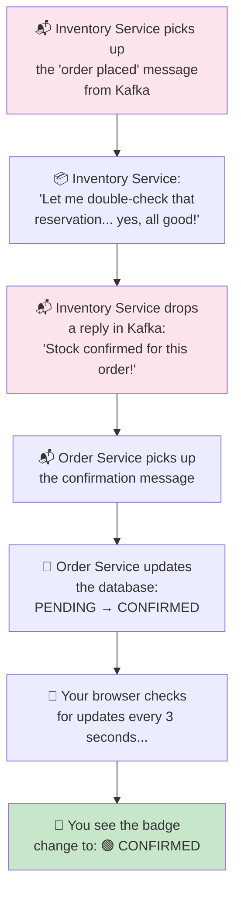

### The Complete Journey in One Picture

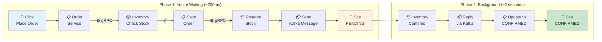

---

## The Admin Experience

### Viewing All Orders

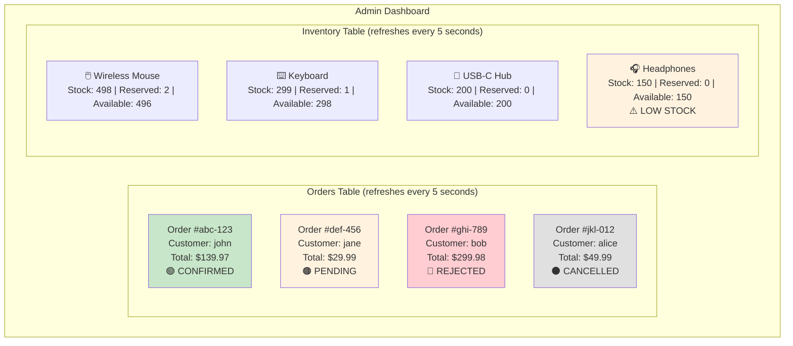

### Cancelling an Order

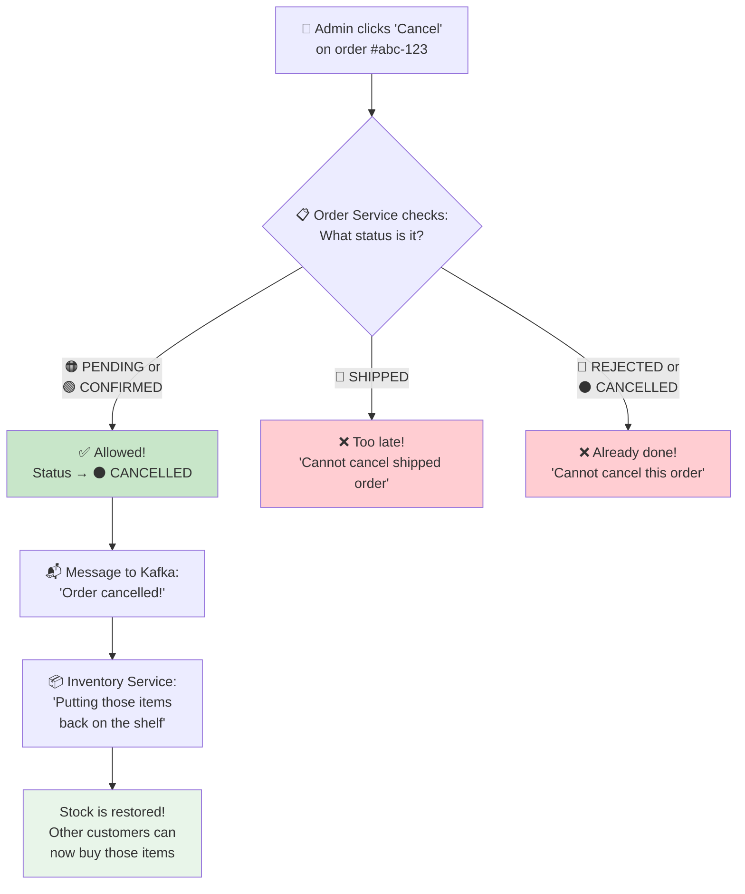

---

## How the Two Services Talk to Each Other

The Order Service and Inventory Service talk in two different ways, depending on the situation:

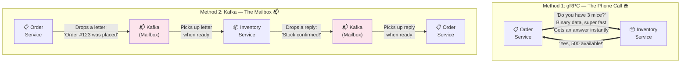

### When do we use each method?

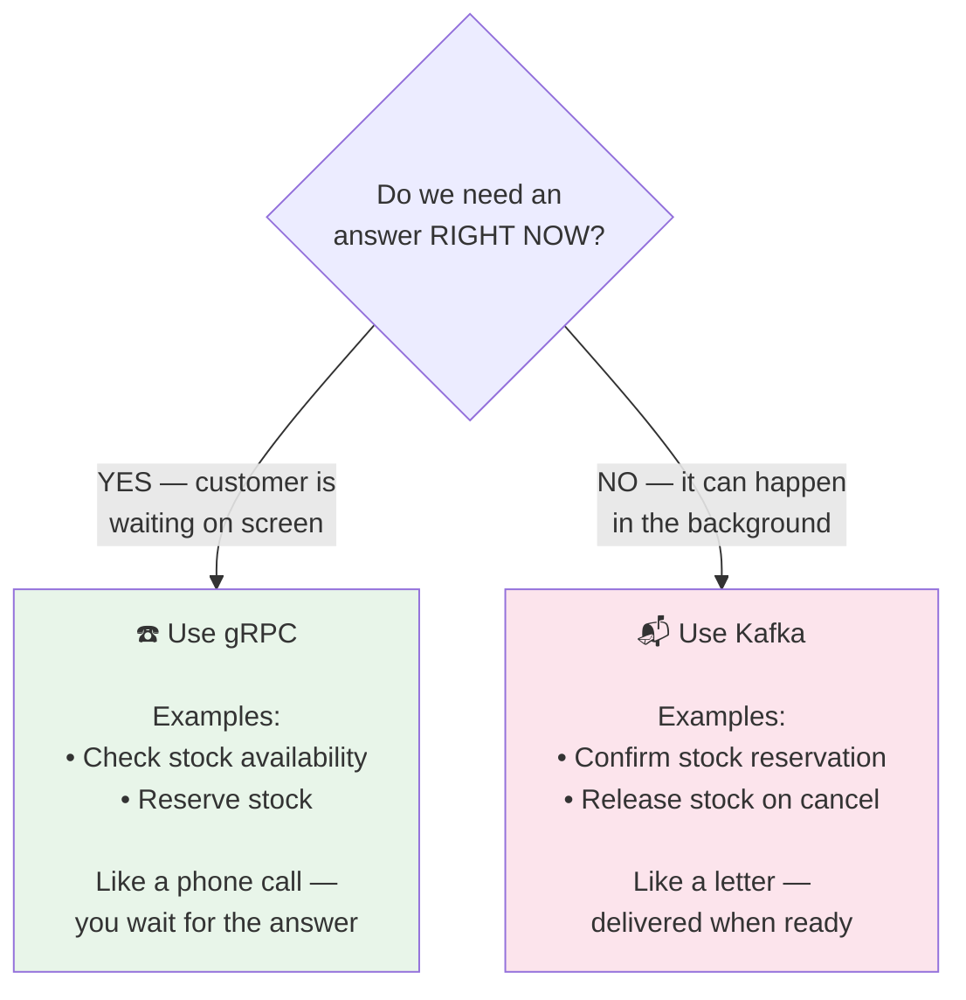

---

## What Happens When Two People Want the Same Item?

This is one of the trickiest problems in any online store. Here's how we solve it:

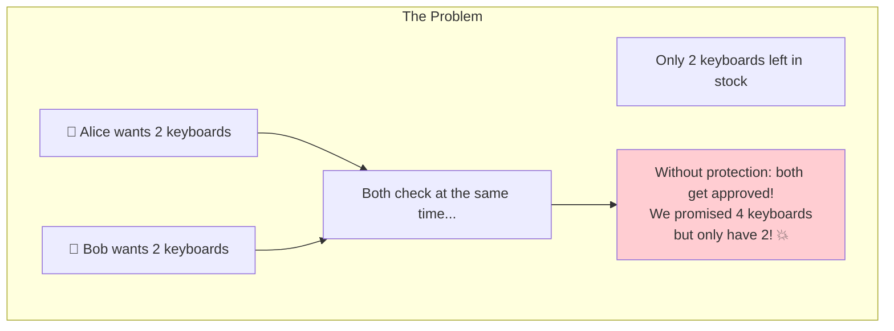

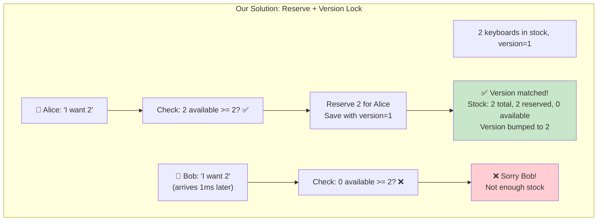

---

## How Data is Stored

### Order Service — PostgreSQL (Tables)

Think of it like a spreadsheet with rows and columns:

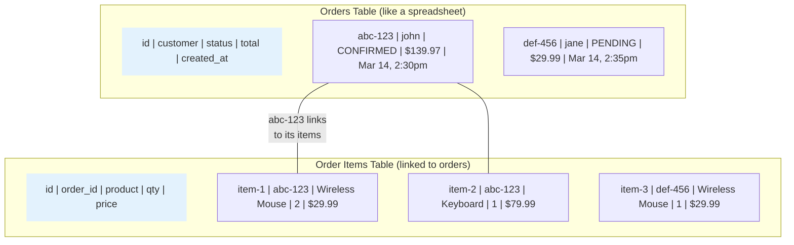

### Inventory Service — MongoDB (Documents)

Think of it like index cards — each card has all the info for one product:

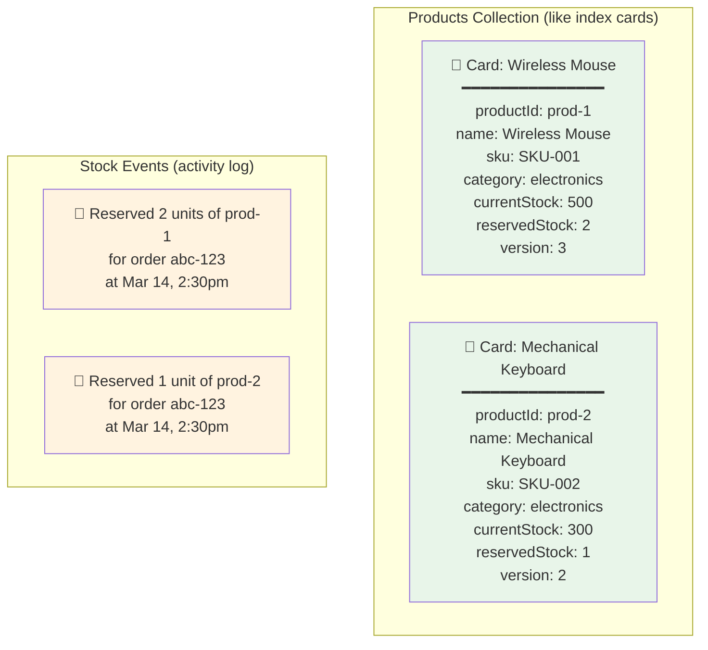

---

## Order Status — The Journey of an Order

Every order is like a package — it goes through stages:

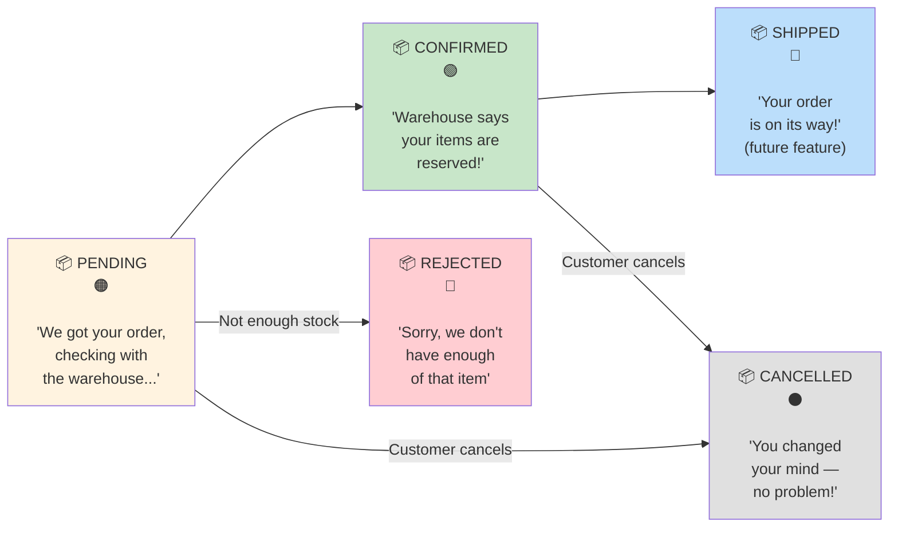

---

## The Monitoring Dashboard — How We Know Everything Is Healthy

The application tracks its own health, like a car dashboard:

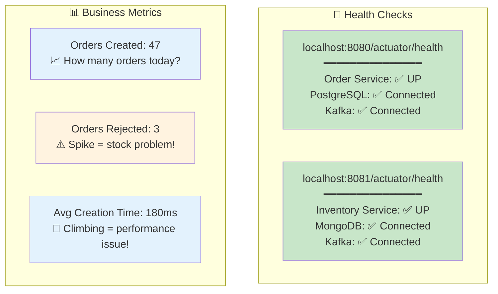

---

## The Infrastructure — What Runs Where

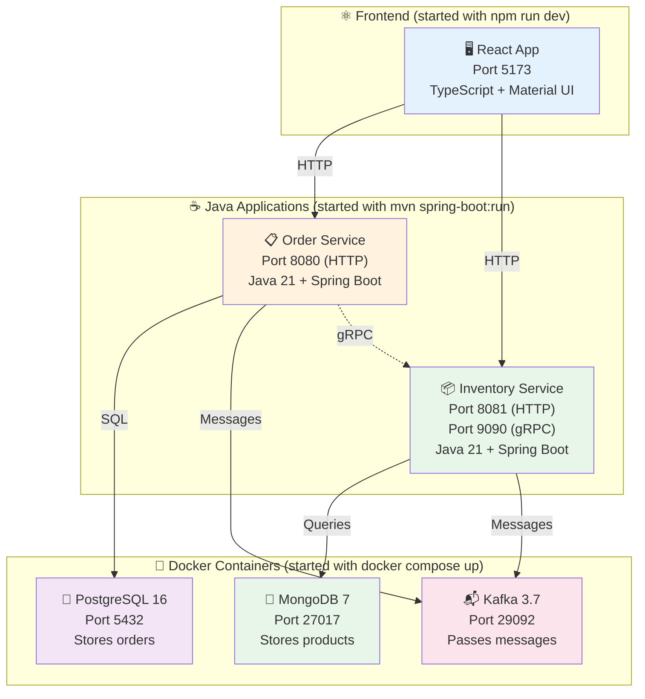

---

## How to Start Everything

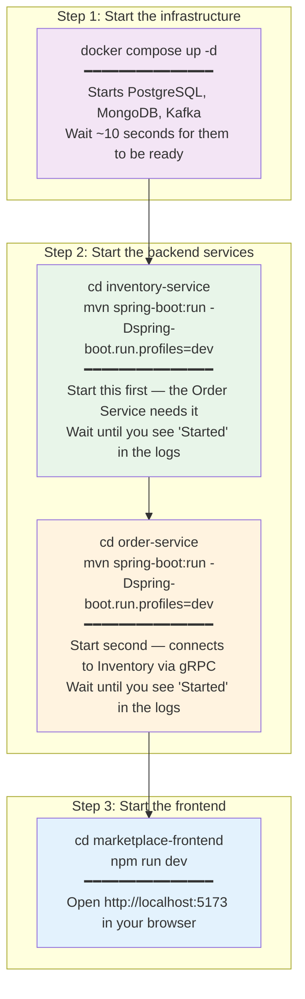
