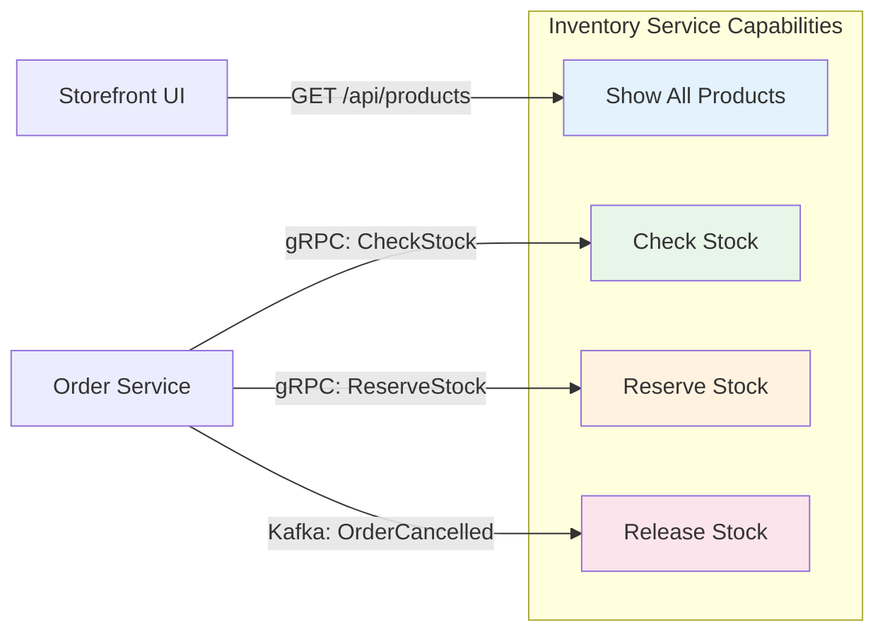
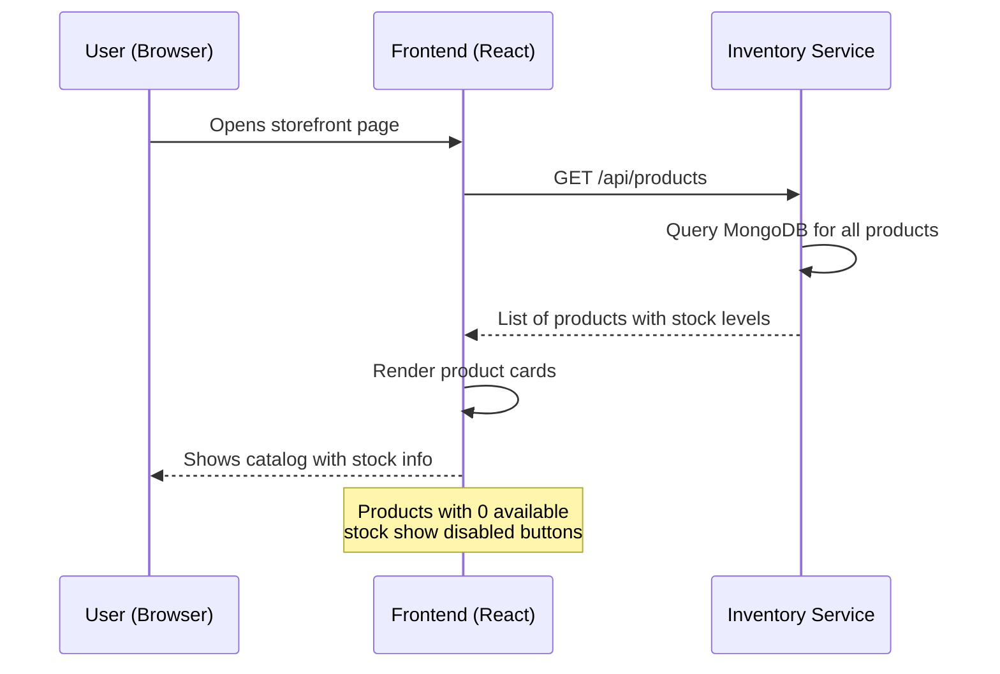
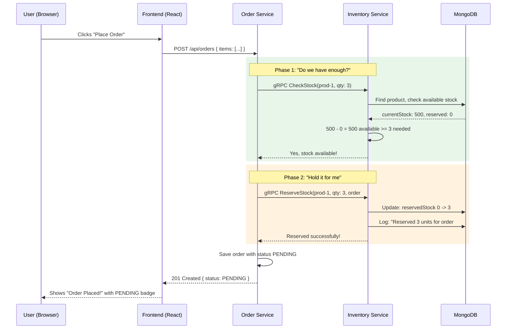
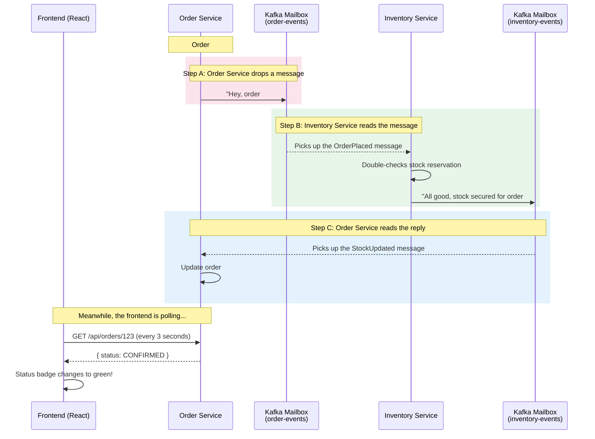
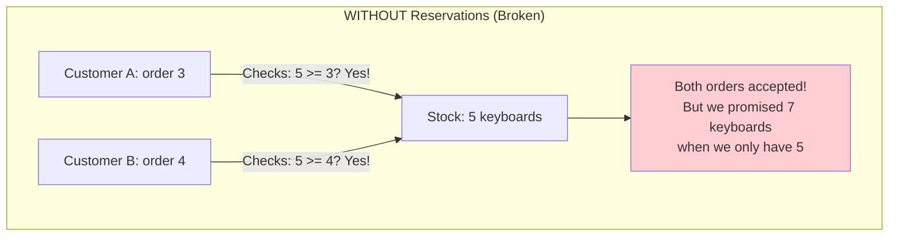
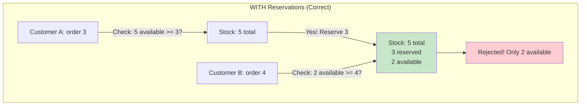
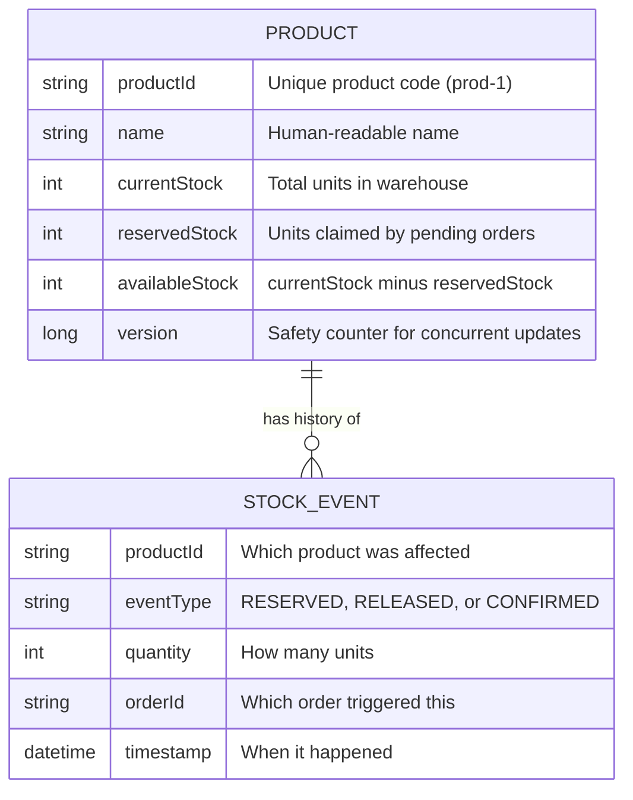
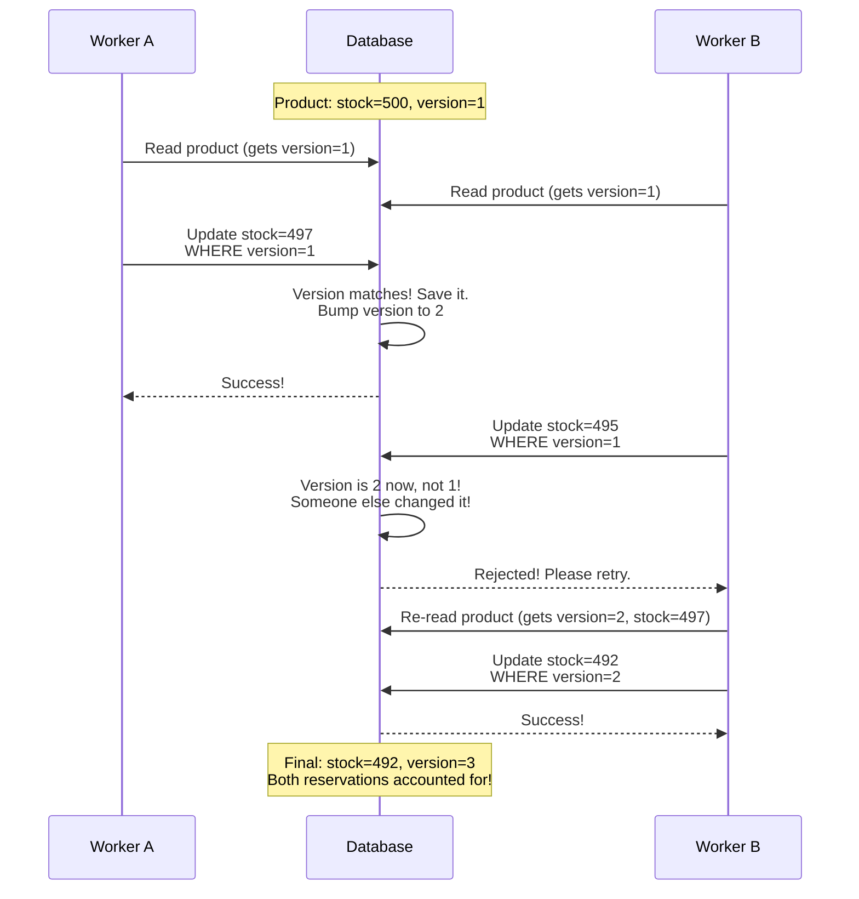
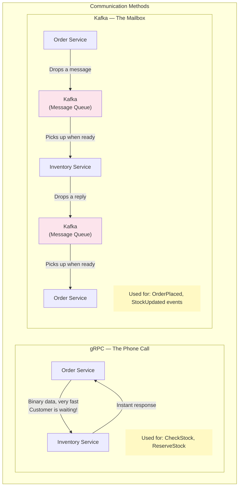
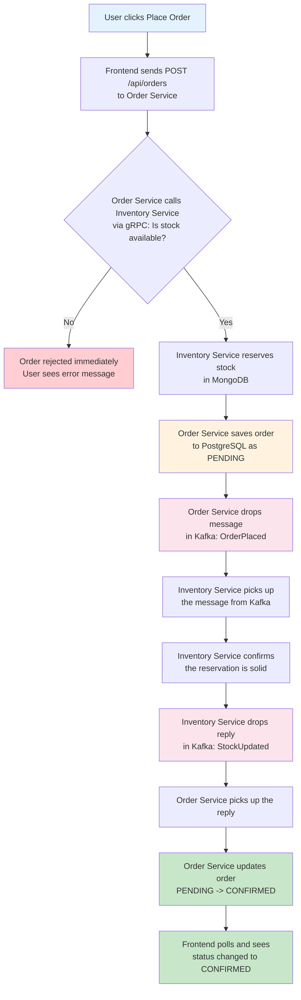

# The Inventory Service — Explained

## What is it?

Think of the Inventory Service as the **warehouse manager** of our marketplace. Its only job is to know **what products exist**, **how many we have**, and **who has claimed what**.

Just like a real warehouse has a person who tracks what's on the shelves, this service is the single source of truth for stock levels.

## What can it do?

The Inventory Service does 4 things:

1. **Show all products** — "Here's everything we sell and how much we have"
2. **Check stock** — "Do we have enough of product X to fill this order?"
3. **Reserve stock** — "Hold 3 units of product X for order #123 — don't let anyone else take them"
4. **Release stock** — "Order #123 was cancelled — put those 3 units back on the shelf"



## How Does the Storefront Use It?

When you open the storefront at `localhost:5173`, here's what happens step by step:

### Step 1 — Loading the Product Catalog

The frontend calls the Inventory Service and asks: "Give me all your products." The service responds with a list like:

| Product | Price | In Stock | Reserved | Available |
|---------|-------|----------|----------|-----------|
| Wireless Mouse | $29.99 | 500 | 0 | 500 |
| Mechanical Keyboard | $79.99 | 300 | 0 | 300 |
| USB-C Hub | $49.99 | 200 | 0 | 200 |

The frontend uses this to render the product cards you see on screen. If a product has 0 available, the "Add to Cart" button is disabled.



### Step 2 — Placing an Order

When you click "Place Order", the **Order Service** takes over — but it immediately calls the Inventory Service behind the scenes to ask two questions:

- **"Do we have enough?"** (Check Stock) — Like calling the warehouse before promising a customer their order. If the answer is no, the order is rejected immediately.

- **"Hold it for me"** (Reserve Stock) — If stock is available, the Order Service tells the warehouse: "Set aside 3 units of this product for order #123." This prevents the situation where two people buy the last item at the same time.



### Step 3 — Confirmation (the async part)

After the initial reservation, something clever happens. The Order Service drops a message into a mailbox (Kafka) saying "Hey, I placed an order." The Inventory Service picks up that message, double-checks the reservation, and drops a reply in another mailbox saying "All good, stock is secured." The Order Service reads that reply and changes the order status from PENDING to CONFIRMED.

This is like a warehouse manager sending a confirmation email after physically pulling items off the shelf — the customer's order page refreshes and shows "Confirmed."



## Why the "Reserved" vs "Available" Distinction?

This is a real-world problem. Imagine this scenario:

- We have **5 keyboards** in stock
- Customer A adds 3 keyboards to their cart and clicks "Place Order"
- At the **same instant**, Customer B tries to order 4 keyboards

Without reservations, both orders might go through (the system thinks there are 5 available for both), and we'd promise 7 keyboards when we only have 5.





This is the same system airlines use when you're booking a seat — it's "held" for you while you complete checkout.

## Where Does the Data Live?

The Inventory Service stores its data in **MongoDB** (a database optimized for document-style data). Each product looks like this:

```json
{
  "productId": "prod-1",
  "name": "Wireless Mouse",
  "currentStock": 500,
  "reservedStock": 3,
  "version": 5
}
```

It also keeps a **history log** (called Stock Events) — every time stock is reserved, released, or confirmed, it records it. Think of it as the warehouse's activity ledger:

```
"Reserved 3 units of prod-1 for order #123 at 2:30 PM"
"Released 3 units of prod-1 for order #123 at 2:45 PM" (order was cancelled)
```



## What's the "version" Field About?

This solves another real-world problem: **two things happening at the exact same time**.

Imagine two warehouse workers both read that there are 500 mice in stock. Worker A reserves 3 (sets it to 497). Worker B, who still thinks there are 500, reserves 5 (sets it to 495). Worker A's reservation just got lost!

The `version` field prevents this. Every time someone updates a product, the version number goes up. Before saving, the system checks: "Is the version still what I read earlier?" If someone else changed it in between, the save fails and it retries with fresh data. This is called **optimistic locking** — it "optimistically" assumes no conflict will happen, but catches it if it does.



## How Does It Talk to the Order Service?

The Inventory Service communicates with the Order Service in **two different ways**, each for a different purpose:

| Method | When | Why this method |
|--------|------|-----------------|
| **gRPC** (direct call) | Stock check & reservation during order placement | The Order Service needs an answer **right now** — the customer is waiting. gRPC is fast because it uses binary data instead of text. |
| **Kafka** (message queue) | Confirmation after order is placed | The customer already got their "Order Placed" response. The confirmation can happen in the background — no one is waiting. If the Inventory Service is temporarily down, the message waits in the queue and gets processed when it comes back. |

Think of it like this:
- **gRPC** = a phone call ("I need to know right now, is this in stock?")
- **Kafka** = a letter in a mailbox ("When you get a chance, confirm this reservation")



## The Complete Picture — Full Order Lifecycle

Here's everything that happens from the moment you click "Place Order" to the moment you see "Confirmed":



## Key Source Files

If you want to look at the actual code, here are the main files:

| File | What it does |
|------|-------------|
| `inventory-service/model/Product.java` | The product data structure with stock management methods |
| `inventory-service/model/StockEvent.java` | The activity ledger entries |
| `inventory-service/service/InventoryStockService.java` | Core business logic — check, reserve, release stock |
| `inventory-service/grpc/InventoryGrpcServer.java` | Handles "phone calls" (gRPC) from Order Service |
| `inventory-service/kafka/OrderEventConsumer.java` | Reads "letters" (Kafka messages) from Order Service |
| `inventory-service/kafka/InventoryEventProducer.java` | Sends "reply letters" back via Kafka |
| `inventory-service/controller/ProductController.java` | REST API for the frontend to list products |
| `inventory-service/config/DataSeeder.java` | Seeds 5 sample products on startup (dev mode only) |
