# Kafka — Explained from Scratch

## What Problem Does Kafka Solve?

Imagine you run a restaurant. When a customer places an order, the waiter could walk to the kitchen, stand there until the food is ready, and then bring it back. But that's horribly inefficient — the waiter is stuck waiting and can't serve other customers.

Instead, the waiter writes the order on a ticket and puts it on a **ticket rail**. The kitchen picks up tickets when ready, prepares the food, and puts the plate on a **pickup rail**. The waiter checks the pickup rail periodically.

**Kafka is the ticket rail between our services.**

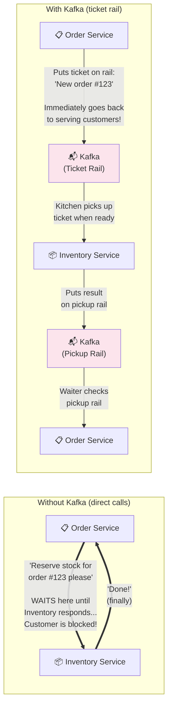

---

## The Key Concepts

Kafka has a few core concepts. Let's learn them one by one with real-world analogies.

### Topics — The Mailboxes

A **topic** is a named category of messages — like a labeled mailbox. Our project has two:

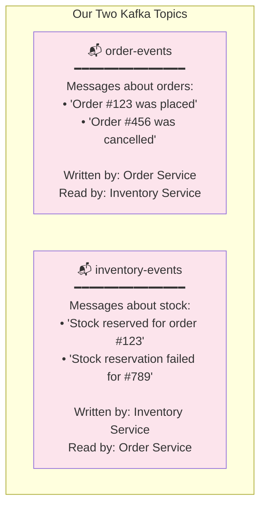

Think of topics like TV channels — Channel 1 broadcasts order news, Channel 2 broadcasts inventory news. Each service tunes into the channels it cares about.

### Messages — The Letters

Each message in Kafka has three parts:

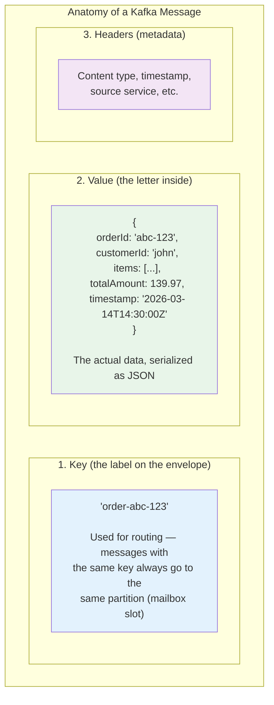

### Partitions — The Sorting Slots

Each topic is divided into **partitions** — think of them as numbered slots in the mailbox. Our topics each have 3 partitions.

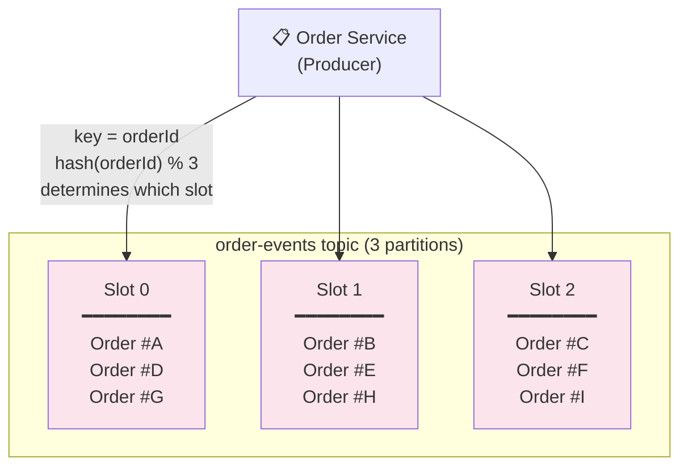

**Why partitions matter:**

1. **Parallelism** — 3 partitions means 3 consumers can read simultaneously, tripling throughput
2. **Ordering** — Messages within a partition are strictly ordered. By using `orderId` as the key, ALL events for the same order land in the same partition, guaranteeing they're processed in order

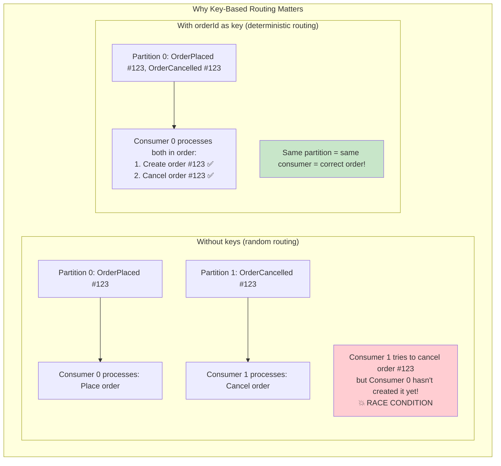

### Producers — The Writers

A **producer** is any service that writes messages to a Kafka topic. In our project:

| Producer | Topic | What it writes |
|----------|-------|---------------|
| Order Service | `order-events` | OrderPlacedEvent, OrderCancelledEvent |
| Inventory Service | `inventory-events` | StockUpdatedEvent |

### Consumers — The Readers

A **consumer** is any service that reads messages from a Kafka topic.

| Consumer | Topic | What it reads | What it does with it |
|----------|-------|-------------|---------------------|
| Inventory Service | `order-events` | OrderPlacedEvent | Reserves stock for the order |
| Order Service | `inventory-events` | StockUpdatedEvent | Updates order to CONFIRMED or REJECTED |

### Consumer Groups — Taking Turns

A **consumer group** is a set of consumers that share the work. If you have 3 partitions and 3 consumers in the same group, each consumer gets 1 partition — no message is processed twice.

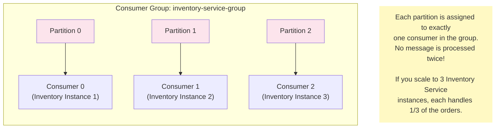

---

## How Kafka Works in Our Project

### The Three Message Types

Our project has 3 types of Kafka messages (events). Each is a Java **record** — an immutable data class:

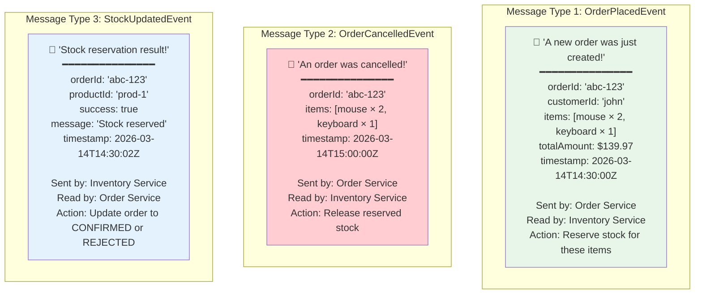

### The Complete Message Flow

Here's the full journey of messages through Kafka when you place an order:

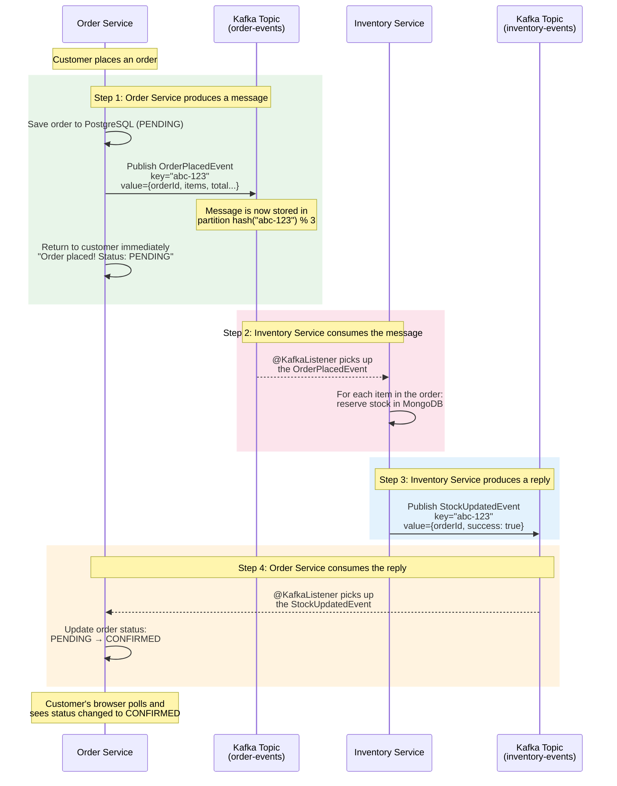

---

## How the Code Works

### Sending Messages (Producers)

The producer uses `KafkaTemplate` — Spring's helper for sending messages. Think of it as the mail service:

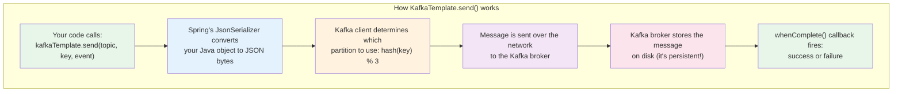

Here's the actual code pattern used in our project:

```java
// 1. Build the event (a Java record — immutable data)
var event = new OrderPlacedEvent(orderId, customerId, items, total, Instant.now());

// 2. Send it to Kafka
//    - "order-events" = which topic (mailbox)
//    - orderId = the key (determines partition)
//    - event = the message (automatically serialized to JSON)
kafkaTemplate.send("order-events", orderId, event)
    .whenComplete((result, ex) -> {
        if (ex != null) {
            log.error("Failed to send!", ex);  // Message was NOT delivered
        } else {
            log.info("Sent to partition {}", result.getRecordMetadata().partition());
        }
    });
```

**Important:** The `.send()` method returns **immediately** — it doesn't wait for Kafka to confirm. The `whenComplete` callback fires later when Kafka acknowledges receipt. This is why Kafka is "fire-and-forget" — the producer doesn't block.

### Receiving Messages (Consumers)

The consumer uses `@KafkaListener` — Spring's annotation that automatically subscribes to a topic and calls your method for every message:

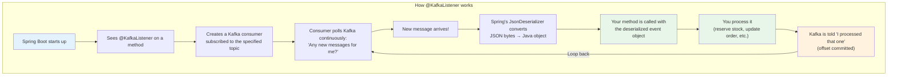

Here's the actual code pattern:

```java
// Spring Kafka calls this method automatically for every message
// on the "order-events" topic
@KafkaListener(
    topics = "order-events",                          // Which mailbox to watch
    groupId = "inventory-service-group",               // Consumer group name
    properties = {
        "spring.json.value.default.type=...OrderPlacedEvent",  // What Java class to deserialize into
        "spring.json.use.type.headers=false"                   // Use default type, ignore producer headers
    }
)
public void handleOrderPlaced(OrderPlacedEvent event) {
    // This method is called automatically — you just write the business logic
    log.info("Received OrderPlaced for order {}", event.orderId());

    for (var item : event.items()) {
        boolean success = stockService.reserveStock(item.productId(), item.quantity(), event.orderId());
        // Publish the result back to Kafka
        eventProducer.publishStockUpdated(event.orderId(), item.productId(), success, ...);
    }
}
```

**The magic:** You write a regular Java method, slap `@KafkaListener` on it, and Spring handles all the networking, polling, deserialization, and error handling. Your method just receives a nice Java object.

---

## Topic Configuration

Each service creates its topic at startup using a `@Bean`:

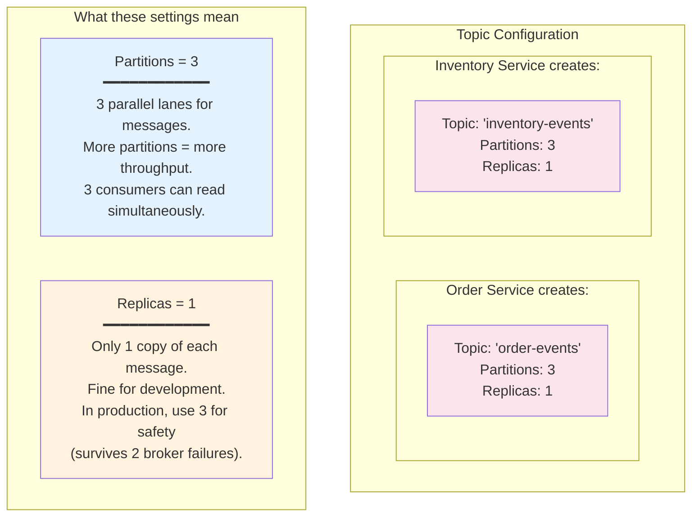

---

## Serialization — How Java Objects Become Kafka Messages

Kafka doesn't understand Java objects — it only deals with bytes. Serialization is the process of converting objects to bytes (and back).

```mermaid
graph LR
    subgraph "Producer Side (Sending)"
        OBJ1["Java Object<br/>OrderPlacedEvent(<br/>  orderId='abc',<br/>  items=[...]<br/>)"] --> SER["JsonSerializer<br/>(Spring Kafka)"]
        SER --> BYTES1["JSON Bytes<br/>{\"orderId\":\"abc\",<br/>\"items\":[...]}"]
        BYTES1 --> KF["Kafka Broker<br/>(stores bytes)"]
    end

    subgraph "Consumer Side (Receiving)"
        KF2["Kafka Broker<br/>(sends bytes)"] --> BYTES2["JSON Bytes<br/>{\"orderId\":\"abc\",<br/>\"items\":[...]}"]
        BYTES2 --> DESER["JsonDeserializer<br/>(Spring Kafka)"]
        DESER --> OBJ2["Java Object<br/>OrderPlacedEvent(<br/>  orderId='abc',<br/>  items=[...]<br/>)"]
    end

    KF -.->|"bytes travel<br/>over the network"| KF2

    style SER fill:#fff3e0
    style DESER fill:#fff3e0
```

**A tricky detail in our project:** The Order Service serializes as `com.marketplace.order.kafka.event.OrderPlacedEvent`, but the Inventory Service's class is `com.marketplace.inventory.kafka.event.OrderPlacedEvent` — different package! We solve this with `spring.json.use.type.headers=false`, which tells the consumer: "Ignore what the producer says the type is — use the default type I specified."

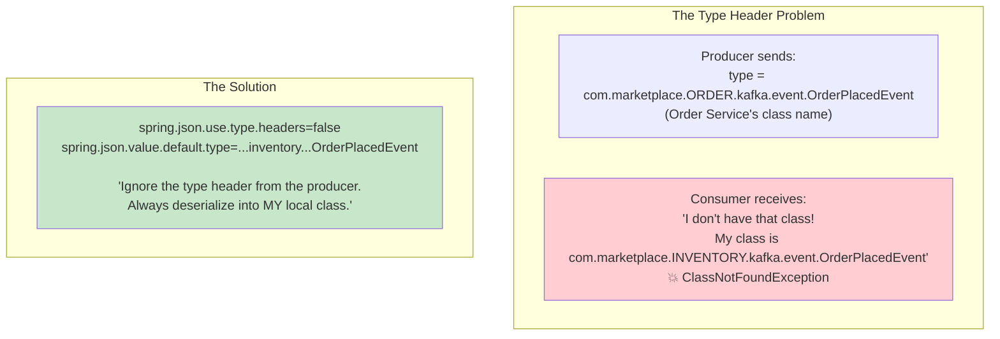

---

## Kafka Configuration in application.yml

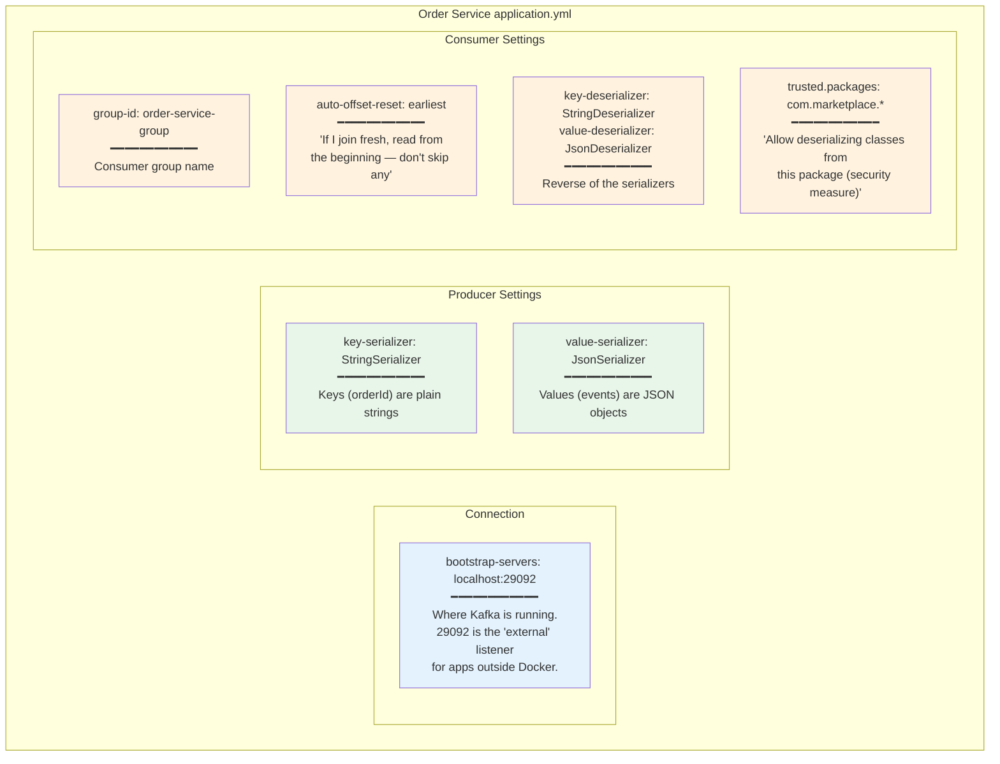

---

## KRaft Mode — Kafka Without Zookeeper

Our Kafka runs in **KRaft mode** — a newer way to run Kafka without a separate coordination service called Zookeeper.

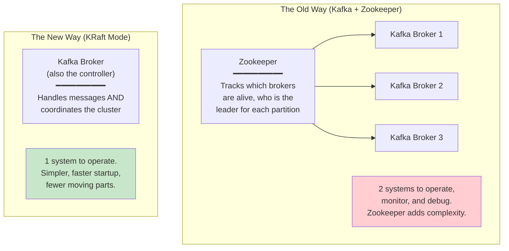

In our `docker-compose.yml`, this line enables KRaft:
```yaml
KAFKA_PROCESS_ROLES: broker,controller  # This node is BOTH broker and controller
```

---

## Why Not Just Use REST for Everything?

Here's why Kafka is better than REST for certain situations:

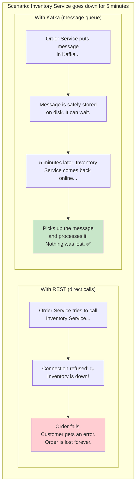

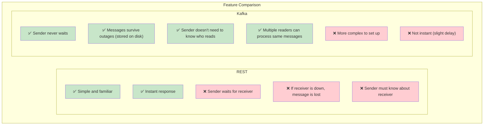

---

## Kafka vs gRPC — When We Use Each

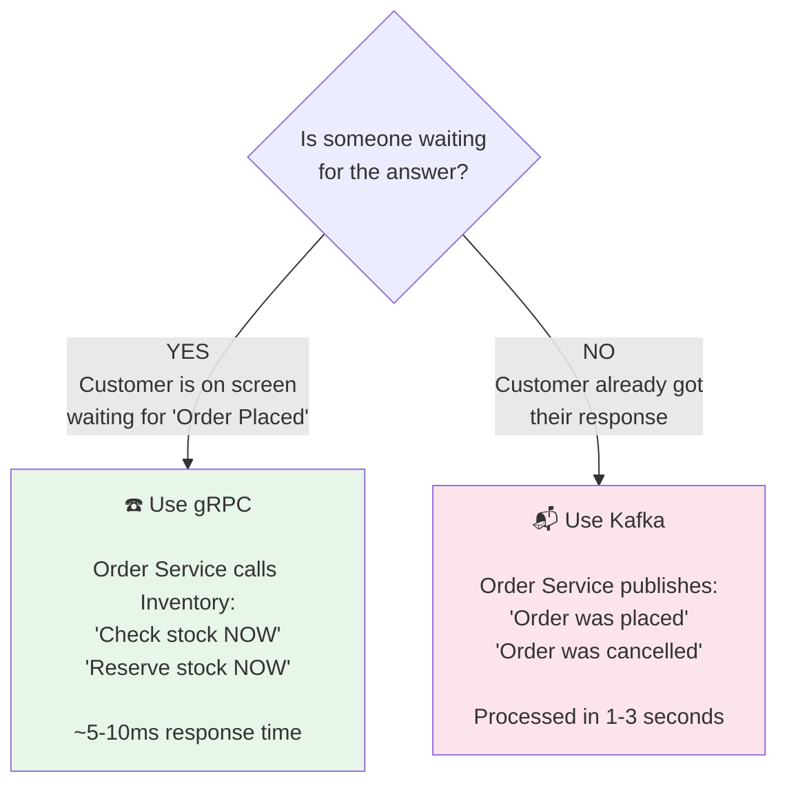

---

## The Complete Kafka Architecture in Our Project

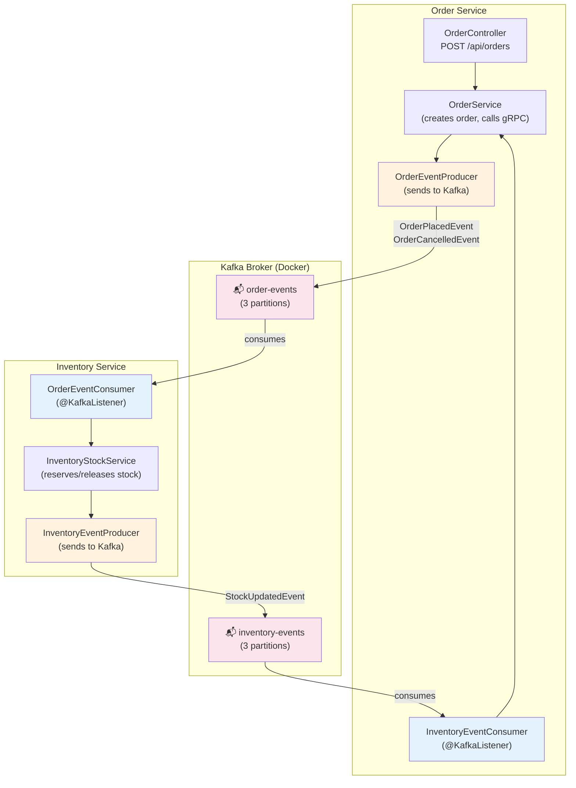

---

## Key Source Files

| File | What it does |
|------|-----------|
| `order-service/.../kafka/OrderEventProducer.java` | Sends OrderPlaced and OrderCancelled events |
| `order-service/.../kafka/InventoryEventConsumer.java` | Receives StockUpdated events, updates order status |
| `order-service/.../kafka/event/OrderPlacedEvent.java` | Message structure for new orders |
| `order-service/.../kafka/event/OrderCancelledEvent.java` | Message structure for cancelled orders |
| `order-service/.../kafka/event/StockUpdatedEvent.java` | Message structure for stock results |
| `order-service/.../config/KafkaTopicConfig.java` | Creates the "order-events" topic (3 partitions) |
| `inventory-service/.../kafka/OrderEventConsumer.java` | Receives OrderPlaced events, reserves stock |
| `inventory-service/.../kafka/InventoryEventProducer.java` | Sends StockUpdated events |
| `inventory-service/.../config/KafkaTopicConfig.java` | Creates the "inventory-events" topic (3 partitions) |
| `order-service/src/main/resources/application.yml` | Kafka connection and serializer config |
| `inventory-service/src/main/resources/application.yml` | Kafka connection and serializer config |
| `docker-compose.yml` (lines 26-42) | Kafka container in KRaft mode |

---

## Summary — Kafka in One Picture

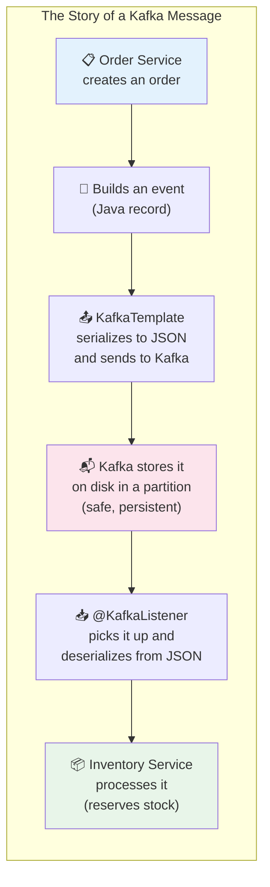

**The key insight:** Kafka decouples services in time and space. The producer doesn't know (or care) who reads its messages or when. The consumer doesn't need to be running when the message is sent. And if you need to add a third service that also cares about orders (like a notification service), just add another consumer — zero changes to the producer.
