# The Order Service — Explained

## What is it?

If the Inventory Service is the **warehouse manager**, the Order Service is the **cashier and customer service desk**. It's the part of the system that customers interact with. Its job is to:

- Take new orders from customers
- Keep track of every order and its current status
- Handle cancellations
- Report on how the business is doing (metrics)

The Order Service is the **front door** of the marketplace. Every request from the storefront or admin dashboard goes through it first.

---

## What can it do?

The Order Service exposes 4 actions through its REST API:

| Action | HTTP Method | URL | What it does |
|--------|------------|-----|-------------|
| Place an order | `POST` | `/api/orders` | Customer submits their cart, gets back an order |
| View an order | `GET` | `/api/orders/{id}` | Look up a specific order by its ID |
| List all orders | `GET` | `/api/orders` | See all orders (with pagination) |
| Cancel an order | `PUT` | `/api/orders/{id}/cancel` | Cancel a pending or confirmed order |

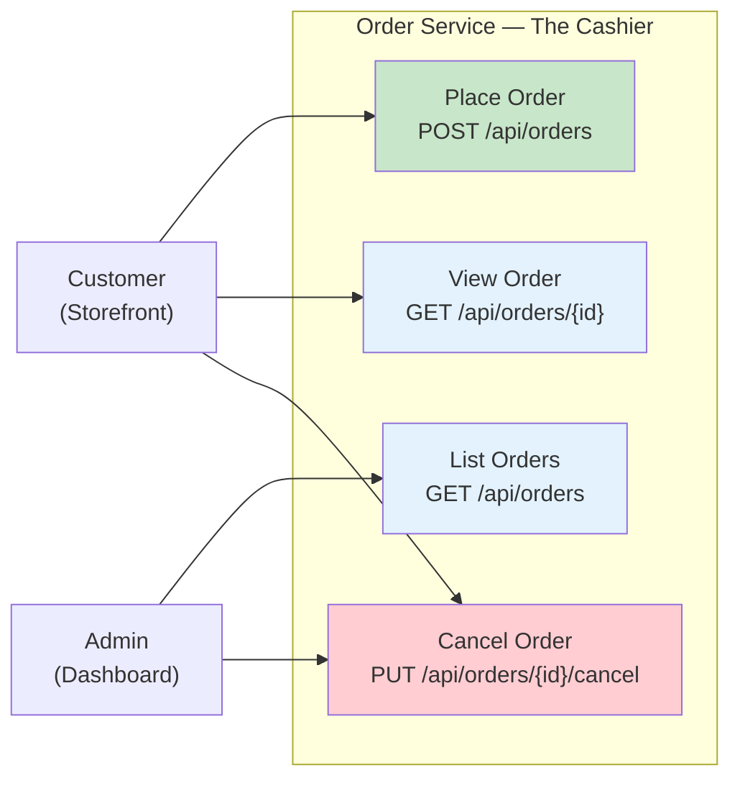

---

## The Life of an Order

Every order goes through a series of **statuses**, like a package being tracked in the mail. Here are all the possible statuses:

| Status | Color | Meaning |
|--------|-------|---------|
| **PENDING** | Orange | "We got your order, checking with the warehouse..." |
| **CONFIRMED** | Green | "The warehouse confirmed your items are reserved!" |
| **REJECTED** | Red | "Sorry, we don't have enough stock" |
| **SHIPPED** | Blue | "Your order is on the way!" (future feature) |
| **CANCELLED** | Grey | "This order was cancelled" |

Not every transition is allowed. You can't go from SHIPPED back to PENDING, for example. Here are the valid paths:

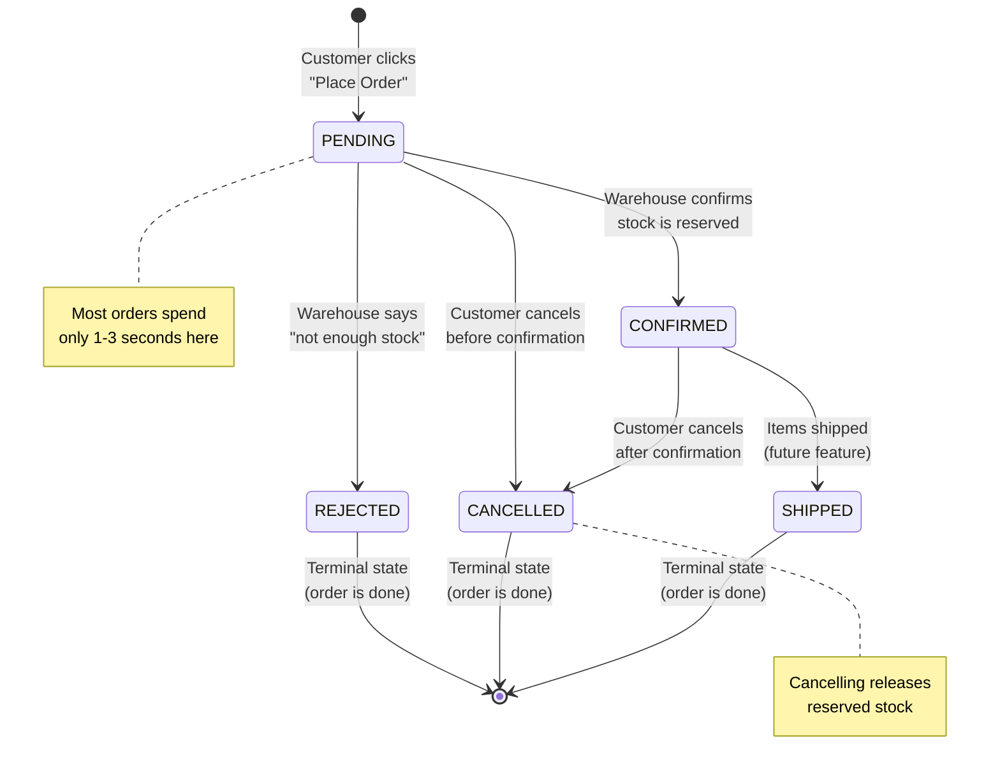

Think of it like ordering food at a restaurant:
- **PENDING** = You placed your order, the waiter is checking with the kitchen
- **CONFIRMED** = The kitchen says "yes, we can make that!"
- **REJECTED** = "Sorry, we're out of that dish"
- **CANCELLED** = You changed your mind and cancelled
- **SHIPPED** = Your food is being brought to your table

---

## How Placing an Order Works — Step by Step

This is the most complex operation in the system. Here's what happens when a customer clicks "Place Order":

### The Short Version

1. Customer sends their cart to the Order Service
2. Order Service calls the warehouse (Inventory Service) to check stock
3. If stock is available, reserve it and save the order as PENDING
4. Drop a message in the mailbox (Kafka) — "new order placed!"
5. Warehouse picks up the message, confirms, drops a reply — "all good!"
6. Order Service reads the reply, updates order to CONFIRMED
7. Customer's screen refreshes and shows green "Confirmed" badge

### The Detailed Version

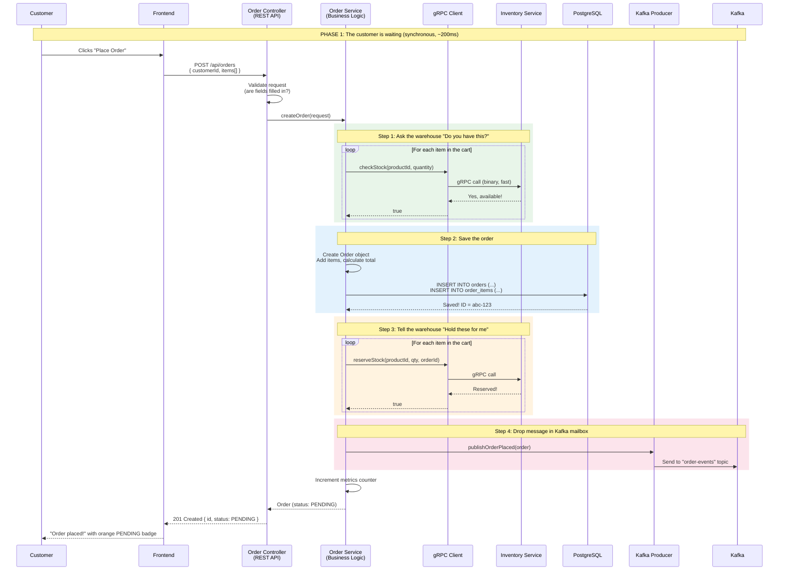

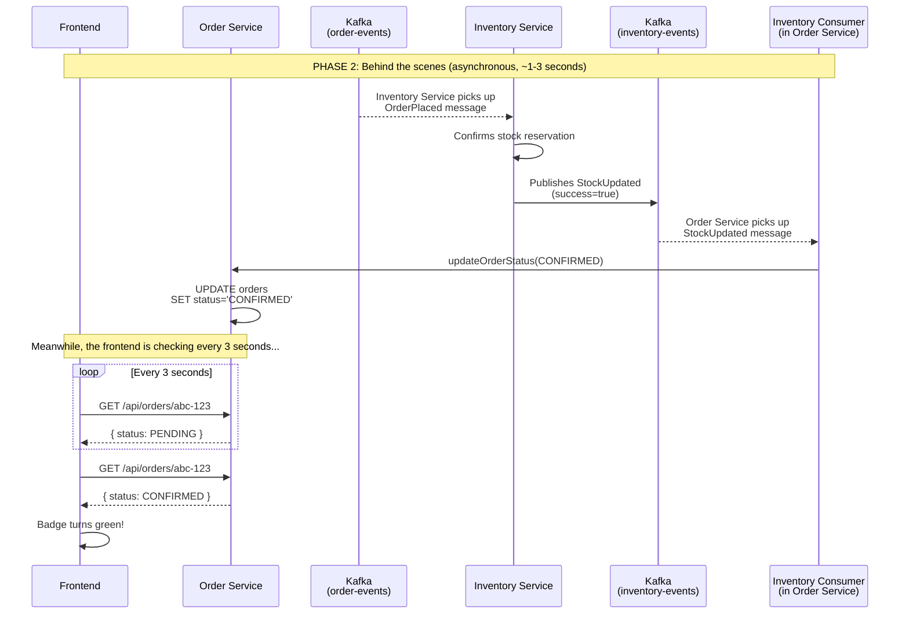

---

## What Happens When Things Go Wrong?

The Order Service handles several failure scenarios gracefully:

### Scenario 1: Not Enough Stock

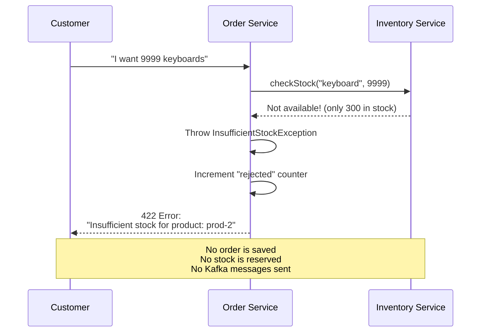

### Scenario 2: Order Not Found

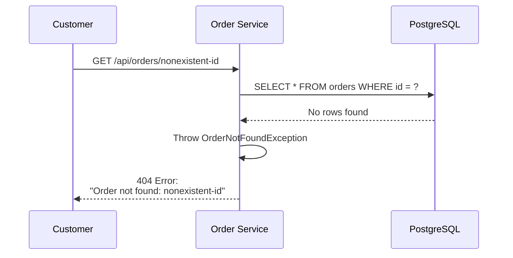

### Scenario 3: Cancelling a Shipped Order

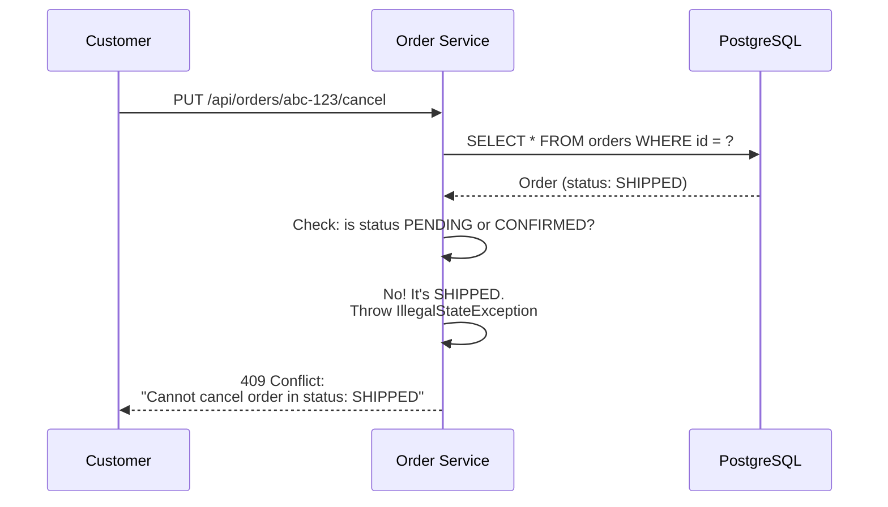

### Scenario 4: Successful Cancellation

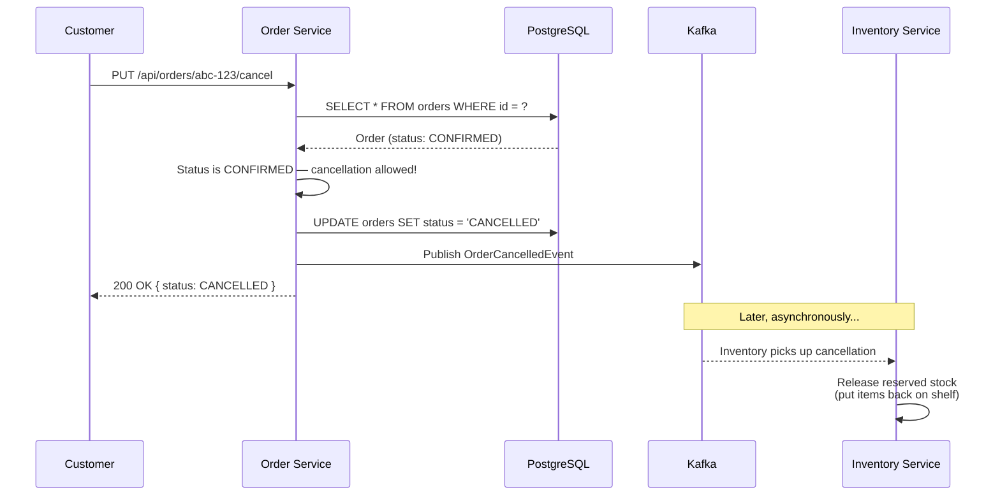

---

## Where Does the Data Live?

The Order Service uses **PostgreSQL**, a relational database. Relational databases are great for orders because:
- Orders have a clear structure (ID, customer, items, status)
- We need **transactions** — if saving an order item fails, the whole order should be rolled back
- We need to query orders by customer, status, date, etc.

The data is stored in two tables:

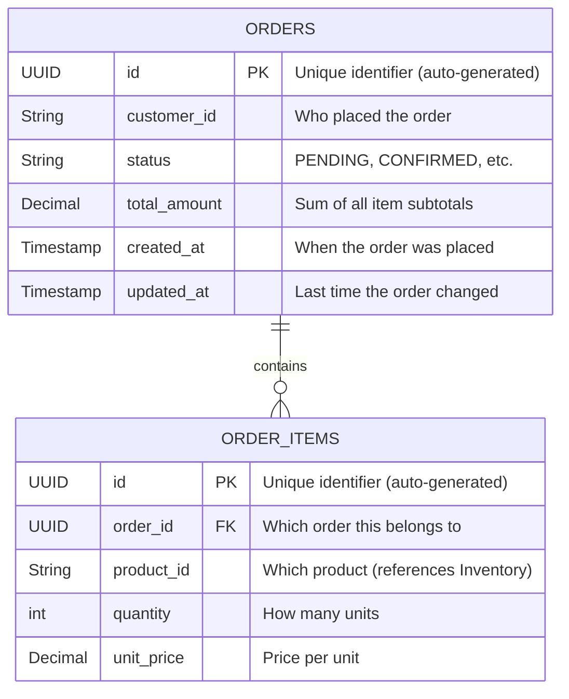

**Example data:**

**Orders table:**
| id | customer_id | status | total_amount | created_at |
|----|------------|--------|-------------|-----------|
| abc-123 | customer-1 | CONFIRMED | $159.97 | 2026-03-14 14:30:00 |
| def-456 | customer-2 | PENDING | $29.99 | 2026-03-14 14:35:00 |

**Order Items table:**
| id | order_id | product_id | quantity | unit_price |
|----|---------|-----------|----------|-----------|
| item-1 | abc-123 | prod-1 | 2 | $29.99 |
| item-2 | abc-123 | prod-3 | 2 | $49.99 |
| item-3 | def-456 | prod-1 | 1 | $29.99 |

Notice how `order_id` in the items table points back to the orders table — this is how we know which items belong to which order. This is called a **foreign key** relationship.

---

## Why PostgreSQL and Not MongoDB?

Good question! The Inventory Service uses MongoDB, so why does the Order Service use PostgreSQL?

| Feature | PostgreSQL (Order Service) | MongoDB (Inventory Service) |
|---------|--------------------------|---------------------------|
| **Data shape** | Structured, predictable | Flexible, document-based |
| **Transactions** | Strong ACID transactions | Limited transaction support |
| **Relationships** | Great for orders + items | Less natural for relationships |
| **Best for** | "I need to make sure these 3 things all happen together or none of them do" | "I need to store and retrieve documents quickly" |

Orders **must** be transactional. When you place an order, the system needs to save the order AND all its items together. If saving item #3 fails, items #1 and #2 should also be rolled back — you don't want a half-saved order. PostgreSQL guarantees this with **ACID transactions**.

The Inventory Service uses MongoDB because products are self-contained documents — you rarely need to join products with other tables, and MongoDB's flexible schema makes it easy to add new product fields without database migrations.

**Using both databases in one project is called polyglot persistence** — choosing the right database for each job rather than forcing everything into one.

---

## How the Order Service Watches Itself (Observability)

The Order Service tracks three metrics to monitor how the business and the system are performing:

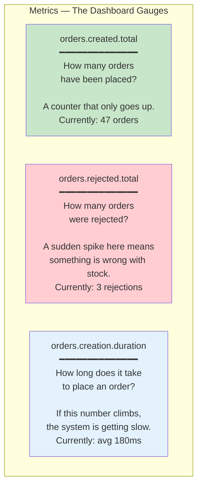

Think of these like the dashboard of a car:
- **Orders created** = odometer (total distance traveled)
- **Orders rejected** = warning light (something might be wrong)
- **Creation duration** = speedometer (how fast things are running)

These metrics are available at `http://localhost:8080/actuator/prometheus` and can be plugged into monitoring tools like Grafana to create real-time dashboards and alerts.

---

## The Role of Transactions

One of the most important concepts in the Order Service is **database transactions**. Here's a non-technical way to understand them:

Imagine you're at a bank transferring $100 from checking to savings. Two things need to happen:
1. Subtract $100 from checking
2. Add $100 to savings

What if the system crashes after step 1 but before step 2? You'd lose $100! A transaction prevents this — it says: "Either BOTH of these things happen, or NEITHER of them does."

In our Order Service, creating an order involves:
1. Insert a row in the `orders` table
2. Insert rows in the `order_items` table (one per item)
3. Call the Inventory Service to reserve stock

If step 2 fails halfway through, the transaction rolls back step 1 automatically. No half-created orders.

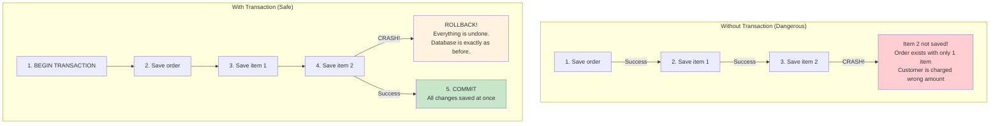

---

## Virtual Threads — Why They Matter

The Order Service uses **Java 21 Virtual Threads**, a modern feature that makes the service handle many more requests at the same time.

### The Problem (without virtual threads)

When the Order Service calls the Inventory Service via gRPC, it has to **wait** for the response. During that wait, the thread (think of it as a worker) is doing nothing — just sitting idle.

Traditional Java servers have a limited number of threads (typically 200). If 200 customers place orders at the same time, all threads are busy waiting for gRPC responses, and customer #201 gets an error: "Server too busy."

### The Solution (with virtual threads)

Virtual threads are lightweight — Java can create **millions** of them instead of just 200. When a virtual thread is waiting for a gRPC response, Java automatically **parks** it and lets another virtual thread use the same underlying resources. It's like having a waiting room instead of blocking the doorway.

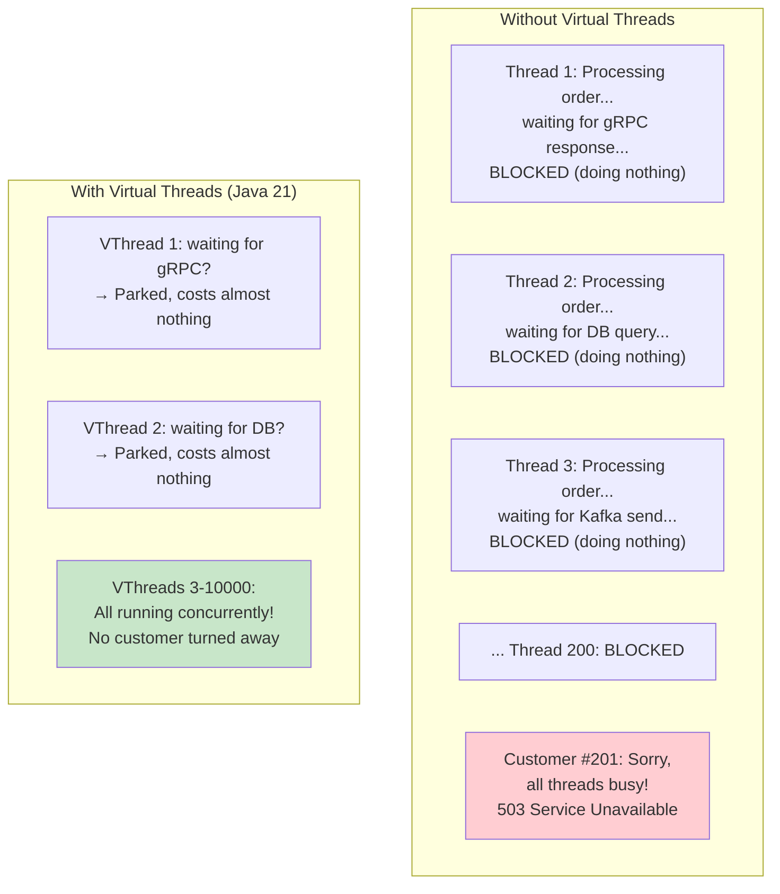

The best part? We get this for free with a single line of configuration:

```yaml
spring:
  threads:
    virtual:
      enabled: true
```

No code changes needed. Spring Boot automatically uses virtual threads for handling every request.

---

## How It Talks to Other Services

The Order Service is the **orchestrator** — it coordinates between the customer, the warehouse, and the message system:

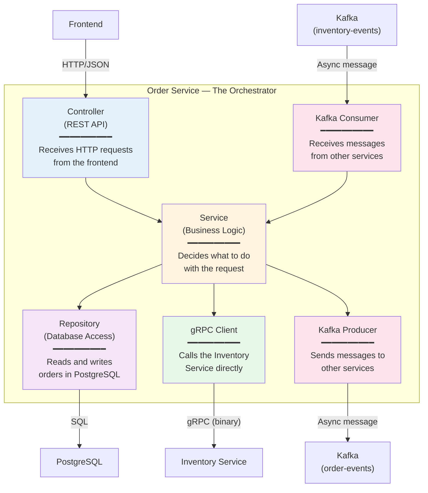

Notice how the **Service** layer is the brain — it coordinates everything. The Controller just receives requests and returns responses. The Repository, gRPC Client, and Kafka Producer/Consumer are the tools the Service uses to get work done.

---

## The Layered Architecture

The Order Service follows a common pattern called **layered architecture**. Each layer has a specific responsibility:

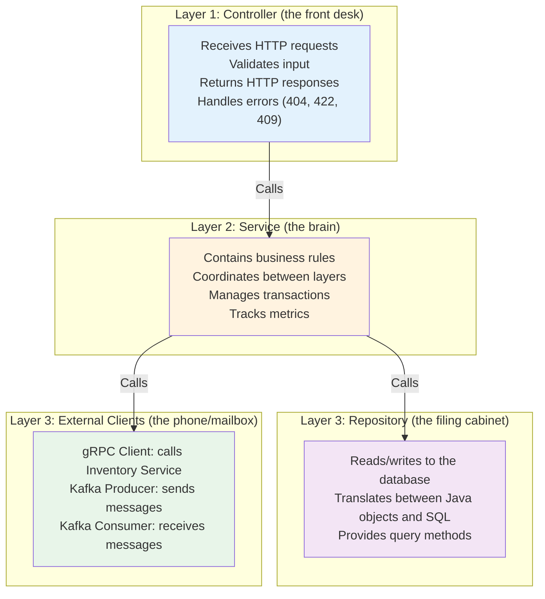

Why layers? **Separation of concerns.** Each layer only knows about the layer directly below it. The Controller doesn't know about PostgreSQL. The Service doesn't know about HTTP status codes. This makes the code easier to understand, test, and change.

---

## Key Source Files

| File | What it does |
|------|-------------|
| `order-service/controller/OrderController.java` | REST API endpoints — receives HTTP requests, returns responses |
| `order-service/service/OrderService.java` | Core business logic — create, get, cancel, update orders |
| `order-service/model/Order.java` | The order data structure — maps to the `orders` database table |
| `order-service/model/OrderItem.java` | The order item data structure — maps to `order_items` table |
| `order-service/model/OrderStatus.java` | The 5 possible order statuses (PENDING, CONFIRMED, etc.) |
| `order-service/repository/OrderRepository.java` | Database access — Spring auto-generates SQL queries |
| `order-service/grpc/InventoryGrpcClient.java` | Makes gRPC calls to the Inventory Service |
| `order-service/kafka/OrderEventProducer.java` | Sends messages to Kafka (OrderPlaced, OrderCancelled) |
| `order-service/kafka/InventoryEventConsumer.java` | Receives messages from Kafka (StockUpdated) |
| `order-service/config/MetricsConfig.java` | Defines the 3 monitoring metrics |
| `order-service/config/KafkaTopicConfig.java` | Creates the "order-events" Kafka topic |
| `order-service/config/WebConfig.java` | CORS configuration — allows the frontend to call the API |
