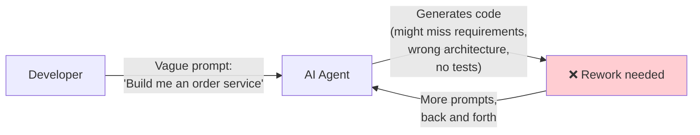
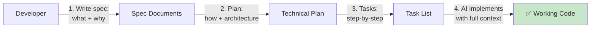
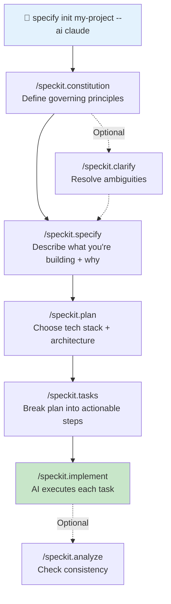
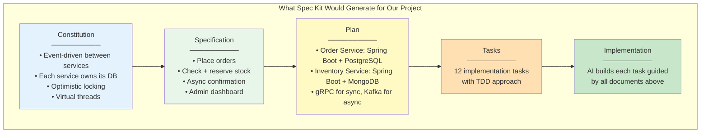
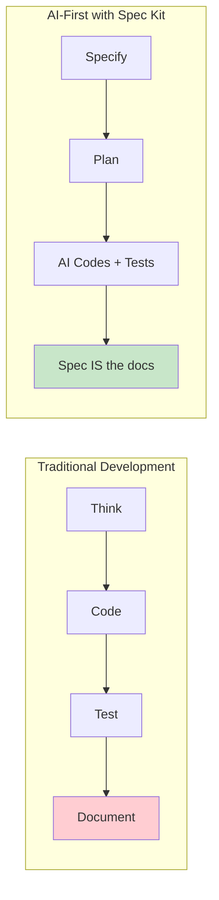

# Spec Kit — Explained from Scratch

## What Problem Does Spec Kit Solve?

When developers build software with AI coding agents (like Claude Code, GitHub Copilot, or Cursor), they usually work like this:



The problem? The AI doesn't know **what you actually want**, **why you want it**, or **what constraints matter**. You end up in an endless loop of corrections, and the AI forgets context between prompts.

**Spec Kit flips this around:**



Instead of coding first and documenting later, you **specify first** and let the AI handle implementation with full understanding of what you need.

---

## The Analogy: Building a House

Think of it like hiring a contractor to build a house:

**Without Spec Kit (typical AI development):**
- You tell the contractor: "Build me a nice house"
- They start building immediately
- You come back and say "No, I wanted 3 bedrooms, not 2"
- They tear down a wall and rebuild
- "Actually, I need a garage too"
- More rework. The house is a mess of patches.

**With Spec Kit (spec-driven development):**
- **Constitution:** "This house must follow city building codes, use sustainable materials, and be wheelchair accessible" (governing principles)
- **Specification:** "3 bedrooms, 2 bathrooms, a garage, open kitchen. The family has two kids and works from home" (what + why)
- **Plan:** "Use wood framing, concrete foundation, solar panels. Kitchen faces south for natural light" (how)
- **Tasks:** "Day 1: Pour foundation. Day 2: Frame walls. Day 3: Electrical..." (step by step)
- **Build:** The contractor builds exactly what you specified, in order, checking against the spec at every step

---

## The Six-Step Workflow



Let's break down each step:

### Step 1: Initialize

```bash
specify init my-project --ai claude
```

This creates a project structure with spec templates and configures your AI agent (Claude Code, Copilot, Cursor, etc.) with slash commands.

### Step 2: Constitution (`/speckit.constitution`)

The constitution defines **non-negotiable principles** that govern everything built in the project. Think of it like a company's engineering standards document.

Examples:
- "All services must expose health check endpoints"
- "No business logic in controllers — controllers only validate and delegate"
- "Every public API must have integration tests"
- "Use event-driven communication between services, never direct DB access"

### Step 3: Specify (`/speckit.specify`)

This is where you describe **what** you're building and **why** — without getting into technical details. Focus on the user's perspective.

Example:
> "Customers need to place orders for products. When an order is placed, the system must verify that enough stock exists before accepting it. If stock runs out between checking and reserving, the order should be rejected rather than overselling. Admins need a dashboard to see all orders and their statuses."

### Step 4: Plan (`/speckit.plan`)

Now you make **technical decisions** — architecture, tech stack, patterns:

> "Two microservices: Order Service (Spring Boot, PostgreSQL) and Inventory Service (Spring Boot, MongoDB). Synchronous stock checks via gRPC. Asynchronous order confirmation via Kafka. Virtual threads for concurrency."

### Step 5: Tasks (`/speckit.tasks`)

The AI breaks your plan into **small, actionable steps** — each one a clear unit of work:

1. Create Order entity with JPA annotations
2. Write OrderRepository interface
3. Write failing test for order creation
4. Implement OrderService.createOrder()
5. ...

### Step 6: Implement (`/speckit.implement`)

The AI agent executes each task, one by one, with the full context of the constitution, spec, and plan guiding every decision.

---

## Why Not Just Prompt the AI Directly?

```mermaid
graph TB
    subgraph "Without Spec Kit"
        A1["Prompt 1"] --> B1["Code"]
        B1 --> C1["'No, change X'"]
        C1 --> D1["More Code"]
        D1 --> E1["'That broke Y'"]
        E1 --> F1["Fix"]
        F1 --> G1["'What about Z?'"]
        G1 --> H1["😰 AI lost context"]
    end

    subgraph "With Spec Kit"
        A2["Constitution"] --> B2["Spec"]
        B2 --> C2["Plan"]
        C2 --> D2["Tasks"]
        D2 --> E2["Implementation"]
        E2 --> F2["✅ Matches spec"]
    end

    style H1 fill:#ffcdd2
    style F2 fill:#c8e6c9
```



| Problem | Without Spec Kit | With Spec Kit |
|---|---|---|
| **AI forgets context** | After many prompts, it loses track of requirements | Spec documents are always available as reference |
| **Scope creep** | AI adds features you didn't ask for | Constitution + spec define clear boundaries |
| **Inconsistent decisions** | AI makes different architecture choices in different files | Plan ensures consistent technical decisions |
| **No traceability** | Can't tell why code was written a certain way | Every implementation traces back to a spec |
| **Rework loops** | Constant back-and-forth corrections | Get it right the first time with clear specs |

---

## The File Structure

After running `specify init`, your project gets:

```
.specify/
├── memory/              # Project governance
│   └── constitution.md  # Non-negotiable principles
├── specs/               # Feature specifications
│   └── 001-feature/     # Each feature gets a folder
│       ├── spec.md      # What + why
│       ├── plan.md      # How (tech decisions)
│       └── tasks.md     # Step-by-step implementation
├── scripts/             # Automation utilities
└── templates/           # Reusable spec templates
```

---

## Spec Kit Commands at a Glance

| Command | Purpose | House Analogy |
|---|---|---|
| `/speckit.constitution` | Define governing principles | Building codes |
| `/speckit.specify` | Describe what you're building + why | Blueprints |
| `/speckit.plan` | Choose tech stack + architecture | Engineering plans |
| `/speckit.tasks` | Break into actionable steps | Construction schedule |
| `/speckit.implement` | AI executes each task | Construction |
| `/speckit.clarify` | Resolve ambiguous requirements | Client meetings |
| `/speckit.analyze` | Check consistency across artifacts | Building inspection |
| `/speckit.checklist` | Generate quality validation | Final walkthrough |

---

## How This Applies to Our Marketplace Platform

Our project was built without Spec Kit, but here's how it **could have been structured** using spec-driven development:

### Constitution (What Our Principles Would Be)

```markdown
- Microservices communicate asynchronously via Kafka for state changes
- Synchronous calls (gRPC) are only for read operations (stock checks)
- Each service owns its database — no shared databases
- All endpoints must be observable (Actuator + Micrometer metrics)
- Virtual threads enabled for all blocking I/O
- Optimistic locking for concurrent data modifications
```

### Specification (What We Built)

```markdown
Feature: Order Management

Customers place orders through a storefront. The system must:
1. Check stock availability before accepting an order
2. Reserve stock atomically (prevent overselling)
3. Confirm orders asynchronously after stock is reserved
4. Allow admins to view all orders and their statuses
5. Handle concurrent stock reservations without data corruption
```

### Plan (How We Built It)

```markdown
Architecture: Two Spring Boot microservices

Order Service:
- REST API for clients
- PostgreSQL for order persistence
- gRPC client for synchronous stock checks
- Kafka producer for order events
- Kafka consumer for inventory confirmations

Inventory Service:
- MongoDB for product/stock data
- gRPC server for stock queries
- Kafka consumer for order events
- Kafka producer for stock confirmations
- @Version for optimistic locking
```

### Tasks (What the Steps Would Look Like)

```markdown
Task 1: Order entity + repository + failing test
Task 2: Product document + repository + failing test
Task 3: gRPC proto contract + code generation
Task 4: Inventory gRPC server implementation
Task 5: Order Service gRPC client
Task 6: Kafka topic configuration
Task 7: Order placement flow (stock check → save → publish)
Task 8: Inventory consumer (reserve stock → publish confirmation)
Task 9: Order confirmation consumer (update status)
Task 10: REST controllers + error handling
Task 11: Admin dashboard frontend
Task 12: Observability (metrics, health checks)
```



---

## Why This Matters for AI-First Development

Spec Kit represents a shift in **how developers work with AI agents**:



| Traditional | AI-First with Spec Kit |
|---|---|
| Developer writes code | Developer writes specs, AI writes code |
| Documentation is an afterthought | Specs are written first and stay current |
| AI is a code autocomplete tool | AI is an autonomous implementer guided by specs |
| Context is in the developer's head | Context is in versioned spec documents |
| Knowledge lost when developer leaves | Knowledge preserved in specs |

### The Key Insight

The most valuable skill in AI-first development is no longer **writing code** — it's **writing clear specifications**. Spec Kit gives that process structure and tooling.

---

## Getting Started with Spec Kit

```bash
# Install (requires Python 3.11+ and uv package manager)
uv tool install specify-cli --from git+https://github.com/github/spec-kit.git

# Initialize in a new project
specify init my-project --ai claude

# Initialize in an existing project (like our marketplace)
cd marketplace-platform
specify init . --ai claude

# Then follow the workflow:
# /speckit.constitution → /speckit.specify → /speckit.plan → /speckit.tasks → /speckit.implement
```

### Supported AI Agents

Spec Kit works with 20+ agents including Claude Code, GitHub Copilot, Cursor, Windsurf, Google Gemini, and more. Use `--ai generic` for unsupported agents.

---

## Summary

Spec Kit is a toolkit for **spec-driven development** — the practice of writing structured specifications before code. It integrates with AI coding agents to turn specs into implementations, reducing rework and keeping the AI focused on what actually matters. For AI-first teams, it's the difference between "prompt and pray" and "specify and ship."
