# Spring Boot — Explained from Scratch

## What is Spring Boot?

Imagine you want to open a restaurant. You have two options:

**Option A: Build everything from scratch.** You design the kitchen layout, install plumbing, wire the electricity, buy ovens, set up ventilation, build the dining area, install a POS system... Before cooking a single dish, you've spent months on infrastructure.

**Option B: Move into a pre-built restaurant space.** The kitchen is already set up with standard equipment, the plumbing works, tables are in place. You just bring your recipes, hire your staff, and start cooking.

**Spring Boot is Option B.**

```mermaid
graph TB
    subgraph "Without Spring Boot (build from scratch)"
        A1["1. Set up a web server (Tomcat)"]
        A2["2. Configure database connections"]
        A3["3. Wire up dependency injection"]
        A4["4. Set up JSON serialization"]
        A5["5. Configure security, logging, metrics..."]
        A6["6. FINALLY write your business logic"]
        A1 --> A2 --> A3 --> A4 --> A5 --> A6
    end

    subgraph "With Spring Boot (pre-configured)"
        B1["1. Add dependencies to pom.xml"]
        B2["2. Write your business logic"]
        B3["Done!"]
        B1 --> B2 --> B3
    end

    style A1 fill:#ffcdd2
    style A2 fill:#ffcdd2
    style A3 fill:#ffcdd2
    style A4 fill:#ffcdd2
    style A5 fill:#ffcdd2
    style A6 fill:#c8e6c9
    style B1 fill:#e3f2fd
    style B2 fill:#c8e6c9
    style B3 fill:#c8e6c9
```

**Spring** is a massive Java framework — it's the kitchen equipment, plumbing, and wiring. It provides tools for web servers, databases, messaging, security, and more.

**Spring Boot** is the pre-configured setup. It says: "You added a database dependency? I'll configure a connection pool for you. You added a web dependency? I'll start an embedded Tomcat server. You added Kafka? I'll create producers and consumers automatically." You just write the parts that are unique to your business.

---

## Dependency Injection — The Core Idea

### The Analogy: A Restaurant Kitchen

Imagine a chef in a restaurant. The chef needs ingredients (tomatoes, flour, olive oil) to cook. There are two approaches:

**Without dependency injection:** The chef goes to the farm, picks tomatoes, goes to the mill, grinds flour, goes to the olive grove... The chef is responsible for finding and creating every ingredient.

**With dependency injection:** The restaurant has a **supply manager** who delivers fresh ingredients to the kitchen every morning. The chef just says "I need tomatoes, flour, and olive oil" and they appear on the counter. The chef doesn't care where they come from — they just use them.

**Spring is the supply manager.** Your classes declare what they need (in the constructor), and Spring provides it automatically.

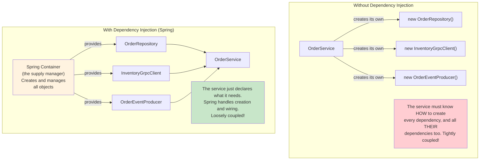

### How It Works in Our Project

Here is exactly how dependency injection works in the Order Service:

```java
// The OrderService DECLARES what it needs in its constructor.
// Spring sees these parameters and says: "I know what those are — let me provide them."
@Service
public class OrderService {

    private final OrderRepository orderRepository;
    private final InventoryGrpcClient inventoryClient;
    private final OrderEventProducer eventProducer;

    // Constructor injection — Spring automatically provides all these dependencies
    public OrderService(OrderRepository orderRepository,
                        InventoryGrpcClient inventoryClient,
                        OrderEventProducer eventProducer, ...) {
        this.orderRepository = orderRepository;
        this.inventoryClient = inventoryClient;
        this.eventProducer = eventProducer;
    }
}
```

Spring's process at startup:
1. "I see `OrderService` needs an `OrderRepository`. Let me create that first."
2. "I see `OrderService` needs an `InventoryGrpcClient`. Let me create that too."
3. "I see `OrderService` needs an `OrderEventProducer`. Let me create that."
4. "Now I have everything. Let me create `OrderService` and pass all three in."

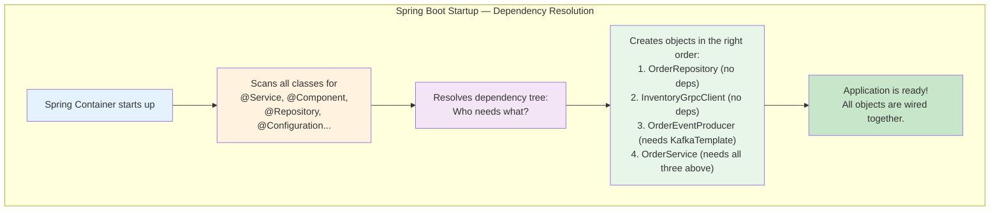

---

## Every Annotation Used in Our Project — Explained

Annotations are the labels you put on your classes and methods to tell Spring what to do with them. They start with `@`. Think of them as sticky notes you attach to your code saying "Spring, treat this as a ____."

### Core Component Annotations

These tell Spring: "This class is important — create an instance and manage it for me."

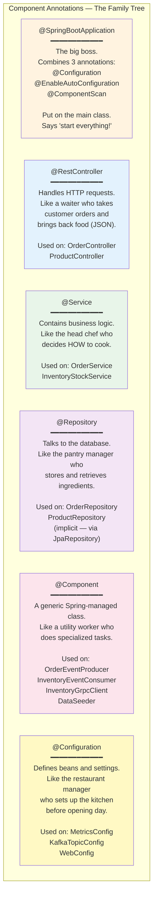

| Annotation | Restaurant Analogy | Used In Our Project |
|---|---|---|
| `@SpringBootApplication` | Opening the restaurant — turns on all the lights, starts all systems | `OrderServiceApplication`, `InventoryServiceApplication` |
| `@RestController` | The waiter — takes orders from customers (HTTP requests) and brings back results (JSON) | `OrderController`, `ProductController` |
| `@Service` | The head chef — contains the recipes (business logic) | `OrderService`, `InventoryStockService` |
| `@Repository` | The pantry manager — stores and retrieves ingredients (data) | `OrderRepository` (implicit), `ProductRepository` (implicit) |
| `@Component` | A utility worker — does specialized jobs | `OrderEventProducer`, `InventoryEventConsumer`, `InventoryGrpcClient`, `DataSeeder` |
| `@Configuration` | The restaurant manager — sets up the kitchen before opening | `MetricsConfig`, `KafkaTopicConfig`, `WebConfig` |

### HTTP Mapping Annotations

These tell Spring which HTTP requests should go to which methods — like routing phone calls to the right department.

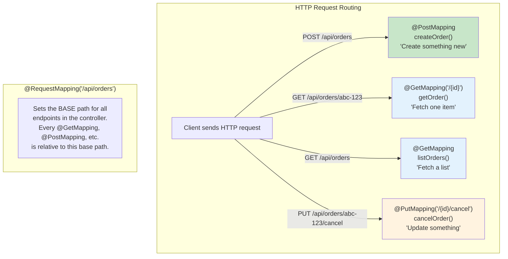

| Annotation | What It Does | Example |
|---|---|---|
| `@RequestMapping("/api/orders")` | Sets the base URL path for all endpoints in the controller | Every endpoint starts with `/api/orders` |
| `@GetMapping` | Maps HTTP GET requests (reading data) | `GET /api/orders` returns a list of orders |
| `@GetMapping("/{id}")` | Maps GET requests with a dynamic path segment | `GET /api/orders/abc-123` returns one order |
| `@PostMapping` | Maps HTTP POST requests (creating data) | `POST /api/orders` creates a new order |
| `@PutMapping("/{id}/cancel")` | Maps HTTP PUT requests (updating data) | `PUT /api/orders/abc-123/cancel` cancels an order |
| `@PathVariable` | Extracts a value from the URL path | `/{id}` in the URL becomes the `UUID id` parameter |
| `@RequestBody` | Tells Spring to convert the JSON request body into a Java object | JSON `{"customerId": "john", ...}` becomes a `CreateOrderRequest` |
| `@RequestParam` | Extracts a query parameter from the URL | `?page=0&size=20` (used by `Pageable` automatically) |

### JPA / Database Annotations (Order Service — PostgreSQL)

These tell Spring how to map Java classes to database tables. Think of them as labels that say "this field is a column, this class is a table."

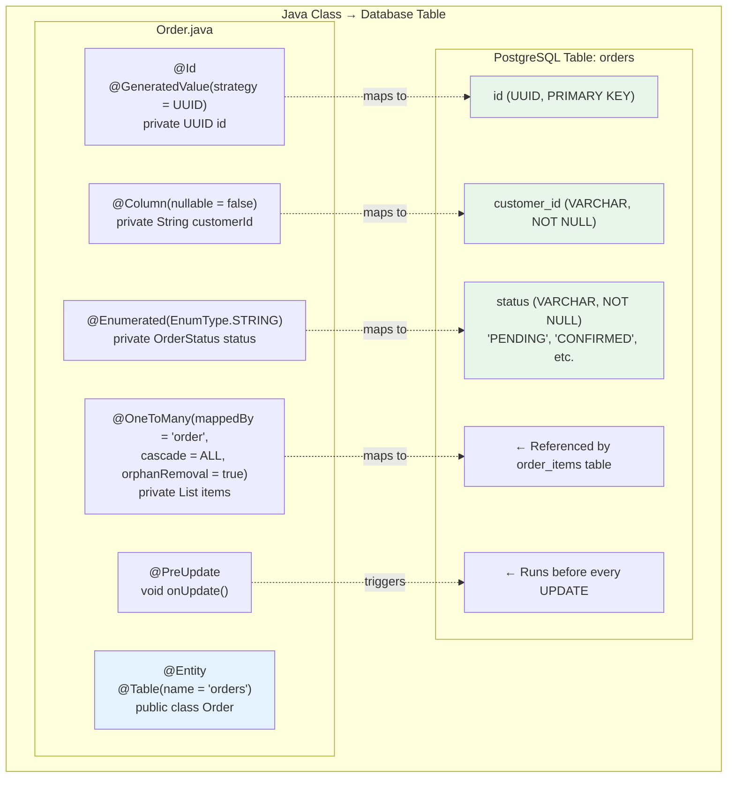

| Annotation | What It Does | Our Usage |
|---|---|---|
| `@Entity` | "This class maps to a database table" | `Order`, `OrderItem` |
| `@Table(name = "orders")` | Specifies the table name (needed because "order" is a reserved SQL word) | `Order` maps to `orders` table |
| `@Id` | "This field is the primary key" | `UUID id` in `Order` and `OrderItem` |
| `@GeneratedValue(strategy = UUID)` | "Auto-generate a UUID for new records" | Both `Order` and `OrderItem` |
| `@Column(nullable = false)` | "This column cannot be NULL in the database" | `customerId`, `status`, `productId`, `quantity`, `unitPrice` |
| `@Enumerated(EnumType.STRING)` | "Store enum values as their name ('PENDING'), not as numbers (0)" | `OrderStatus status` |
| `@OneToMany` | "One Order has many OrderItems" (one-to-many relationship) | `Order.items` |
| `@ManyToOne(fetch = LAZY)` | "Many OrderItems belong to one Order" (the other side of the relationship) | `OrderItem.order` |
| `@JoinColumn` | "This column holds the foreign key" | `order_id` in the `order_items` table |
| `@PreUpdate` | "Run this method automatically before any update" | `Order.onUpdate()` updates the `updatedAt` timestamp |

### MongoDB Annotations (Inventory Service)

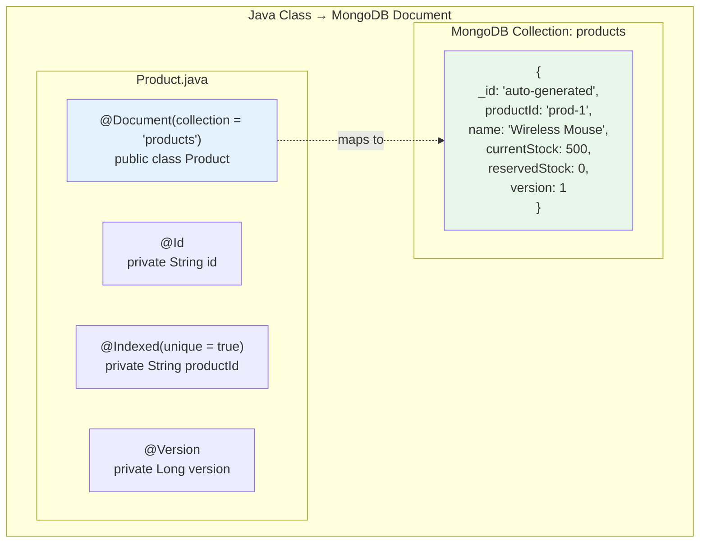

| Annotation | What It Does | Our Usage |
|---|---|---|
| `@Document(collection = "products")` | "Store this class as documents in the 'products' MongoDB collection" (like `@Entity` but for MongoDB) | `Product` |
| `@Id` | "This field is the document's unique identifier" | `Product.id` |
| `@Indexed(unique = true)` | "Create a unique index on this field for fast lookups and uniqueness" | `Product.productId` |
| `@Version` | "Use this field for optimistic locking — reject saves if the version doesn't match" | `Product.version` (prevents two requests from overwriting each other) |

### Transaction and Data Fetching Annotations

| Annotation | What It Does | Our Usage |
|---|---|---|
| `@Transactional` | "Wrap this method in a database transaction — if anything fails, undo everything" | `OrderService.createOrder()`, `cancelOrder()`, `updateOrderStatus()` |
| `@Transactional(readOnly = true)` | "Read-only transaction — optimized for queries (no dirty-checking overhead)" | `OrderService.getOrder()`, `listOrders()` |
| `@EntityGraph(attributePaths = "items")` | "When loading orders, also load their items in the same query (avoid lazy loading issues)" | `OrderRepository.findAll()` |

### Configuration and Bean Annotations

| Annotation | What It Does | Our Usage |
|---|---|---|
| `@Configuration` | "This class defines beans and settings for the application" | `MetricsConfig`, `KafkaTopicConfig`, `WebConfig` |
| `@Bean` | "The object returned by this method should be managed by Spring" | Counters, Timers, Kafka topics |
| `@Profile("dev")` | "Only activate this bean when the 'dev' profile is active" | `DataSeeder` (seeds sample data in development only) |

### Messaging and gRPC Annotations

| Annotation | What It Does | Our Usage |
|---|---|---|
| `@KafkaListener(topics = "...")` | "Call this method automatically when a message arrives on this Kafka topic" | `InventoryEventConsumer.handleStockUpdated()` |
| `@GrpcService` | "This class is a gRPC server endpoint — like `@RestController` but for gRPC" | `InventoryGrpcServer` |
| `@GrpcClient("inventory-service")` | "Inject a gRPC client stub connected to the 'inventory-service'" | `InventoryGrpcClient.inventoryStub` |

### Validation Annotations

These act as automatic guards at the door — they reject bad data before it reaches your business logic.

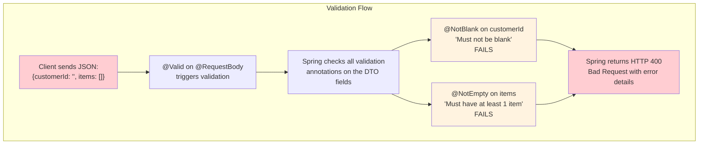

| Annotation | What It Does | Our Usage |
|---|---|---|
| `@Valid` | "Validate this object's fields before processing" | On `@RequestBody CreateOrderRequest` in the controller |
| `@NotBlank` | "Must not be null, empty, or just whitespace" | `CreateOrderRequest.customerId`, `OrderItemRequest.productId` |
| `@NotEmpty` | "List must not be null and must have at least one element" | `CreateOrderRequest.items` |
| `@Min(1)` | "Number must be at least 1" | `OrderItemRequest.quantity` |
| `@Positive` | "Number must be greater than zero" | `OrderItemRequest.unitPrice` |

---

## The Layered Architecture Pattern

Spring Boot applications follow a layered architecture — like a restaurant where each role has a clear responsibility and only talks to the next layer.

```mermaid
graph TB
    subgraph "The Layered Architecture"
        CLIENT["Client<br/>(Browser, Mobile App, curl)<br/>Sends HTTP requests"]

        subgraph "Controller Layer — The Waiter"
            CTRL["@RestController<br/>OrderController / ProductController<br/>━━━━━━━━━━━━━━━<br/>Receives HTTP requests<br/>Validates input (@Valid)<br/>Converts entities to DTOs<br/>Returns HTTP responses<br/>Handles exceptions"]
        end

        subgraph "Service Layer — The Chef"
            SVC["@Service<br/>OrderService / InventoryStockService<br/>━━━━━━━━━━━━━━━<br/>Contains business logic<br/>Orchestrates operations<br/>Manages transactions<br/>Calls other services (gRPC)<br/>Publishes events (Kafka)"]
        end

        subgraph "Repository Layer — The Pantry"
            REPO["JpaRepository / MongoRepository<br/>OrderRepository / ProductRepository<br/>━━━━━━━━━━━━━━━<br/>Reads from database<br/>Writes to database<br/>Auto-generates queries from method names"]
        end

        subgraph "Database — The Storage Room"
            DB["PostgreSQL (orders)<br/>MongoDB (products)"]
        end

        CLIENT -->|"HTTP Request<br/>POST /api/orders"| CTRL
        CTRL -->|"Calls service method<br/>orderService.createOrder(request)"| SVC
        SVC -->|"Calls repository<br/>orderRepository.save(order)"| REPO
        REPO -->|"SQL / MongoDB query"| DB
        DB -->|"Data"| REPO
        REPO -->|"Entity"| SVC
        SVC -->|"Entity"| CTRL
        CTRL -->|"HTTP Response<br/>JSON (OrderResponse DTO)"| CLIENT
    end

    style CLIENT fill:#e0e0e0
    style CTRL fill:#e3f2fd
    style SVC fill:#e8f5e9
    style REPO fill:#f3e5f5
    style DB fill:#fff3e0
```

**Why layers?** Each layer has exactly one responsibility:
- **Controller** does NOT contain business logic — it just receives requests and returns responses
- **Service** does NOT know about HTTP or JSON — it just processes business rules
- **Repository** does NOT know about business rules — it just reads and writes data

This means you can change one layer without breaking the others. For example, you could replace PostgreSQL with MySQL, and only the repository layer would need changes.

---

## Auto-Configuration Magic

The most powerful feature of Spring Boot is **auto-configuration** — it reads your `application.yml` and your dependencies, then automatically configures everything for you.

### How It Works

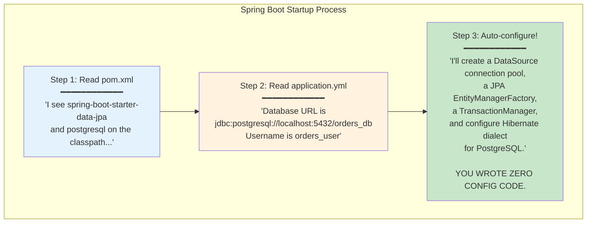

### What Gets Auto-Configured in Our Project

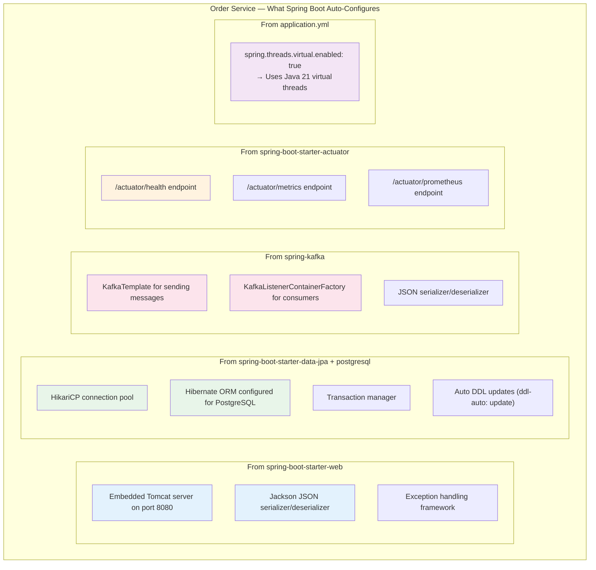

### application.yml — The Control Panel

The `application.yml` file is like the control panel for your restaurant. Every setting has a purpose:

```yaml
spring:
  application:
    name: order-service              # Name shown in logs and monitoring

  threads:
    virtual:
      enabled: true                  # Use Java 21 virtual threads for better performance

  datasource:
    url: jdbc:postgresql://localhost:5432/orders_db    # Where the database is
    username: orders_user                               # Login credentials
    password: orders_pass

  jpa:
    hibernate:
      ddl-auto: update               # Auto-create/update tables when the app starts
    properties:
      hibernate:
        dialect: org.hibernate.dialect.PostgreSQLDialect  # Tell Hibernate we're using PostgreSQL
    open-in-view: false              # Performance: don't keep DB sessions open during view rendering

  kafka:
    bootstrap-servers: localhost:29092   # Where Kafka is running
    producer:                            # How to SEND messages
      key-serializer: StringSerializer       # Keys are strings
      value-serializer: JsonSerializer       # Values are converted to JSON
    consumer:                            # How to RECEIVE messages
      group-id: order-service-group          # Consumer group identity
      auto-offset-reset: earliest            # Start reading from the beginning if new

server:
  port: 8080                         # HTTP port for REST API

grpc:
  client:
    inventory-service:
      address: static://localhost:9090    # Where the gRPC server is
      negotiation-type: plaintext         # No TLS (dev mode)

management:
  endpoints:
    web:
      exposure:
        include: health,info,metrics,prometheus    # Which monitoring endpoints to expose
```

Spring Boot reads this file at startup and uses each value to configure the corresponding subsystem. You write configuration; Spring Boot writes the code that uses it.

---

## Spring Data JPA and Spring Data MongoDB — How Repositories Work

### The Magic of Method Names

The most mind-blowing feature of Spring Data is that **you write an interface with method names, and Spring generates the SQL/queries for you.** No implementation code needed.

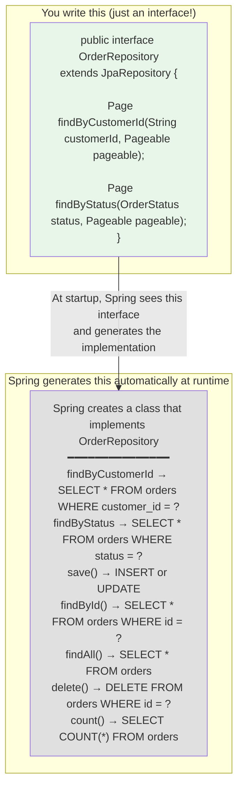

### How Method Names Become Queries

Spring Data parses the method name to build queries. It follows a pattern:

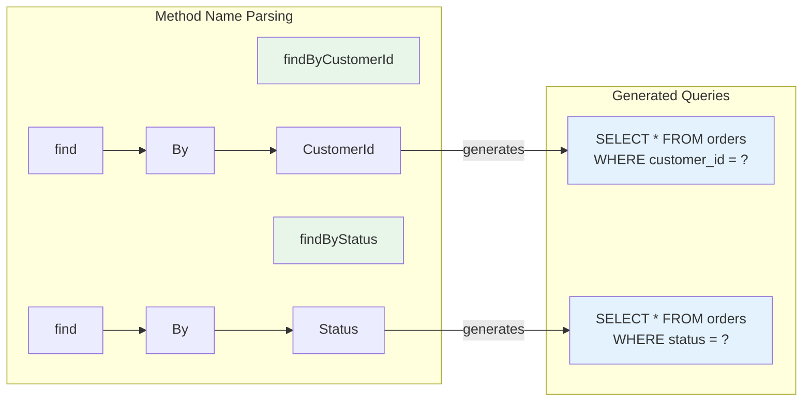

### JpaRepository vs MongoRepository

Our project uses both because we have two different databases:

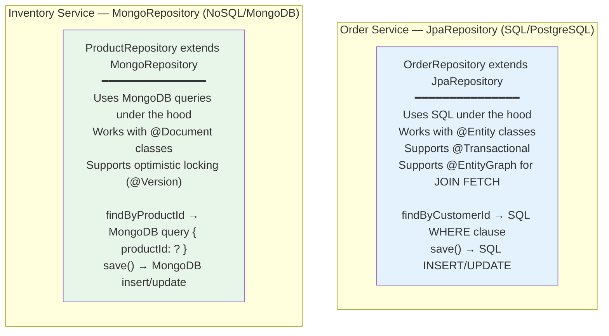

Both follow the same pattern: you declare an interface, Spring provides the implementation. The difference is only which database they talk to.

### @EntityGraph — Solving the Lazy Loading Problem

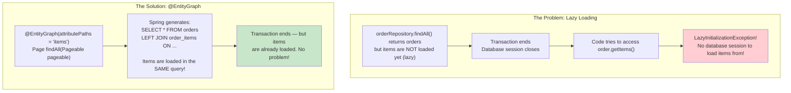

---

## Design Patterns in Spring Boot

Our project uses several well-known design patterns. Here is each one with an explanation of how it appears in the code.

### 1. Repository Pattern

**What:** Hides database access behind a clean interface. The service layer never writes SQL directly.

**In our project:** `OrderRepository` and `ProductRepository` are interfaces. The service calls `orderRepository.save(order)` without knowing whether it is PostgreSQL, MySQL, or an in-memory database.

### 2. Service Layer Pattern

**What:** All business logic lives in a dedicated layer, separate from HTTP handling and data access.

**In our project:** `OrderService` contains the logic for creating orders (check stock, save order, reserve stock, publish events). The controller just calls `orderService.createOrder(request)` and returns the result.

### 3. DTO Pattern (Data Transfer Object)

**What:** Separate objects for what the API receives/returns vs. what is stored in the database. This prevents exposing internal database structure to clients.

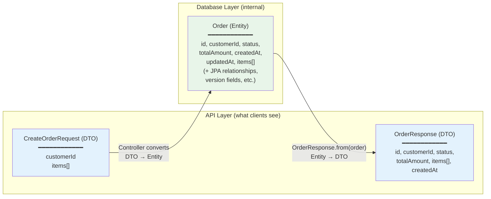

**In our project:**
- `CreateOrderRequest` and `OrderItemRequest` are input DTOs (what the client sends)
- `OrderResponse` is the output DTO (what the client receives)
- `Order` and `OrderItem` are entities (what is stored in the database)

The `OrderResponse.from(order)` factory method converts from entity to DTO.

### 4. Factory Method Pattern

**What:** A static method that creates objects, encapsulating the creation logic in one place.

**In our project:** `OrderResponse.from(Order order)` is a factory method that converts an `Order` entity to an `OrderResponse` DTO. Every controller uses it instead of manually mapping fields.

### 5. Observer Pattern (Kafka Events)

**What:** When something happens, interested parties are notified automatically, without the publisher knowing who they are.

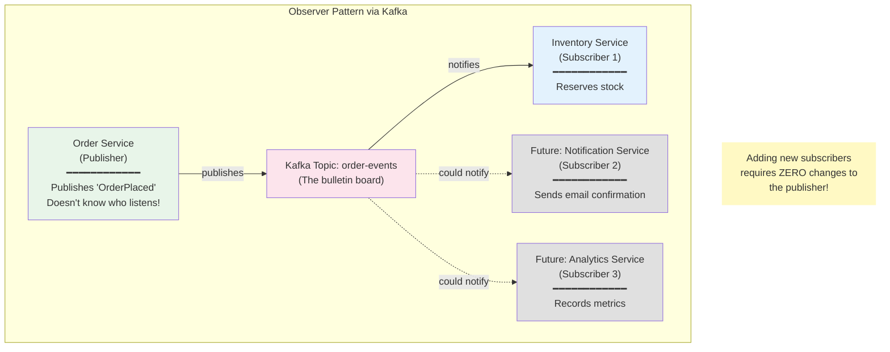

### 6. Template Method Pattern (KafkaTemplate)

**What:** A pre-built class that handles the boilerplate and lets you fill in the specifics.

**In our project:** `KafkaTemplate<String, Object>` handles serialization, partition selection, network communication, and error handling. You just call `kafkaTemplate.send(topic, key, event)` — the template handles the rest. Similarly, `JpaRepository` is a template that provides `save()`, `findById()`, `findAll()`, and `delete()` without you implementing them.

### 7. Proxy Pattern (How @Transactional Works Behind the Scenes)

**What:** Spring wraps your class in an invisible "proxy" that adds behavior before and after your methods.

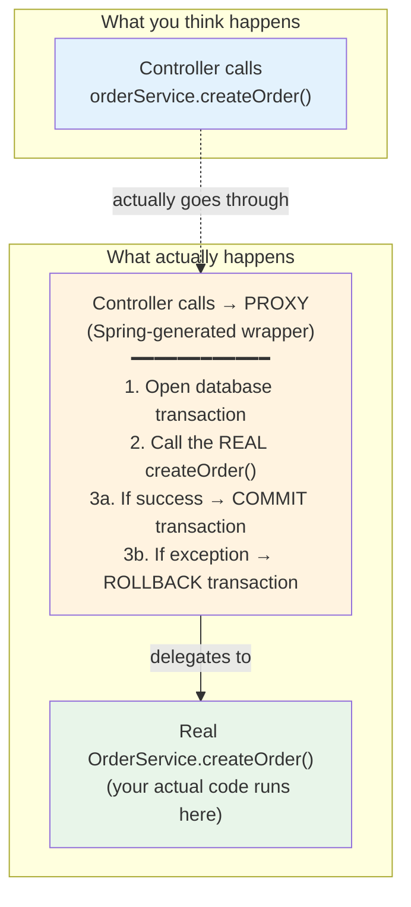

When you put `@Transactional` on a method, Spring does not modify your class directly. Instead, at startup, it creates a **proxy** — a wrapper class that looks identical to yours but adds transaction management around every call. The controller never touches your real `OrderService` directly; it always goes through the proxy.

### 8. Optimistic Locking Pattern

**What:** Instead of locking a database row (preventing others from reading it), you let everyone read and write freely, but detect conflicts using a version number.

**In our project:** The `Product` class has a `@Version` field. When two requests try to reserve stock at the same time:

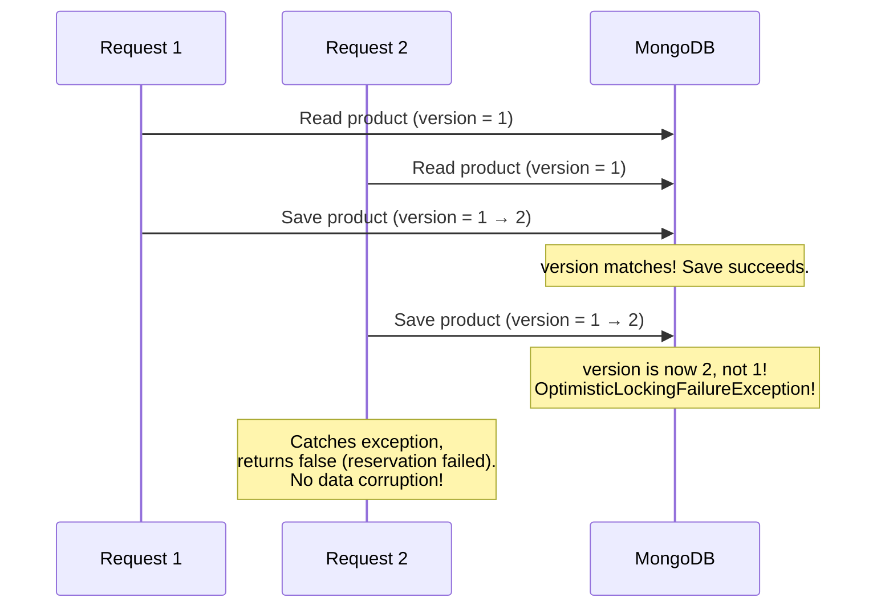

---

## Bean Lifecycle — How Spring Creates and Manages Objects

A **bean** is any object that Spring creates and manages. Every class annotated with `@Service`, `@Component`, `@Configuration`, `@RestController`, or `@Repository` becomes a bean.

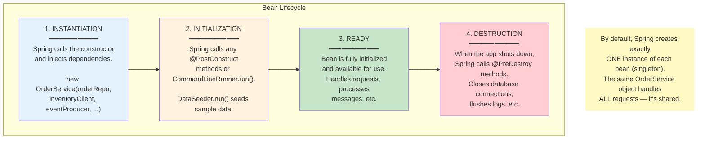

### The Singleton Scope

By default, every Spring bean is a **singleton** — there is only one instance in the entire application. This is efficient because:
- Database connection pools are shared
- Configuration objects are loaded once
- Service objects are stateless (they don't hold per-request data)

In our project, there is exactly one `OrderService` instance handling all HTTP requests. This is safe because `OrderService` is stateless — it doesn't store any request-specific data in its fields. Each request gets its own data through method parameters.

---

## Error Handling

Our project uses `@ExceptionHandler` methods in the controller to convert exceptions into proper HTTP responses.

```mermaid
graph TB
    subgraph "Error Handling Flow"
        REQ["Client sends:<br/>POST /api/orders<br/>with product that has no stock"]

        SVC["OrderService.createOrder()<br/>throws InsufficientStockException"]

        subgraph "Exception Handlers in OrderController"
            H1["@ExceptionHandler(OrderNotFoundException.class)<br/>→ Returns HTTP 404 (Not Found)"]
            H2["@ExceptionHandler(InsufficientStockException.class)<br/>→ Returns HTTP 422 (Unprocessable Entity)"]
            H3["@ExceptionHandler(IllegalStateException.class)<br/>→ Returns HTTP 409 (Conflict)"]
        end

        RES["Client receives:<br/>HTTP 422<br/>'Insufficient stock for product: prod-1'"]

        REQ --> SVC
        SVC -->|"exception bubbles up"| H2
        H2 --> RES
    end

    style REQ fill:#e3f2fd
    style SVC fill:#ffcdd2
    style H2 fill:#fff3e0
    style RES fill:#e8f5e9
```

The `@ExceptionHandler` annotation tells Spring: "When this exception is thrown by any method in this controller, catch it and call this handler method instead of returning a generic 500 error."

| Exception | HTTP Status | When It Happens |
|---|---|---|
| `OrderNotFoundException` | 404 Not Found | Order with the given ID does not exist |
| `InsufficientStockException` | 422 Unprocessable Entity | Not enough stock to fulfill the order |
| `IllegalStateException` | 409 Conflict | Trying to cancel an order that cannot be cancelled (already shipped, etc.) |

---

## Configuration Properties — How application.yml Maps to Java

Spring Boot takes the YAML configuration and injects values into your application. There are several ways this happens:

```mermaid
graph TB
    subgraph "application.yml"
        Y1["spring.datasource.url:<br/>jdbc:postgresql://localhost:5432/orders_db"]
        Y2["server.port: 8080"]
        Y3["spring.kafka.bootstrap-servers:<br/>localhost:29092"]
        Y4["grpc.client.inventory-service.address:<br/>static://localhost:9090"]
        Y5["management.endpoints.web.exposure.include:<br/>health,info,metrics,prometheus"]
    end

    subgraph "What Spring Does With Each"
        A1["Auto-configures HikariCP<br/>connection pool with this URL"]
        A2["Starts embedded Tomcat<br/>on this port"]
        A3["Configures KafkaTemplate<br/>and consumers with this server"]
        A4["Configures @GrpcClient<br/>to connect to this address"]
        A5["Exposes only these<br/>actuator endpoints"]
    end

    Y1 --> A1
    Y2 --> A2
    Y3 --> A3
    Y4 --> A4
    Y5 --> A5

    style Y1 fill:#e3f2fd
    style Y2 fill:#e3f2fd
    style Y3 fill:#e3f2fd
    style Y4 fill:#e3f2fd
    style Y5 fill:#e3f2fd
    style A1 fill:#e8f5e9
    style A2 fill:#e8f5e9
    style A3 fill:#e8f5e9
    style A4 fill:#e8f5e9
    style A5 fill:#e8f5e9
```

### How Spring Selects What to Auto-Configure

Spring Boot looks at your **classpath** (the dependencies in `pom.xml`) to decide what to configure:

```mermaid
graph TB
    subgraph "Dependency → Auto-Configuration"
        D1["spring-boot-starter-web<br/>on classpath?"] -->|"YES"| A1["Start Tomcat,<br/>configure Jackson JSON,<br/>set up MVC"]
        D2["spring-boot-starter-data-jpa<br/>+ postgresql on classpath?"] -->|"YES"| A2["Create DataSource,<br/>EntityManagerFactory,<br/>TransactionManager"]
        D3["spring-kafka<br/>on classpath?"] -->|"YES"| A3["Create KafkaTemplate,<br/>KafkaListenerContainerFactory"]
        D4["spring-boot-starter-actuator<br/>on classpath?"] -->|"YES"| A4["Create /actuator endpoints"]
        D5["spring-boot-starter-data-mongodb<br/>on classpath?"] -->|"YES"| A5["Create MongoTemplate,<br/>MongoClient"]
        D6["micrometer-registry-prometheus<br/>on classpath?"] -->|"YES"| A6["Create /actuator/prometheus<br/>metrics exporter"]
    end

    style D1 fill:#e3f2fd
    style D2 fill:#e3f2fd
    style D3 fill:#e3f2fd
    style D4 fill:#e3f2fd
    style D5 fill:#e3f2fd
    style D6 fill:#e3f2fd
    style A1 fill:#c8e6c9
    style A2 fill:#c8e6c9
    style A3 fill:#c8e6c9
    style A4 fill:#c8e6c9
    style A5 fill:#c8e6c9
    style A6 fill:#c8e6c9
```

---

## Complete Spring Boot Flow — From HTTP Request to Response

Here is the complete journey of an HTTP request through all the Spring Boot layers when a client creates a new order:

```mermaid
sequenceDiagram
    participant C as Client (Browser)
    participant T as Embedded Tomcat
    participant F as Filters & Validation
    participant CTRL as OrderController
    participant PROXY as Transactional Proxy
    participant SVC as OrderService
    participant GRPC as InventoryGrpcClient
    participant INV as Inventory Service (gRPC)
    participant REPO as OrderRepository
    participant DB as PostgreSQL
    participant KAFKA as KafkaTemplate
    participant KB as Kafka Broker

    C->>T: POST /api/orders<br/>{"customerId": "john", "items": [...]}

    Note over T: Tomcat receives the HTTP request<br/>and routes it to Spring MVC

    T->>F: Deserialize JSON → CreateOrderRequest<br/>Run @Valid validation
    Note over F: @NotBlank checks customerId<br/>@NotEmpty checks items list<br/>@Min(1) checks quantities

    F->>CTRL: createOrder(@Valid @RequestBody request)

    CTRL->>PROXY: orderService.createOrder(request)
    Note over PROXY: @Transactional proxy:<br/>BEGIN TRANSACTION

    PROXY->>SVC: createOrder(request)

    loop For each item in the order
        SVC->>GRPC: checkStock(productId, quantity)
        GRPC->>INV: gRPC call (binary, HTTP/2)
        INV-->>GRPC: available = true
        GRPC-->>SVC: true
    end

    SVC->>REPO: orderRepository.save(order)
    REPO->>DB: INSERT INTO orders ...
    DB-->>REPO: saved order with generated UUID
    REPO-->>SVC: Order entity

    loop For each item
        SVC->>GRPC: reserveStock(productId, quantity, orderId)
        GRPC->>INV: gRPC call
        INV-->>GRPC: success = true
    end

    SVC->>KAFKA: kafkaTemplate.send("order-events", orderId, event)
    KAFKA->>KB: Publish OrderPlacedEvent (async)

    SVC-->>PROXY: return saved order

    Note over PROXY: @Transactional proxy:<br/>COMMIT TRANSACTION

    PROXY-->>CTRL: Order entity

    Note over CTRL: OrderResponse.from(order)<br/>Entity → DTO conversion

    CTRL-->>T: ResponseEntity<OrderResponse><br/>HTTP 201 Created

    T-->>C: HTTP 201<br/>{"id": "abc-123", "status": "PENDING", ...}
```

---

## Key Source Files

| File | What It Is | Key Annotations |
|---|---|---|
| `OrderServiceApplication.java` | Entry point — boots the entire application | `@SpringBootApplication` |
| `OrderController.java` | HTTP endpoint handler — the waiter | `@RestController`, `@RequestMapping`, `@GetMapping`, `@PostMapping`, `@PutMapping`, `@ExceptionHandler` |
| `OrderService.java` | Business logic — the chef | `@Service`, `@Transactional` |
| `OrderRepository.java` | Database access for orders | `JpaRepository`, `@EntityGraph` |
| `Order.java` | Database entity for orders | `@Entity`, `@Table`, `@Id`, `@GeneratedValue`, `@Column`, `@OneToMany`, `@Enumerated`, `@PreUpdate` |
| `OrderItem.java` | Database entity for order line items | `@Entity`, `@Table`, `@Id`, `@ManyToOne`, `@JoinColumn` |
| `CreateOrderRequest.java` | Input DTO for order creation | `@NotBlank`, `@NotEmpty`, `@Valid` |
| `OrderItemRequest.java` | Input DTO for order items | `@NotBlank`, `@Min`, `@Positive` |
| `OrderResponse.java` | Output DTO for API responses | Factory method pattern |
| `MetricsConfig.java` | Defines monitoring metrics | `@Configuration`, `@Bean` |
| `KafkaTopicConfig.java` | Creates Kafka topics at startup | `@Configuration`, `@Bean` |
| `WebConfig.java` | CORS configuration | `@Configuration`, implements `WebMvcConfigurer` |
| `OrderEventProducer.java` | Sends events to Kafka | `@Component`, uses `KafkaTemplate` |
| `InventoryEventConsumer.java` | Receives events from Kafka | `@Component`, `@KafkaListener` |
| `InventoryGrpcClient.java` | gRPC client for Inventory Service | `@Component`, `@GrpcClient` |
| `InventoryStockService.java` | Inventory business logic | `@Service` |
| `ProductController.java` | HTTP endpoint for products | `@RestController`, `@GetMapping` |
| `ProductRepository.java` | MongoDB access for products | `MongoRepository` |
| `Product.java` | MongoDB document for products | `@Document`, `@Id`, `@Indexed`, `@Version` |
| `InventoryGrpcServer.java` | gRPC server for stock checks | `@GrpcService` |
| `DataSeeder.java` | Seeds sample data in dev mode | `@Component`, `@Profile("dev")`, `CommandLineRunner` |
| `application.yml` (both services) | All configuration settings | Read by Spring Boot auto-configuration |

---

## Summary — Spring Boot in One Picture

```mermaid
graph TB
    subgraph "The Story of Spring Boot"
        A["You write annotated Java classes<br/>@Service, @RestController, @Repository, @Configuration"]
        B["Spring Boot scans your code at startup<br/>and finds all annotated classes"]
        C["It reads application.yml<br/>for database URLs, ports, Kafka servers, etc."]
        D["It checks your dependencies (pom.xml)<br/>and auto-configures everything:<br/>web server, database, Kafka, gRPC, metrics"]
        E["It creates all beans (objects),<br/>resolves dependencies between them,<br/>and wires everything together"]
        F["Your application is ready!<br/>All you wrote was business logic<br/>and a few configuration lines."]

        A --> B --> C --> D --> E --> F
    end

    style A fill:#e3f2fd
    style B fill:#fff3e0
    style C fill:#f3e5f5
    style D fill:#fce4ec
    style E fill:#e8f5e9
    style F fill:#c8e6c9
```

**The key insight:** Spring Boot inverts the traditional approach. Instead of you configuring and creating everything, you just declare what you need (via annotations and YAML), and Spring Boot figures out how to wire it all together. You focus on business logic; Spring Boot handles the infrastructure.
