# Virtual Threads — Explained from Scratch

## What Problem Do Virtual Threads Solve?

To understand virtual threads, you first need to understand what a **thread** is and why traditional threads have a problem.

### What's a Thread?

Think of a thread as a **worker** in a restaurant. Each worker can handle one customer at a time. When a customer places an order, the worker:

1. Takes the order
2. Walks to the kitchen and **waits** for the food
3. Brings the food back

The waiting part is the problem.

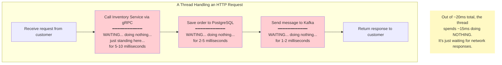

### The Traditional Thread Problem

A traditional Java server (Tomcat) creates a **pool of platform threads** — typically around 200. Each thread is backed by an operating system thread, which is expensive: each one takes about 1MB of memory and OS resources.

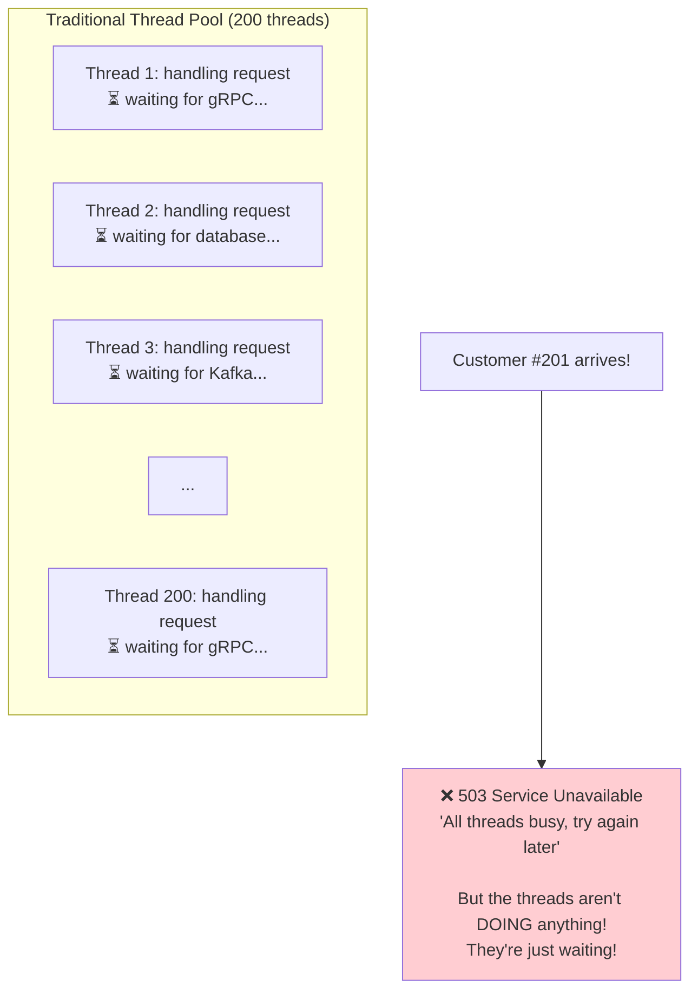

**The irony:** All 200 threads are "busy" but none of them are actually doing work. They're all just **waiting** for network responses. The CPU is practically idle, but the server can't accept new requests.

This is like a restaurant with 200 waiters, all standing in the kitchen waiting for food, while new customers are turned away at the door.

---

## The Solution: Virtual Threads

Java 21 introduced **virtual threads** — lightweight threads that are managed by the JVM instead of the operating system. Here's the key difference:

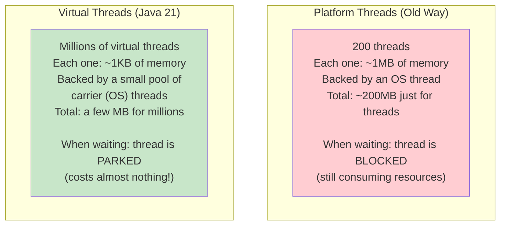

### How Virtual Threads Work — The Hotel Analogy

Think of **carrier threads** as hotel rooms and **virtual threads** as guests.

**Old way (platform threads):** Each guest gets their own room for the entire stay. If they leave to go sightseeing for 8 hours, the room sits empty — but it's still "theirs." With 200 rooms, you can only have 200 guests.

**New way (virtual threads):** Guests share rooms. When a guest leaves to go sightseeing (= waiting for a network response), they check out and the room becomes available for another guest. When they return, they check into any available room. With 200 rooms, you can serve **thousands** of guests because most are out sightseeing at any given time.

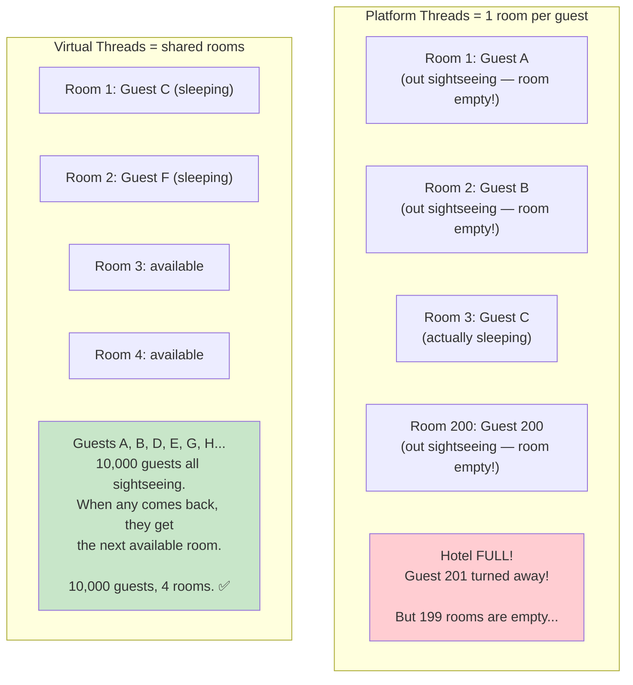

---

## What Happens Under the Hood

When a virtual thread hits a blocking operation (like a network call), here's what actually happens:

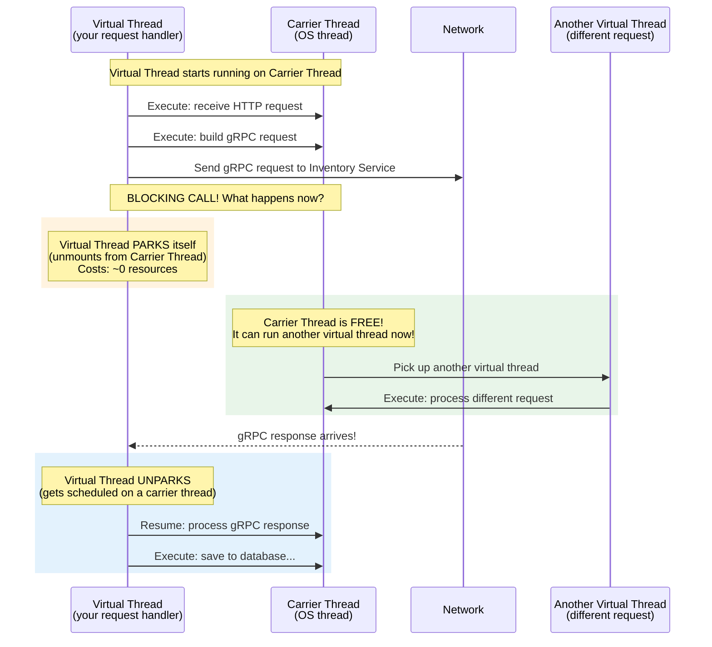

The key insight: **the carrier thread is never wasted.** When one virtual thread parks, the carrier immediately picks up another virtual thread that has work to do.

---

## Virtual Threads in Our Order Service

Here's specifically what happens in our Order Service when virtual threads are enabled:

```mermaid
graph TB
    subgraph "Processing Order #123 (Virtual Thread 1)"
        A1["1. Receive POST /api/orders<br/>▶️ Running on Carrier-1"]
        A2["2. gRPC: checkStock()<br/>⏸️ PARK — Carrier-1 is freed"]
        A3["3. gRPC response arrives<br/>▶️ Resume on Carrier-3"]
        A4["4. Save to PostgreSQL<br/>⏸️ PARK — Carrier-3 is freed"]
        A5["5. DB response arrives<br/>▶️ Resume on Carrier-1"]
        A6["6. gRPC: reserveStock()<br/>⏸️ PARK — Carrier-1 is freed"]
        A7["7. gRPC response arrives<br/>▶️ Resume on Carrier-2"]
        A8["8. Kafka: send event<br/>⏸️ PARK — Carrier-2 is freed"]
        A9["9. Kafka confirms<br/>▶️ Resume on Carrier-1"]
        A10["10. Return HTTP response"]
        A1 --> A2 --> A3 --> A4 --> A5 --> A6 --> A7 --> A8 --> A9 --> A10
    end

    Note["Notice: the virtual thread bounces<br/>between different carrier threads!<br/>It doesn't 'own' any carrier thread.<br/><br/>Each ⏸️ PARK moment lets the<br/>carrier serve another request."]

    style A2 fill:#fff3e0
    style A4 fill:#fff3e0
    style A6 fill:#fff3e0
    style A8 fill:#fff3e0
    style Note fill:#fff9c4,stroke:none
```

### How many requests can we handle?

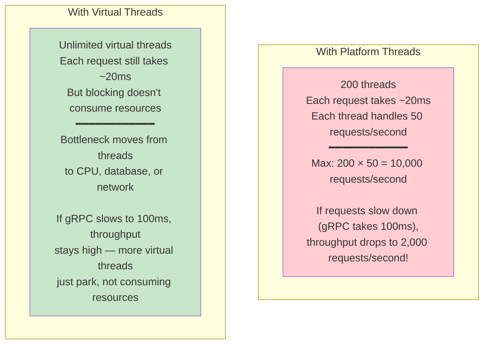

---

## How to Enable Virtual Threads

This is the best part — it takes exactly **two lines of configuration:**

```yaml
# application.yml
spring:
  threads:
    virtual:
      enabled: true
```

That's it. No code changes. Spring Boot automatically:
1. Configures Tomcat to use virtual threads for handling HTTP requests
2. Every incoming request gets its own virtual thread
3. All blocking operations (gRPC, database, Kafka) automatically park instead of blocking

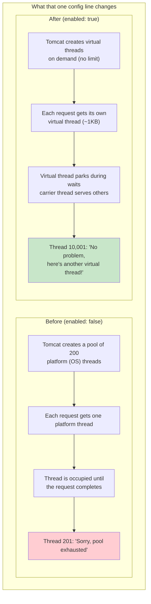

---

## When Do Virtual Threads Help the Most?

Virtual threads shine when your application does a lot of **I/O waiting** — which is exactly what our Order Service does:

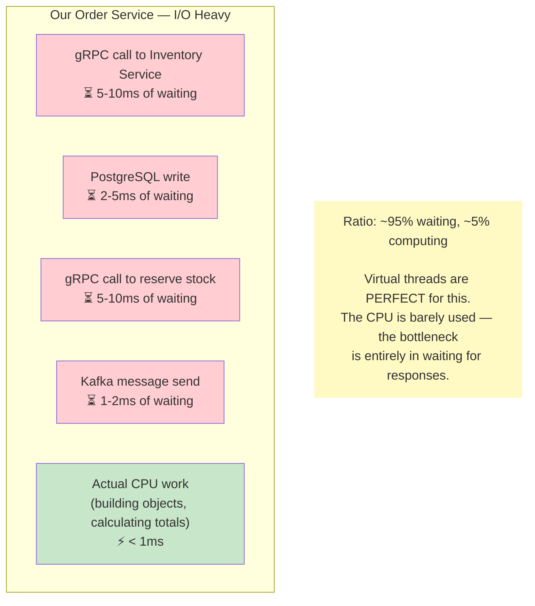

### When Virtual Threads DON'T Help

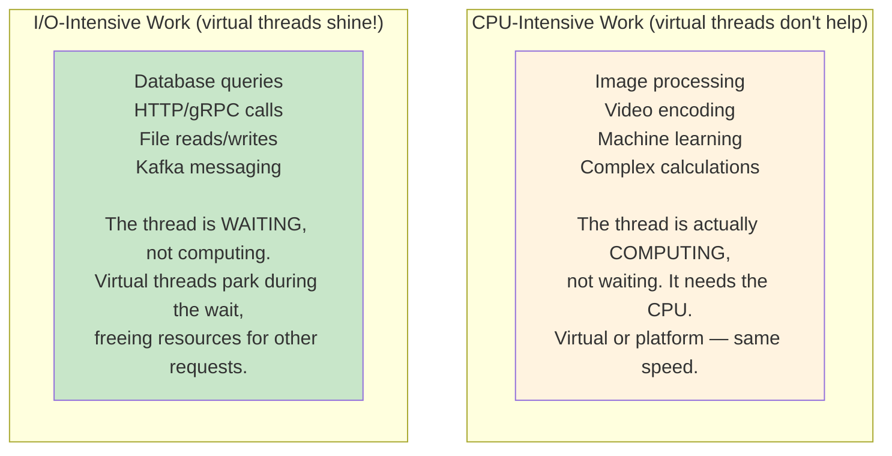

---

## Virtual Threads vs Reactive Programming

Before virtual threads, the main solution for high-concurrency Java was **reactive programming** (like Spring WebFlux, Project Reactor). Here's why virtual threads are simpler:

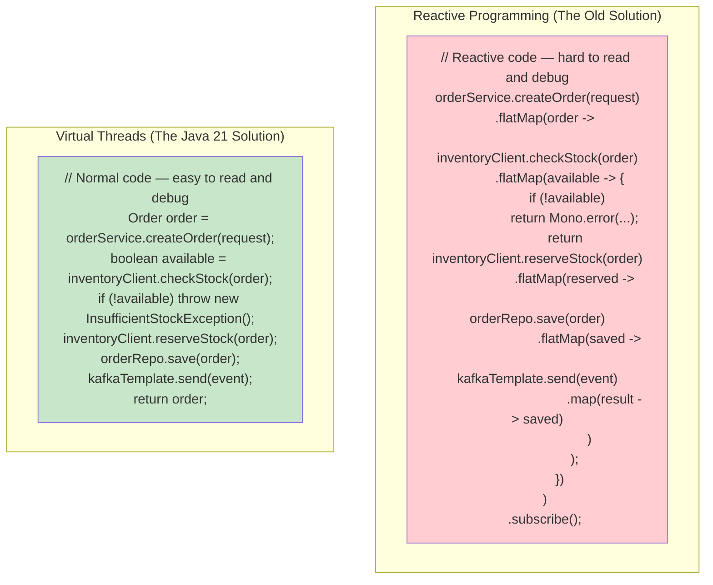

**The comparison:**

| Aspect | Reactive (WebFlux) | Virtual Threads |
|--------|-------------------|-----------------|
| **Code style** | Callbacks, chains, complex operators | Normal, sequential Java code |
| **Debugging** | Painful — stack traces are meaningless | Normal stack traces |
| **Learning curve** | Steep — new programming model | Zero — write code the same way |
| **Libraries** | Need reactive drivers for everything | Works with existing blocking libraries |
| **Performance** | Excellent | Excellent (comparable) |

**Interview talking point:** "We chose virtual threads over reactive programming because they give us the same concurrency benefits with normal, readable, debuggable code. Our OrderService uses standard `@Transactional` methods with blocking gRPC calls — with virtual threads enabled, these blocking calls are automatically efficient because the virtual thread parks instead of blocking a platform thread."

---

## The Relationship Between Virtual Threads, gRPC, and Kafka

All three technologies work together beautifully in our project:

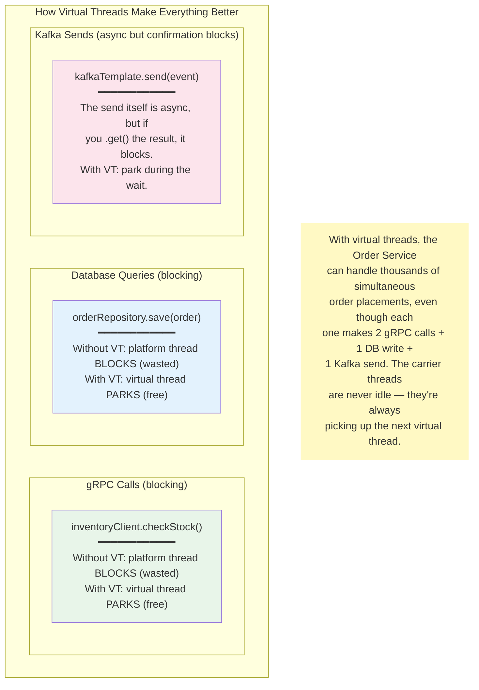

---

## Key Source Files

| File | What it does |
|------|-----------|
| `order-service/src/main/resources/application.yml` (line 5) | `spring.threads.virtual.enabled: true` — enables virtual threads |
| `inventory-service/src/main/resources/application.yml` (line 5) | Same setting for the Inventory Service |
| `pom.xml` (line 26) | `<java.version>21</java.version>` — requires Java 21 |

That's it — 3 lines across the entire project. The power of virtual threads is that they require **zero code changes**. Every blocking call in the application automatically benefits.

---

## Summary — Virtual Threads in One Picture

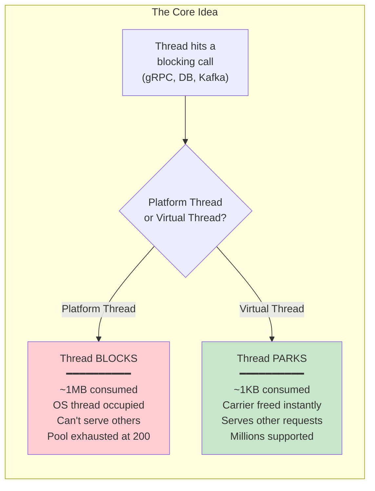

**The key insight:** Virtual threads make blocking calls cheap. Instead of redesigning your code to be non-blocking (reactive), you write normal sequential Java code and let the JVM handle the efficiency. One config line, zero code changes, massive concurrency improvement.
